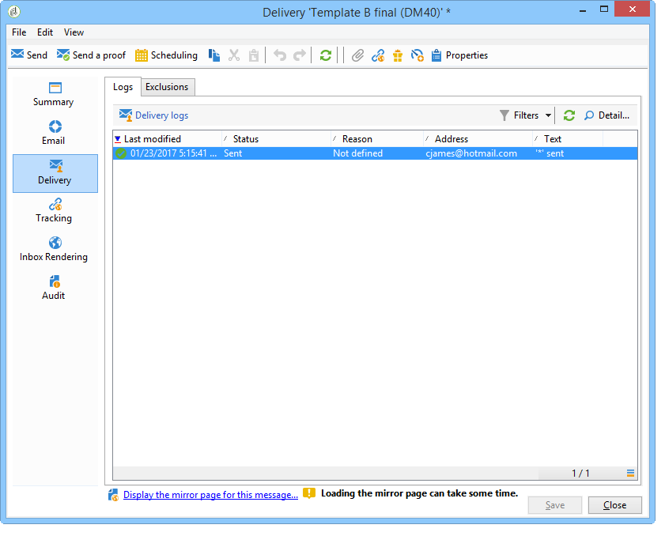

# 分析结果 {#step-8--analyzing-the-result}

发送测试投放后，您可以检查它们已发送给哪些收件人以及是否打开了它们。

* 要确定已定向哪些收件人，请通过活动仪表板打开投放并单击 **[!UICONTROL Delivery]** 选项卡。

   

* 要了解投放是否已打开，请转到 **[!UICONTROL Tracking]** 选项卡。

   

* 与其他投放进行比较。

   

在我们的示例中，投放B的打开率最高。 这意味着内容B将用于最终投放。

