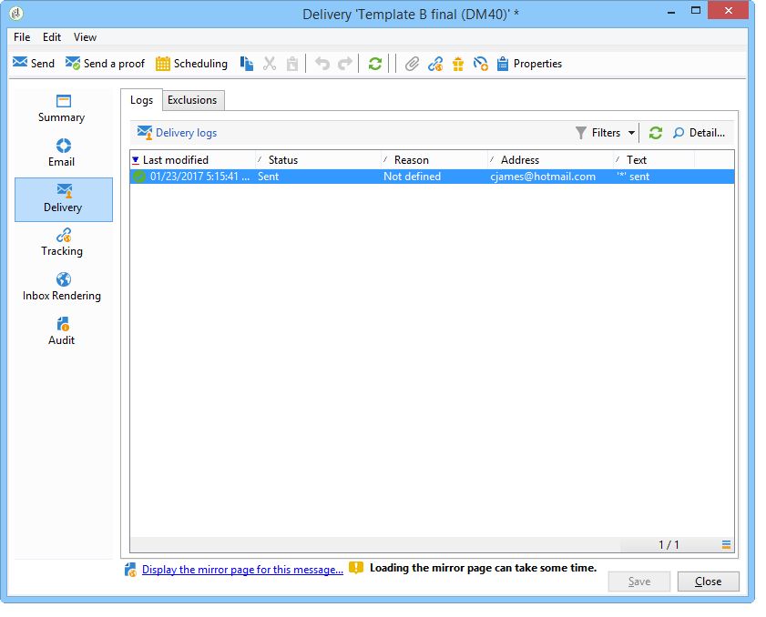

# AB测试：分析结果 {#step-8--analyzing-the-result}

发送测试投放后，您可以检查它们已发送给哪些收件人，以及是否打开了它们。

* 要确定目标收件人，请通过活动仪表板打开投放，然后单击&#x200B;**[!UICONTROL Delivery]**&#x200B;选项卡。

  

* 要了解投放是否已打开，请转到&#x200B;**[!UICONTROL Tracking]**&#x200B;选项卡。

  

* 与其他投放进行比较。

  

在我们的示例中，投放B的打开率最高。 这意味着内容B将用于最终投放。

