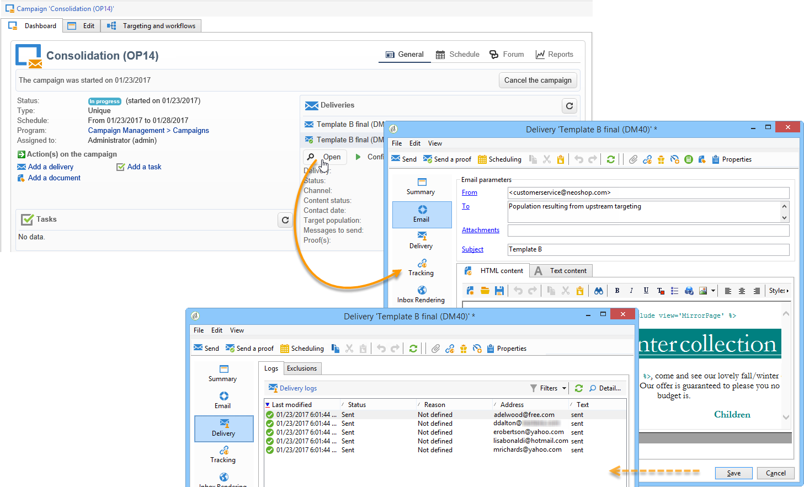

# 分析结果 {#step-8--analyzing-the-result}

发送测试投放后，您可以检查已将其发送到的收件人以及是否已打开这些投放。

* 要确定已定向的收件人，请通过营销活动仪表板打开投放，然后单击 **[!UICONTROL Delivery]** 选项卡。

   

* 要了解投放是否已打开，请转到 **[!UICONTROL Tracking]** 选项卡。

   

* 与其他投放进行比较。

   

在本例中，投放B的打开率最高。 这意味着内容B将用于最终交付。

