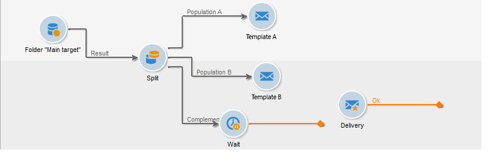

# 在工作流{#step-4--configuring-the-deliveries-in-the-workflow}中配置投放

下一步是配置投放。 它们的目标群体是在前一个阶段创建的三个群体：[步骤2:配置群体示例](#step-2--configuring-population-samples)。 前两个投放允许您向群体A和B发送不同的内容。第三个投放的目标群体既未收到A，也未收到B。其内容将由脚本计算，并且与A或B相同，具体取决于打开率最高的群体。 我们需要为第三个投放配置一个等待期，以了解投放A和B的结果。这就是第三个投放包含&#x200B;**[!UICONTROL Wait]**&#x200B;活动的原因。

1. 转到&#x200B;**[!UICONTROL Split]**&#x200B;活动，并将定向于群体A的过渡链接到工作流中已有的电子邮件投放之一。

   

1. 双击投放以将其打开。
1. 使用下拉列表，选择投放A的模板。

   

1. 单击&#x200B;**[!UICONTROL Continue]**&#x200B;以查看投放，然后保存它。

   

1. 将目标为群体B的&#x200B;**[!UICONTROL Split]**&#x200B;活动的过渡链接到第二个电子邮件投放。

   

1. 打开投放，在投放B中选择模板，然后保存投放。

   

1. 将发往其余群体的过渡链接到&#x200B;**[!UICONTROL Wait]**&#x200B;活动。

   

1. 打开&#x200B;**[!UICONTROL Wait]**&#x200B;活动并配置5天的等待期。

   

1. 将&#x200B;**[!UICONTROL Wait]**&#x200B;活动链接到&#x200B;**[!UICONTROL JavaScript code]**&#x200B;活动。

   

您现在可以创建脚本(请参阅[步骤5:创建脚本](../../delivery/using/a-b-testing-uc-script.md))。
