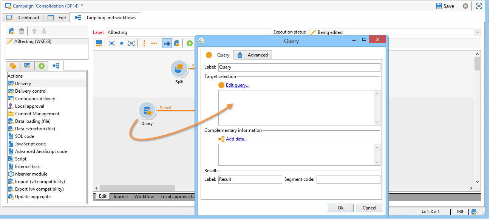

# 配置人群样本 {#step-2--configuring-population-samples}

## 配置查询活动 {#configuring-the-query-activity}

* 双击 **[!UICONTROL Query]** 活动。

   

* 单击 **[!UICONTROL Edit query]** 链接并选择要定位的收件人。

   

* 链接 **[!UICONTROL Query]** 的活动 **[!UICONTROL Split]** 活动。

   

## 配置拆分活动 {#configuring-the-split-activity}

通过此活动，可创建多个群体：接收投放A的群体、接收投放B的群体和其余群体。 通过使用随机选择，您可以只定向每次投放的部分群体。

1. 创建群体A：

   * 双击 **[!UICONTROL Split]** 活动。

      

   * 在现有选项卡中，将标签更改为群体A。

      

   * 选择 **[!UICONTROL Limit the selected records]** 选项。

      

   * 单击 **[!UICONTROL Edit]** 链接，选择 **[!UICONTROL Activate random sampling]**，然后单击 **[!UICONTROL Next]**.

      

   * 将阈值设置为10%，然后单击 **[!UICONTROL Finish]**.

      

1. 创建群体B：

   * 单击 **[!UICONTROL Add]** 为群体B创建新选项卡。

      

   * 与以前一样，将人口限制在10%。

      

1. 创建剩余群体：

   * 转到 **[!UICONTROL General]** 选项卡。

      

   * 选择 **[!UICONTROL Generate complement]**。

      

   * 更改标签以指定此群体既不包括A也不包括B，然后单击 **[!UICONTROL OK]** 以关闭活动。

      

您现在可以创建这两个投放模板。 [了解详情](a-b-testing-uc-delivery-templates.md)).
