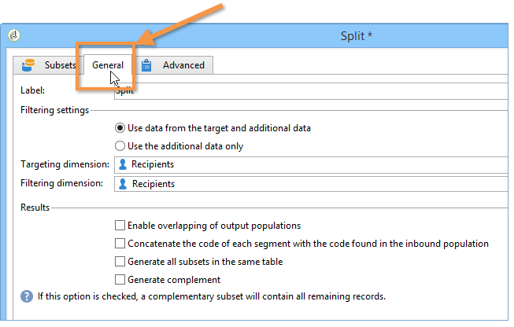

# 配置人群样本 {#step-2--configuring-population-samples}

## 配置查询活动{#configuring-the-query-activity}

* 双击&#x200B;**[!UICONTROL Query]**&#x200B;活动。

   

* 单击&#x200B;**[!UICONTROL Edit query]**&#x200B;链接，然后选择要定位的收件人。

   

* 将&#x200B;**[!UICONTROL Query]**&#x200B;活动链接到&#x200B;**[!UICONTROL Split]**&#x200B;活动。

   

## 配置拆分活动{#configuring-the-split-activity}

此活动允许您创建多个群体：接收投放A的，接收投放B的，以及剩余的群体。 通过使用随机选择，您只能定位每个投放的一部分群体。

1. 创建群体A:

   * 双击&#x200B;**[!UICONTROL Split]**&#x200B;活动。

      

   * 在现有选项卡中，将标签更改为群体A。

      

   * 选择&#x200B;**[!UICONTROL Limit the selected records]**&#x200B;选项。

      

   * 单击&#x200B;**[!UICONTROL Edit]**&#x200B;链接，选择&#x200B;**[!UICONTROL Activate random sampling]**，然后单击&#x200B;**[!UICONTROL Next]**。

      

   * 将阈值设置为10%，然后单击&#x200B;**[!UICONTROL Finish]**。

      

1. 创建群体B:

   * 单击&#x200B;**[!UICONTROL Add]**&#x200B;为群体B创建新选项卡。

      

   * 将群体限制为以前的10%。

      

1. 创建剩余群体：

   * 转到 **[!UICONTROL General]** 选项卡。

      

   * 选择 **[!UICONTROL Generate complement]**。

      

   * 更改标签以指定此群体既不包含A也不包含B，然后单击&#x200B;**[!UICONTROL OK]**&#x200B;以关闭活动。

      

您现在可以创建两个投放模板。 [了解详情](a-b-testing-uc-delivery-templates.md)).
