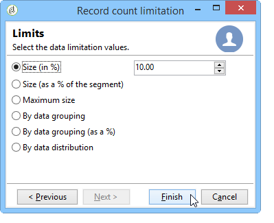

# AB测试：配置群体示例 {#step-2--configuring-population-samples}

## 配置查询活动 {#configuring-the-query-activity}

* 双击&#x200B;**[!UICONTROL Query]**&#x200B;活动。

  

* 单击&#x200B;**[!UICONTROL Edit query]**&#x200B;链接并选择要定位的收件人。

  

* 将&#x200B;**[!UICONTROL Query]**&#x200B;活动链接到&#x200B;**[!UICONTROL Split]**&#x200B;活动。

  

## 配置“拆分”活动 {#configuring-the-split-activity}

利用此活动，可创建多个群体：接收投放A的群体、接收投放B的群体和其余群体。 通过使用随机选择，您可以只定向每次投放的部分群体。

1. 创建群体A：

   * 双击&#x200B;**[!UICONTROL Split]**&#x200B;活动。

     

   * 在现有选项卡中，将标签更改为群体A。

     

   * 选择&#x200B;**[!UICONTROL Limit the selected records]**&#x200B;选项。

     

   * 单击&#x200B;**[!UICONTROL Edit]**&#x200B;链接，选择&#x200B;**[!UICONTROL Activate random sampling]**，然后单击&#x200B;**[!UICONTROL Next]**。

     

   * 将阈值设置为10%，然后单击&#x200B;**[!UICONTROL Finish]**。

     

1. 创建群体B：

   * 单击&#x200B;**[!UICONTROL Add]**&#x200B;为群体B创建新选项卡。

     

   * 与之前一样，将人口限制为10%。

     

1. 创建剩余群体：

   * 转到&#x200B;**[!UICONTROL General]**&#x200B;选项卡。

     

   * 选择 **[!UICONTROL Generate complement]**。

     

   * 更改标签以指定此群体既不包括A也不包括B，然后单击&#x200B;**[!UICONTROL OK]**&#x200B;以关闭活动。

     

您现在可以创建这两个投放模板。 [了解详情](a-b-testing-uc-delivery-templates.md))。
