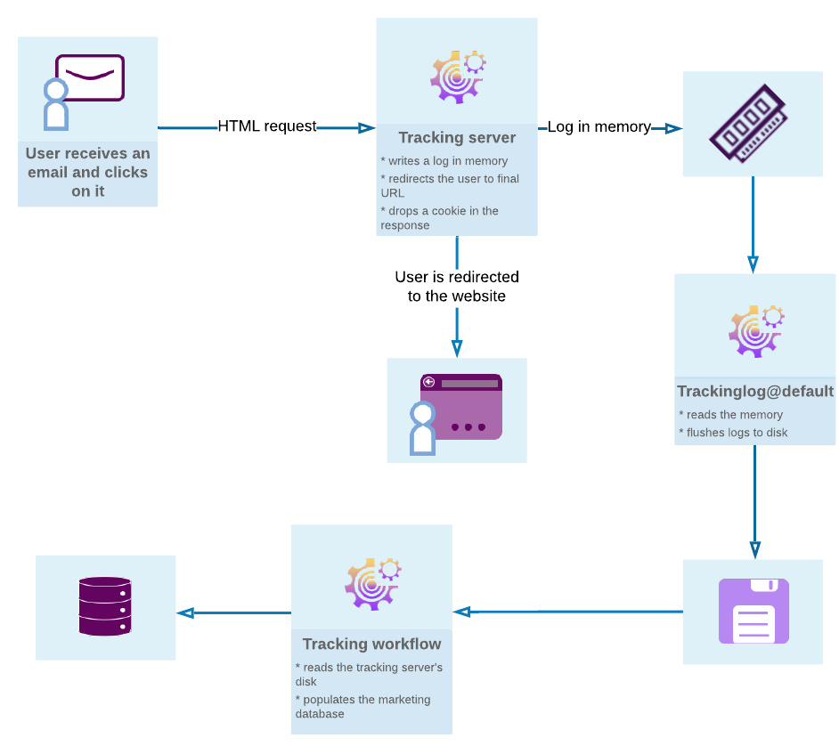

# 邮件跟踪{#get-started-tracking}入门

借助Adobe Campaign的跟踪功能，您可以跟踪发送的消息并检查收件人的行为：打开、单击链接、退订等。

此信息在投放的每个用户档案的&#x200B;**[!UICONTROL Tracking]**&#x200B;选项卡中检索。 此选项卡显示从列表中选择的收件人跟踪和单击的所有URL链接。 这是在投放中跟踪的所有URL的累积，这些URL仍显示在投放屏幕中。 该列表可以配置，并且通常包含：单击的URL、单击的日期和时间以及找到URL的文档。 如需详细信息，请参阅[此部分](../../platform/using/editing-a-profile.md#tracking-tab)。

**投放仪表板**&#x200B;也是监视投放和发送消息时遇到的最终问题的关键。 有关详细信息，请参阅[此部分](../../delivery/using/delivery-dashboard.md)。

下图显示了用户与各种服务器之间对话的各个阶段。

## 配置跟踪{#configure-tracking}

**工作原理**

在使用跟踪之前，您需要先为实例配置它。 [了解详情](../../installation/using/deploying-an-instance.md#operating-principle)

**跟踪服务器**

要配置跟踪，必须声明您的实例并向跟踪服务器注册。 [了解详情](../../installation/using/deploying-an-instance.md#tracking-server)

**保存跟踪**

配置跟踪并填充URL后，必须注册跟踪服务器。 [了解详情](../../installation/using/deploying-an-instance.md#tracking-configuration#saving-tracking)

## 消息跟踪{#message-tracking}

**跟踪链接**

您可以跟踪消息的接收和插入消息内容的链接的激活，以更好地了解收件人的行为。 [了解详情](../../delivery/using/how-to-configure-tracked-links.md)

**URL跟踪**

可以通过激活或取消激活跟踪的URL来配置跟踪选项。 [了解详情](../../delivery/using/personalizing-url-tracking.md)

**跟踪链接个性化**

Campaign Classic跟踪功能允许您在电子邮件中添加可进行个性化和支持跟踪的链接。 [了解详情](../../delivery/using/tracking-personalized-links.md)

**跟踪日志**

在发送投放并激活跟踪后，跟踪技术工作流会检索跟踪数据。 此数据位于投放的“跟踪”选项卡中。 [了解详情](../../delivery/using/accessing-the-tracking-logs.md)

**测试跟踪**

在发送包含跟踪的邮件之前，您可以测试镜像页面、电子邮件日志和链接的跟踪。 [了解详情](../../delivery/using/testing-tracking.md)

## Web 应用程序跟踪{#web-application-tracking}

**跟踪 Web 应用程序**

您还可以使用跟踪标签跟踪和衡量Web 应用程序页面上的访问。 此功能可用于所有Web 应用程序类型，如表单和在线调查。 [了解详情](../../web/using/tracking-a-web-application.md)

**Web 应用程序跟踪退出**

Web 应用程序跟踪退出功能使您能够停止跟踪退出行为跟踪的最终用户的Web行为。 您可以在Web应用程序或登陆页中显示横幅，以允许用户选择退出。 [了解详情](../../web/using/web-application-tracking-opt-out.md)

## 跟踪报告{#tracking-reports}

**跟踪统计**

此报表提供打开、点击和事务处理的统计信息，并允许您跟踪投放的营销影响。 [了解详情](../../reporting/using/delivery-reports.md#tracking-statistics)

**URL 和点击流**

此报表显示在投放后访问的页面的列表。 [了解详情](../../reporting/using/delivery-reports.md#urls-and-click-streams)

**人员和收件人**

通过此示例，更好地了解Adobe Campaign中的人/人和收件人之间的跟踪差异。 [了解详情](../../reporting/using/person-people-recipients.md)

**跟踪指标**

此报告结合了在收到收件人时跟踪投放行为的关键指标，如打开、点进率和点击流。 [了解详情](../../reporting/using/delivery-reports.md#tracking-indicators)

**指标计算**

不同的表为您提供了不同报表中使用的指示器的列表，以及它们的计算公式，具体取决于投放类型。 [了解详情](../../reporting/using/indicator-calculation.md)

## 跟踪疑难解答{#tracking-troubleshooting}

以下疑难解答提示将帮助您解决在Adobe Campaign Classic中使用跟踪时出现的最常见问题。 有关更高级的疑难解答，请参阅[本节](../../delivery/using/tracking-troubleshooting.md)。

* 检查trackinglogd进程是否正在运行

   此过程从IIS/Web服务器共享内存中读取并写入重定向日志。

   您可以通过选择实例中的“监视”选项卡，从主页访问它。 您还可以对实例执行以下命令：`<user>@<instance>:~$ nlserver pdump`

   如果列表中未显示trackinglogd进程，则在实例上使用以下命令启动它：`<user>@<instance>:~$ nlserver start trackinglogd`

* 检查跟踪技术工作流是否最近正在运行。

   您可以在文件夹“管理”>“生产”>“技术工作流”中找到“跟踪”技术工作流。
