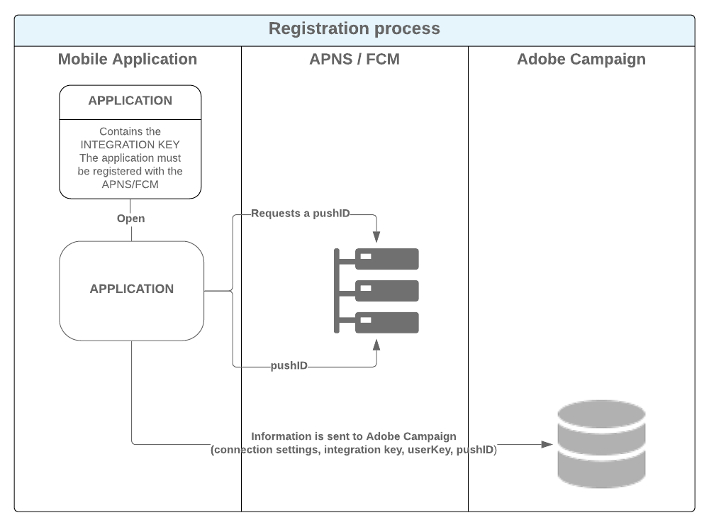

# 移动应用程序渠道入门{#about-mobile-app-channel}

此 **移动应用程序渠道** 允许您使用Adobe Campaign平台通过应用程序向iOS和Android终端发送个性化的推送通知。

提供了两个投放渠道：

* 一种iOS渠道，可让您将通知发送到Apple移动设备。

  

* 一种Android渠道，可让您将数据消息发送到Android移动设备。

  

  >[!IMPORTANT]
  >
  >Android Firebase Cloud Messaging (FCM) 服务的一些重要更改将于 2024 年发布，并将影响您的 Adobe Campaign 实施。您可能需要更新 Android 推送消息的订阅服务配置，才能支持此更改。您已经可以检查并执行操作。 在本节中了解详情 [Adobe Campaign v8技术说明](https://experienceleague.adobe.com/docs/campaign/technotes-ac/tn-new/push-technote.html?lang=zh-Hans){target="_blank"}.

与这两个渠道相对应，活动工作流中有两个投放活动。 两个事务性消息模板也可用于事务性消息传递。


您可以定义当用户激活通知以显示与应用程序上下文匹配的屏幕时的应用程序行为。 例如：

* 系统会向客户发送通知，告知他们包裹已离开仓库。 激活通知将打开一个页面，其中显示与投放相关的信息。
* 用户已将商品添加到购物车，但未完成购买就离开了应用程序。 将发送通知，告知他们购物车已被放弃。 当他们激活通知时，屏幕上将显示该项目。

>[!CAUTION]
>
>* 您需要确保发送到移动应用程序的通知符合Apple (Apple推送通知服务)和Google (Firebase Cloud Messaging)指定的先决条件和条件。
>* 警告：在某些国家/地区，法律要求您向用户告知收集的数据类型移动应用程序及其处理目的。 你必须检查法律。

此 **[!UICONTROL NMAC opt-out management]** (mobileAppOptOutMgt)工作流可更新移动设备上的取消订阅通知。 有关此工作流的详细信息，请参阅 [技术工作流列表](../../workflow/using/about-technical-workflows.md).

Adobe Campaign与HTTP/2 APN兼容。 有关配置步骤的更多详细信息，请参阅 [本节](configuring-the-mobile-application.md) 部分。

有关如何创建投放的全局信息，请参阅 [本节](steps-about-delivery-creation-steps.md).

## 数据路径 {#data-path}

以下架构详细介绍了使移动应用程序能够与Adobe Campaign交换数据的步骤。 此过程涉及三个实体：

* 移动应用程序
* 通知服务：适用于Apple的APN(Apple推送通知服务)和适用于Android的FCM(Firebase Cloud Messaging)
* Adobe Campaign

通知过程的三个主要步骤是：在Adobe Campaign中注册应用程序（订阅收集）、投放和跟踪。

### 步骤1：订阅收集 {#step-1--subscription-collection}

用户从App Store或Google Play下载移动应用程序。 此应用程序包含连接设置(Android的iOS证书和项目密钥)和集成密钥。 首次打开应用程序时（取决于配置），可能会要求用户输入注册信息(例@userKey：电子邮件或帐号)。 同时，应用程序询问通知服务是否收集通知ID（推送ID）。 所有这些信息（连接设置、集成密钥、通知标识符、userKey）都会发送到Adobe Campaign。



### 步骤2：交付 {#step-2--delivery}

营销人员定位应用程序订阅者。 投放过程将连接设置发送到通知服务(适用于Android的iOS证书和项目密钥)、通知ID（推送ID）和通知内容。 通知服务发送通知到目标终端。

Adobe Campaign中提供了以下信息：

* 仅限Android：已显示通知（展示次数）的设备数量
* Android和iOS：通知的点击次数


Adobe Campaign服务器必须能够与iOS HTTP/2连接器的443端口上的APNs服务器联系。

要检查它是否正常工作，请使用以下命令：

* 对于测试：

  ```
  api.development.push.apple.com:443
  ```

* 生产中：

  ```
  api.push.apple.com:443
  ```

使用iOS HTTP/2连接器时，MTA和Web服务器必须能够联系端口443上的APN。

如果您需要通过代理使用iOS HTTP/2连接器，请参阅此 [页面](../../installation/using/file-res-management.md#proxy-connection-configuration).
