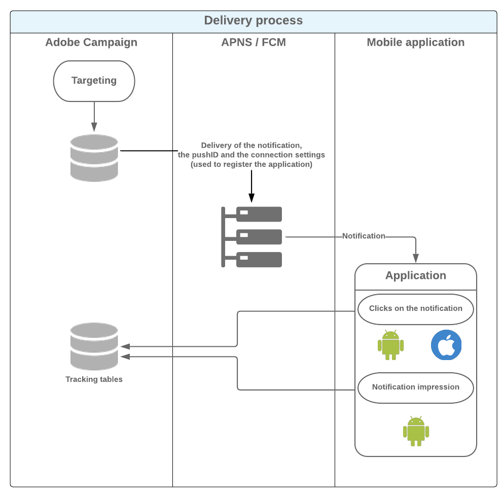

# 关于移动应用程序渠道{#about-mobile-app-channel}

>[!CAUTION]
>
>本文档详细介绍了将移动应用程序与Adobe Campaign平台集成的过程。 它不提供有关如何创建移动应用程序或如何配置它以管理通知的信息。 如果您希望获得有关此方面的更多信息，请参阅Apple官方文 [档](https://developer.apple.com/) 和Android [文档](https://developer.android.com/index.html)。

以下部分提供特定于移动应用程序渠道的信息。

有关如何创建交付的全局信息，请参阅[此部分](../../delivery/using/steps-about-delivery-creation-steps.md)。

通过 **移动应用渠道** ，您可以使用Adobe Campaign平台通过应用程序向iOS和Android终端发送个性化通知。 提供两个交付渠道：

* iOS渠道，允许您向Apple移动设备发送通知。

   

* 允许您向Android移动设备发送数据消息的Android渠道。

   

与这两个渠道相对应，营销活动工作流中有两个交付活动：


>[!NOTE]
>
>还有两个事务消息模板可用于事务消息传递。

您可以为用户激活通知以显示与应用程序上下文匹配的屏幕时定义应用程序行为。 例如：

* 客户将收到通知，告知其包裹已退出仓库。 激活通知后，将打开一个页面，其中包含与传送相关的信息。
* 用户已将商品添加到购物车，但未完成购买而离开了应用程序。 系统会发送通知，告知他们已放弃购物车。 当他们激活通知时，该项目会显示在屏幕上。

>[!CAUTION]
>
>* 您需要确保发送到移动应用程序的通知符合Apple（Apple推送通知服务）和Google(Firebase Cloud Messaging)指定的先决条件和条件。
>* 警告：在某些国家／地区，法律要求您告知用户所收集的数据类型移动应用程序及其处理目的。 你必须检查立法。


(mobileAppOptOutMgt) **[!UICONTROL NMAC opt-out management]** 工作流可更新移动设备上取消订阅的通知。 有关此工作流程的详细信息，请参阅工作 [流指南](../../workflow/using/mobile-app-channel.md)。

Adobe Campaign兼容二进制和HTTP/2 APNS。 有关配置步骤的更多详细信息，请参阅在Adobe [Campaign中配置移动应用程序一节](../../delivery/using/configuring-the-mobile-application.md) 。

## 数据路径 {#data-path}

以下架构详细介绍了使移动应用程序能够与Adobe Campaign交换数据的步骤。 此过程涉及三个实体：

* 移动应用程序
* 通知服务：适用于Apple的APNS（Apple推送通知服务）和适用于Android的FCM(Firebase Cloud Messaging)
* Adobe Campaign

通知过程的三个主要步骤是：在Adobe Campaign中注册应用程序（订阅集合）、提交和跟踪。

### 第1步：订阅集合 {#step-1--subscription-collection}

移动应用程序由用户从App Store或Google Play下载。 此应用程序包含连接设置（iOS证书和Android项目密钥）和集成密钥。 首次打开应用程序时（取决于配置），可要求用户输入注册信息(@userKey:电子邮件或帐号)。 同时，应用程序询问通知服务以收集通知ID（推送ID）。 所有这些信息（连接设置、集成密钥、通知标识符、userKey）都将发送到Adobe Campaign。


### 第2步：交付 {#step-2--delivery}

营销人员瞄准应用程序订阅者。 交付进程将连接设置发送到通知服务（iOS证书和Android项目密钥）、通知ID（推送ID）和通知内容。 通知服务向目标终端发送通知。

Adobe Campaign中提供以下信息：

* 仅限Android:显示通知的设备数（展示次数）
* Android和iOS:单击通知的次数



Adobe Campaign服务器必须能够通过以下端口与APNS服务器联系：

* 适用于iOS二进制连接器的2195（发送）和2186（反馈服务）
* 443 for iOS HTTP/2 connector

要检查其是否正常工作，请使用以下命令：

* 对于测试：

   ```
   telnet gateway.sandbox.push.apple.com
   ```

* 生产中：

   ```
   telnet gateway.push.apple.com
   ```

如果使用iOS二进制连接器，则MTA和Web服务器必须能够在端口2195（发送）上与APNS联系，那么工作流服务器必须能够在端口2196（反馈服务）上与APNS联系。

如果使用iOS HTTP/2连接器，则MTA、Web服务器和工作流服务器必须能够在端口443上与APNS联系。

