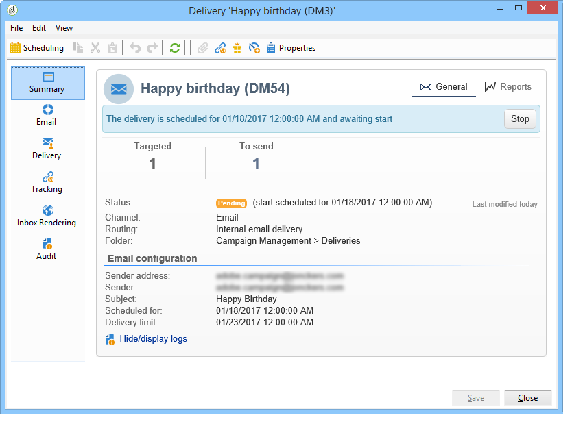

# 访问交付信息{#accessing-deliveries-information}

## 访问交付列表 {#accessing-the-list-of-deliveries}

要访问交付列表，请转到范围， **[!UICONTROL Campaigns]** 然后单击链 **[!UICONTROL Deliveries]** 接。

如果您使用“ [资源管理器”视图](../../platform/using/adobe-campaign-workspace.md#about-adobe-campaign-explorer)，则可以通过树中的节点访问 **[!UICONTROL Campaign management > Deliveries]** 所有分发。

>[!NOTE]
>
>Adobe Campaign工作区显示在此 [部分中](../../platform/using/adobe-campaign-workspace.md)。

通过此页面，您可以访问提交的整体视图：它显示数据库中的所有提交。 您可以查看其状态、成功率和修改日期。

>[!NOTE]
>
>信息过滤功能在此部 [分中介绍](../../platform/using/filtering-options.md)。

通过交付向导，您可以配置提交、启动批准流程和发送。 向导的内容取决于通信渠道（电子邮件、移动设备、推送、直邮）和运营商权限。

要处理列表中的提交，请单击提交。 例如，它在新窗口中打开，您可以确认其提交或暂停。

根据交货周期的阶段，主要可能的状态有：

* 已取消
* 失败
* 待定
* 已完成
* 已暂停
* 重试等待
* 进行中
* 交付就绪
* 正在准备
* 目标计算
* 正在编辑

每个状态都有其自己的颜色和标签。

通过按钮旁边的下拉列 **[!UICONTROL Create]** 表，您可以根据分发的状态筛选分发。

## 访问交付日历 {#accessing-the-delivery-calendar}

要访问交付日历，请转到范 **[!UICONTROL Campaign]** 围并单击链 **[!UICONTROL Campaign calendar]** 接。 此日历显示一段时间内的营销活动细分。 您可以按月、周或天个性化展示。

单击交付的名称以显示有关它的主要信息。 您还可以根据需要通过单击打开营销活动 **[!UICONTROL Open]**。

## 访问交付吞吐量信息 {#accessing-deliveries-throughput-information}

页面上的信 **[!UICONTROL Delivery throughput]** 息涉及平台的所有交付。 为了测量消息的传送速度，标准是每小时发送的消息数和消息的大小（以位／秒为单位）。 在以下示例中，第一个图以蓝色显示成功交付，以橙色显示错误交付的数量。

您可以选择计算吞吐量的时隙。 为此，请从下拉列表中选择值，然后单击 **[!UICONTROL Refresh]**。

>[!NOTE]
>
>对于托管或混合安装，如果您已升级到增强的MTA，该页 **[!UICONTROL Delivery throughput]** 面将不再显示电子邮件收件人的吞吐量。 它将显示从Campaign到增强MTA的消息的中继吞吐量速度。
>
>有关Adobe Campaign增强型MTA的详细信息，请参阅本 [文档](https://helpx.adobe.com/campaign/kb/campaign-enhanced-mta.html)。