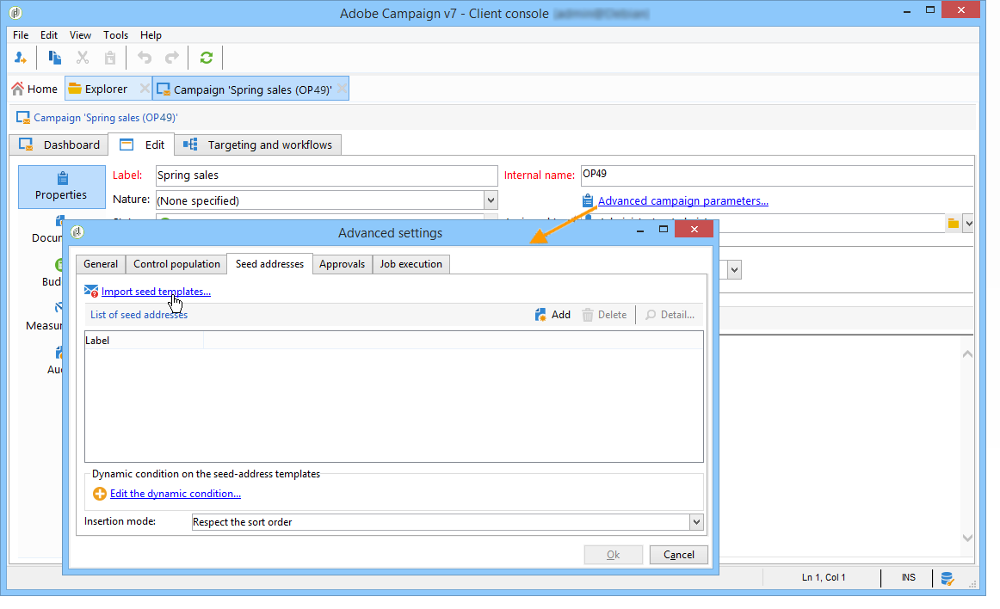

# 添加种子地址{#adding-seed-addresses}

## 种子地址{#seed-addresses-in-a-delivery}投放

要为投放添加特定种子地址，请单击&#x200B;**[!UICONTROL To]**&#x200B;链接，然后选择&#x200B;**[!UICONTROL Seed addresses]**&#x200B;选项卡。

有三种可能的插入模式：

1. 输入单个种子地址。

   要执行此操作，请单击&#x200B;**[!UICONTROL Add]**&#x200B;按钮并定义地址字段的内容。 对每个地址重复上述步骤。 如需详细信息，请参阅[此部分](../../message-center/using/managing-seed-addresses-in-transactional-messages.md#creating-a-seed-address)。

1. 导入地址模板并调整它们以满足您的需求。

   要执行此操作，请单击&#x200B;**[!UICONTROL Import seed templates...]**&#x200B;链接，然后选择包含地址模板的文件夹。 如需详细信息，请参阅[此部分](../../delivery/using/creating-seed-addresses.md#creating-seed-address-templates)。

   如有必要，添加这些地址后，您可以按住多次单击它们，或单击&#x200B;**[!UICONTROL Detail...]**&#x200B;按钮以调整每个地址的内容。

1. 创建条件以动态选择要插入的控制地址。

   要执行此操作，请单击&#x200B;**[!UICONTROL Edit the dynamic condition...]**&#x200B;链接，然后输入种子地址选择参数。 例如，您可以包含特定文件夹中包含的所有种子地址，或您组织中属于特定部门的种子地址。

   本节中介绍了此示例：[用例：选择标准](../../delivery/using/use-case--selecting-seed-addresses-on-criteria.md)上的种子地址。

>[!NOTE]
>
>当使用的收件人表不是默认的&#x200B;**nms:收件人**&#x200B;表，而您使用的是Adobe Campaign **[!UICONTROL Deliverability]**&#x200B;模块提供的收件箱渲染功能时，将使用此选项。
>
>有关详细信息，请参阅[使用外部收件人表](../../delivery/using/using-an-external-recipient-table.md)和[收件箱渲染](../../delivery/using/inbox-rendering.md)上的文档。

对于投放，还可以自定义地址插入提取文件的方式。 默认情况下，它们按输出文件的排序顺序插入，但您可以选择在文件末尾或开头插入，或在主目标的收件人之间随机插入。

## 种子地址{#seed-addresses-in-a-campaign}活动

要将种子地址添加到活动的目标，请选择操作并单击&#x200B;**[!UICONTROL Edit]**&#x200B;选项卡。

单击&#x200B;**[!UICONTROL Advanced campaign settings...]**&#x200B;链接，然后单击&#x200B;**[!UICONTROL Seed addresses]**&#x200B;选项卡，如下所示：

从活动插入的种子地址将添加到活动中每个投放的目标。
