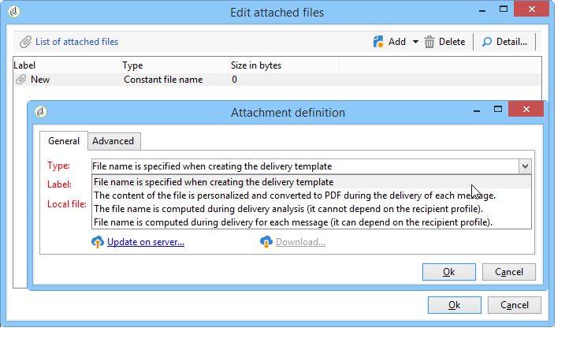
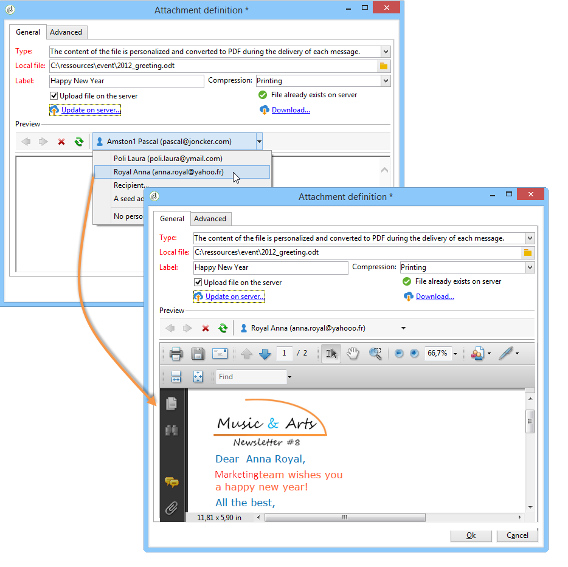
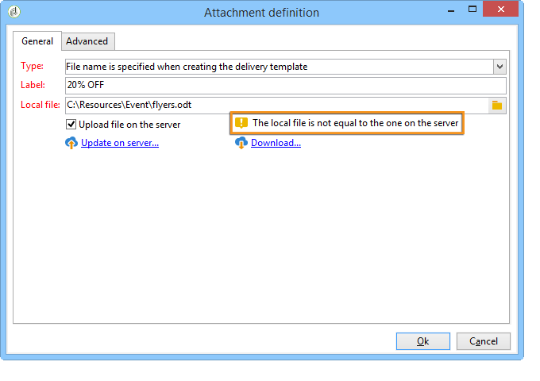

# 将文件附加到电子邮件{#attaching-files}

## 关于电子邮件附件{#about-email-attachments}

您可以将一个或多个文件附加到电子邮件投放。

>[!NOTE]
>
>为避免出现性能问题，建议在每封电子邮件中不要包含多个附件。 建议的阈值可从[Campaign Classic选项列表](../../installation/using/configuring-campaign-options.md#delivery)中配置。

可能有两种情况：

* 选择一个文件，并将其原样附加到投放。
* 为每个收件人个性化附件的内容。 在这种情况下，您需要创建&#x200B;**计算附件**:根据收件人的不同，在投放每条消息时计算附件的名称。 如果您具有&#x200B;**Variable Digital Printing**&#x200B;选项，则内容也可以在交付时个性化并转换为PDF格式。

>[!NOTE]
>
>此类配置通常在投放模板中执行。 有关更多信息，请参阅[关于模板](../../delivery/using/about-templates.md)。

## 附加本地文件{#attaching-a-local-file}

要将本地文件附加到投放，请执行以下步骤。

>[!NOTE]
>
>您可以将多个文件附加到投放。 附件可以采用任何格式（包括压缩格式）。

1. 单击&#x200B;**[!UICONTROL Attachments]**&#x200B;链接。
1. 单击 **[!UICONTROL Add]** 按钮。
1. 单击&#x200B;**[!UICONTROL File...]**&#x200B;选择要附加到投放的文件。

   

您还可以直接将文件拖放到投放&#x200B;**[!UICONTROL Attachments]**&#x200B;字段中，或使用投放向导工具栏中的&#x200B;**[!UICONTROL Attach]**&#x200B;图标。

选择文件后，该文件会立即上传到服务器，以便在交付时可用。 它列在&#x200B;**[!UICONTROL Attachments]**&#x200B;字段中。

## 创建计算附件{#creating-a-calculated-attachment}

在创建计算附件时，可以在分析或传递每个消息时计算附件的名称，这取决于收件人。 也可以进行个性化并转换为PDF。

要创建个性化附件，请执行以下步骤：

1. 单击&#x200B;**[!UICONTROL Attachments]**&#x200B;链接。
1. 单击&#x200B;**[!UICONTROL Add]**&#x200B;按钮，然后选择&#x200B;**[!UICONTROL Calculated attachment]**。
1. 从&#x200B;**[!UICONTROL Type]**&#x200B;下拉列表中选择计算类型：

可以使用以下选项：

* **在创建投放模板时指定文件名**
* **在发送每条消息期间，文件内容会进行个性化并转换为PDF**
* **文件名称在投放分析期间计算（它不能取决于收件人用户档案）**
* **在每个收件人（取决于收件人）的投放时计算文件名**

### 附加本地文件{#attach-a-local-file}

如果附件是本地文件，请选择选项：**[!UICONTROL File name is specified when creating the delivery template]**。 将在本地选择该文件并将其上传到服务器上。 按照下面的步骤进行操作：

1. 在&#x200B;**[!UICONTROL Local file]**&#x200B;字段中选择要上传的文件。
1. 根据需要指定标签。 在消息系统中查看时，标签会替换文件名。 如果未指定任何内容，则默认使用文件名。

   

1. 如有必要，选择&#x200B;**[!UICONTROL Upload file on the server]**，然后单击&#x200B;**[!UICONTROL Update on server]**&#x200B;以开始传输。

   

然后，该文件将在服务器上提供，用于附加到从此模板创建的不同投放。

### 附加个性化消息{#attach-a-personalized-message}

选项&#x200B;**[!UICONTROL The file content is personalized and converted into PDF format at the time of delivery for each message]**&#x200B;允许您选择具有个性化字段的文件，如目标收件人的姓氏和名字。

对于此类型的附件，应用以下配置步骤：

1. 选择要上传的文件。
1. 根据需要指定标签。
1. 选择&#x200B;**[!UICONTROL Upload file on the server]**，然后单击&#x200B;**[!UICONTROL Update on server]**&#x200B;以开始传输。
1. 您可以显示预览。 要执行此操作，请选择收件人。

   

1. 分析投放，然后启动它。

   每个收件人都会收到附加到投放的个性化PDF。

   

>[!NOTE]
>
>为避免出现性能问题，如果您将从个性化URL动态下载的图像作为附件包含在内，则默认情况下每个图像大小不应超过100,000字节。 此建议的阈值可从[Campaign Classic选项列表](../../installation/using/configuring-campaign-options.md#delivery)中配置。

### 附加计算文件{#attach-a-calculated-file}

您可以在投放准备期间计算附件名称。 要执行此操作，请选择选项&#x200B;**[!UICONTROL The file name is calculated during delivery analysis (it cannot depend on the recipient)]**。

>[!NOTE]
>
>仅当由外部进程或工作流发送投放时，才使用此选项。

1. 指定要应用于附件的标签。
1. 在定义窗口中指定文件的访问路径及其确切名称。

   >[!IMPORTANT]
   >
   >服务器上必须存在文件。

   

1. 分析并开始投放。

   文件名计算可在分析日志中查看。

   

### 附加个性化文件{#attach-a-personalized-file}

选择附件时，可以选择选项&#x200B;**[!UICONTROL The file name is calculated during delivery for each recipient (it can depend on the recipient)]**。 然后，您可以将收件人个性化数据与要发送的文件名称进行映射。

>[!NOTE]
>
>仅当由外部进程或工作流发送投放时，才使用此选项。

1. 指定要应用于附件的标签。
1. 在定义窗口中指定文件的访问路径及其确切名称。 如果文件名是个性化的，您可以将“个性化”字段用于相关值。

   

   >[!IMPORTANT]
   >
   >服务器上必须存在文件。

1. 分析并开始投放。

   在以下示例中，根据使用合并字段定义的文件名称选择附加的文件。

   

### 附件设置{#attachment-settings}

对于前两个选项，您可以通过选择相应的选项来选择&#x200B;**[!UICONTROL Upload file on the server]**。 **[!UICONTROL Update the file on the server]**&#x200B;链接允许您开始上传。

将显示一条消息，告知您文件已上传到服务器：

对于文件更改，将显示一条警告消息：

使用&#x200B;**[!UICONTROL Advanced]**&#x200B;选项卡可以对附加的文件定义高级选项：

* 您可以定义过滤器选项，以避免将附加的文件发送给所有收件人。 选项&#x200B;**[!UICONTROL Enable filtering of recipients who will receive the attachment]**&#x200B;可激活用于定义收件人选择脚本的输入字段，该脚本必须在JavaScript中输入。
* 您可以编写文件名称的脚本，以便对其进行个性化设置。

   在窗口中输入文本，然后使用下拉列表中提供的个性化字段。 在以下示例中，文件名是个性化的，以包含今天的日期和收件人的姓名。

   
