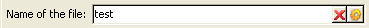

# 通过工作流实现自动化{#automating-via-workflows}

## 内容管理活动 {#content-management-activity}

使用通过Adobe Campaign客户端界面配置的工作流程，可以自动创建、编辑和发布内容。

通 **过工作** 流图的工 **[!UICONTROL Tools]** 具栏访问内容管理活动。

活动属性分为四个步骤：

* **[!UICONTROL Content]** :允许您输入现有内容或创建内容，
* **[!UICONTROL Update content]** :允许您修改内容主题或通过XML数据流更新内容，
* **[!UICONTROL Action to execute]** :允许您保存或生成内容，
* **[!UICONTROL Transition]** :允许您选择是否生成输出过渡并为其指定名称。


### 内容 {#content}

* **由过渡指定**

   要使用的内容是以前创建的。 进程将与传入事件传播的内容实例相关。 内容标识符通过事件的“contentId”变量访问。

* **显式**

   允许您选择之前创建的内容。

* **由脚本计算**

   根据JavaScript模板选择内容实例。 要评估的代码允许您检索内容标识符。

* **新增，通过发布模板创建**

   通过发布模板创建新内容。 内容实例将保存在填充的“String”文件夹中。

### 更新内容 {#update-the-content}

* **主题**

   允许您在发布时修改投放操作的主题。

* **从XML源访问数据**

   从外部源的XML源更新内容。 必须输入URL才能进行数据下载。

   XSL样式表可用于转换传入的XML数据。

### 要执行的操作 {#action-to-execute}

* **保存**

   保存创建或修改的内容。 已保存内容的标识符会传播到传出事件的“contentId”变量中。

* **生成**

   使用“File”类型发布为每个转换模板生成输出文件。 将为每个生成的文件激活传出过渡，并使用以下参数：“contentId”变量中保存的内容的标识符和“filename”变量中的文件名。

### 过渡 {#transition}

通过 **“生成输出过渡** ”选项，您可以向活动添加输出过渡, **[!UICONTROL Content management]** 以将新活动链接到工作流执行。 选中此选项后，输入过渡的标签。

## 示例{#examples}

### 内容创建和投放自动化 {#automating-content-creation-and-delivery}

以下示例自动创建和投放内容块。


内容通过“内容管理”活动配置：


通过发布模型和内容字符串文件夹创建新内容实例。

以我们的例子来说，我们超负荷投放。 它将被考虑在内，而不是在模板中输入的 **[!UICONTROL Delivery]** 内。

内容由输入的URL中的XML源自动填充：

```
<?xml version='1.0' encoding='ISO-8859-1'?>
<book name="Content automation test" date="2008/06/08" language="eng" computeString="Content automation test">
  <section id="1" name="Introduction">
    <page>Introduction to input forms.</page>
  </section>
</book>
```

模式格式与发布模板中输入的格式不&#x200B;**匹配(示例中** cus:book);元 **`<section>`** 素必须替换为元 **`<chapter>`** 素。 我们需要应用“cus:book-workflow.xsl”样式表以进行必要的更改。

使用的XSLT样式表的源代码：

```
<?xml version="1.0" encoding="utf-8"?>
<xsl:stylesheet version="1.0" xmlns:xsl="http://www.w3.org/1999/XSL/Transform">
 <xsl:output indent="yes" method="xml"  encoding="ISO-8859-1"/>

 <xsl:template match="text()|@*"/>

  <xsl:template match="*">
    <xsl:variable name="element.name" select="name(.)"/>
    <xsl:element name="{$element.name}">
      <xsl:copy-of select="text()|@*"/>
      <xsl:apply-templates/>
    </xsl:element>
  </xsl:template>

  <xsl:template match="book">
  <book name="test">
     <xsl:apply-templates/>
    <book>
 </xsl:template>

  <xsl:template match="section">
    <chapter>
      <xsl:for-each select="@*">
        <xsl:copy-of select="."/>
      </xsl:for-each>
       <xsl:apply-templates/>
    </chapter>
  </xsl:template>
  
</xsl:stylesheet>
```

活动的最终操作是保存内容实例并继续到下一个任务。

通过查询活动 **进行** 定位。

添 **加了AND** -join活动，以确保只有在目标查询和内容更新完成后才启动投放。

投放操作通过投放 **活动** :


将根据模板创建新投放操作。

活动的投放模板用于选择发布模板的转换模板。 内容生成将考虑所有HTML和文本模板，这些模板没有投放模板，或者引用的模板与活动相同。

要传送的目标通过传入事件输入。

投放内容通过传入事件填充。

完成活动的最后一步是准备并启动投放。

### 创建内容并稍后发布 {#creating-content-and-publishing-it-later}

此示例创建内容块并在特定时间延迟后启动文件发布。


第一个 **内容管理** 任务创建内容实例。


>[!NOTE]
>
>必 **[!UICONTROL Publication]** 须在转换模板窗口的选项卡中填充要生成的目标的位置。

将添加一个等待活动，以暂停下一个过渡一周。


在此时间段内，将手动输入内容。

下一个任务启动内容生成。


要发布的内容通过传入过渡输入。

最终操作是强制发布目录生成此内容。

JavaScript **代码活动** ，检索每个生成文件的完整名称。


### 创建投放及其内容 {#creating-the-delivery-and-its-content}

此示例使用与第一个示例相同的概念，只在第一步中创建投放操作。


第一个创 **建投放** 任务创建投放操作。

叉活动允许您同时启动目标计算和内容实例的创建。

执行任务后，“与连接”框将激活 **投放** 任务，以启动先前创建的内容和定位投放。


要启动的投放操作将通过过渡填充。

要传送的目标通过传入事件输入。

投放内容通过传入事件填充。

活动的最后行动是准备和启动投放。

### 从FTP导入内容 {#importing-content-from-ftp}

如果您的投放内容位于FTP或SFTP服务器上的HTML文件中，则可以轻松将此内容加载到Adobe Campaign投放中。 Refer to [this example](../../workflow/using/loading-delivery-content.md).

### 从Amazon简单存储服务(S3)连接器导入内容 {#importing-content-from-amazon-simple-storage-service--s3--connector}

如果您的投放内容位于Amazon简单存储服务(S3)存储桶上，则可以轻松将此内容加载到Adobe Campaign投放。 Refer to [this example](../../workflow/using/loading-delivery-content.md).

## 半自动更新 {#semi-automatic-update}

内容数据可以在“半自动”模式下更新。 通过URL从XML源中恢复数据。

通过输入表单手动执行激活恢复。

其目的是在表单 **中声明****`<input>`** editBtn类型字段。 此控件包括编辑区域和启动处理的按钮。

编辑区域允许您填充用于构建要检索的数据XML源URL的变量数据。

该按钮执行 **在标签下** 填充的GetAndTransform SOAP **`<input>`** 方法。

表单中的控件声明如下：

```
<input type="editbtn" xpath="<path>">
  <enter>
    <soapCall name="GetAndTransform" service="ncm:content">
      <param exprIn="<url>" type="string"/>
      <param exprIn="'xtk:xslt|<style sheet>'" type="string"/>
      <param type="DOMElement" xpathOut="<output path>"/>
    </soapCall>
  </enter>
</input>
```

必 **须在标** 签的元素下 **`<enter>`** 声明GetAndTransform **`<input>`** 方法。 此标签将XML数据从动态构建的表达式恢复的URL作为参数。 该函数的第二个参数是可选的，当传入的XML数据的格式与内容的格式不同时，该参数引用用于中间转换的样式表。

输出将根据在最后一个参数中输入的路径更新内容。

**示例**:为了说明此示例，我们从“cus:book”开始进行模式。

添加了半自动更新编辑控制输入表：



```
<input label="File name" type="editbtn" xpath="/tmp/@name">
  <enter>
    <soapCall name="GetAndTransform" service="ncm:content">
      <param exprIn="'https://myserver.adobe.com/incoming/' + [/tmp/@name] + '.xml'" type="string"/>
      <param exprIn="'xtk:xslt|cus:book-workflow.xsl'" type="string"/>
      <param type="DOMElement" xpathOut="."/>
    </soapCall>
  </enter>
</input>
```

编辑区域允许您输入要检索的文件的名称。 URL是根据此名称构建的，例如：https://myserver.adobe.com/incomin/data.xml

要检索的数据的格式与工作流自动化示例1中的格式相同。 我们将使用本示例中显示的“cus:book-workflow.xsl”样式表。

作业执行结果从路径“.”更新内容实例。
