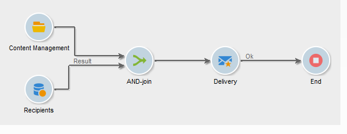

# 使用工作流实现自动化{#automating-via-workflows}

## 内容管理活动 {#content-management-activity}

可以使用通过Adobe Campaign客户端界面配置的工作流，自动创建、编辑和发布内容。

通过工作流图的&#x200B;**[!UICONTROL Tools]**&#x200B;工具栏访问&#x200B;**内容管理**&#x200B;活动。

活动属性分为四个步骤：

* **[!UICONTROL Content]** ：允许您输入现有内容或创建内容，
* **[!UICONTROL Update content]** ：允许您修改内容的主题或通过XML数据流量更新内容，
* **[!UICONTROL Action to execute]** ：用于保存或生成内容，
* **[!UICONTROL Transition]** ：用于选择是否生成输出过渡并为其命名。


### 内容 {#content}

* **由过渡指定**

  要使用的内容是以前创建的。 进程将涉及由传入事件传播的内容实例。 通过事件的“contentId”变量访问内容标识符。

* **显式**

  允许您选择之前创建的内容。

* **由脚本计算**

  基于JavaScript模板选择内容实例。 要计算的代码允许您检索内容标识符。

* **新建，通过发布模板创建**

  通过发布模板创建新内容。 内容实例将保存在填充的“String”文件夹中。

### 更新内容 {#update-the-content}

* **主题**

  允许您在发布时修改投放操作的主题。

* **从XML馈送访问数据**

  内容是从外部源的XML馈送中更新的。 必须输入URL才能进行数据下载。

  XSL样式表可用于转换传入的XML数据。

### 要执行的操作 {#action-to-execute}

* **保存**

  保存创建或修改的内容。 保存内容的标识符会在传出事件的“contentId”变量中传播。

* **生成**

  为具有“文件”类型发布的每个转换模板生成输出文件。 对于每个生成的文件，将使用以下参数激活传出过渡：“contentId”变量中保存内容的标识符和“filename”变量中的文件名。

### 过渡 {#transition}

通过&#x200B;**生成输出过渡**&#x200B;选项，可将输出过渡添加到&#x200B;**[!UICONTROL Content management]**&#x200B;活动，以将新活动链接到工作流执行。 选中此选项后，输入过渡的标签。

## 示例 {#examples}

### 自动化内容创建和交付 {#automating-content-creation-and-delivery}

以下示例自动创建和投放内容块。



内容是通过“内容管理”活动配置的：


通过发布模型和内容字符串文件夹创建新内容实例。

在我们的示例中，我们已重载投放主题。 它将被考虑在内，而不是&#x200B;**[!UICONTROL Delivery]**&#x200B;模板中输入的内容。

内容由来自输入的URL的XML馈送自动填充：

```
<?xml version='1.0' encoding='ISO-8859-1'?>
<book name="Content automation test" date="2008/06/08" language="eng" computeString="Content automation test">
  <section id="1" name="Introduction">
    <page>Introduction to input forms.</page>
  </section>
</book>
```

数据格式与发布模板中输入的数据架构不匹配（在本例中为&#x200B;**cus：book**）；**`<section>`**&#x200B;元素必须替换为&#x200B;**`<chapter>`**&#x200B;元素。 我们需要应用“cus：book-workflow.xsl”样式表以进行必要的更改。

使用的XSLT样式表的Source代码：

```
<?xml version="1.0" encoding="utf-8"?>
<xsl:stylesheet version="1.0" xmlns:xsl="http://www.w3.org/1999/XSL/Transform">
 <xsl:output indent="yes" method="xml"  encoding="ISO-8859-1"/>

 <xsl:template match="text()|@*"/>

  <xsl:template match="*">
    <xsl:variable name="element.name" select="name(.)"/>
    <xsl:element name="{$element.name}">
      <xsl:copy-of select="text()|@*"/>
      <xsl:apply-templates/>
    </xsl:element>
  </xsl:template>

  <xsl:template match="book">
  <book name="test">
     <xsl:apply-templates/>
    <book>
 </xsl:template>

  <xsl:template match="section">
    <chapter>
      <xsl:for-each select="@*">
        <xsl:copy-of select="."/>
      </xsl:for-each>
       <xsl:apply-templates/>
    </chapter>
  </xsl:template>
  
</xsl:stylesheet>
```

活动的最终操作是保存内容实例并继续执行下一个任务。

定位是通过&#x200B;**查询**&#x200B;活动执行的。

添加了&#x200B;**AND-join**&#x200B;活动，以确保仅在完成目标查询和内容更新后开始投放。

传递操作是通过&#x200B;**传递**&#x200B;活动配置的：


基于模板创建新的投放操作。

活动的投放模板用于选择发布模板的转换模板。 内容生成将考虑所有不含投放模板的HTML和文本模板，或者使用与活动相同的模板引用的模板。

要投放的目标通过传入事件输入。

投放内容通过传入事件填充。

完成活动的最后一步是准备并启动投放。

### 创建内容以供以后发布 {#creating-content-and-publishing-it-later}

此示例创建一个内容块，并在特定时间延迟后启动文件发布。


第一个&#x200B;**内容管理**&#x200B;任务创建一个内容实例。


>[!NOTE]
>
>必须使用要生成的目标位置填充转换模板窗口的&#x200B;**[!UICONTROL Publication]**&#x200B;选项卡。

添加了等待活动以暂停下一个过渡一周。


在此时间段内手动输入内容。

下一个任务将启动内容生成。


要发布的内容通过传入过渡输入。

最终操作是通过强制发布目录来生成此内容。

**JavaScript Code**&#x200B;活动可检索生成的每个文件的全名。


### 创建投放及其内容 {#creating-the-delivery-and-its-content}

此示例使用与第一个示例相同的概念，只是在第一步中创建投放操作。


第一个&#x200B;**创建投放**&#x200B;任务创建投放操作。

利用分支活动，可并行启动Target计算和内容实例的创建。

执行任务后，合并连接框将激活&#x200B;**投放**&#x200B;任务，以启动之前创建的内容和定位投放。


要启动的投放操作通过过渡填充。

要投放的目标通过传入事件输入。

投放内容通过传入事件填充。

活动的最终操作是准备和启动投放。

### 从FTP导入内容 {#importing-content-from-ftp}

如果您的投放内容位于FTP或SFTP服务器上的HTML文件中，则可以轻松地将此内容加载到Adobe Campaign投放中。 请参阅[此示例](../../workflow/using/loading-delivery-content.md)。

### 从Amazon Simple Storage Service (S3)连接器导入内容 {#importing-content-from-amazon-simple-storage-service--s3--connector}

如果您的投放内容位于Amazon Simple Storage Service (S3)存储桶中，则可以轻松地将此内容加载到Adobe Campaign投放中。 请参阅[此示例](../../workflow/using/loading-delivery-content.md)。

## 半自动更新 {#semi-automatic-update}

可在“半自动”模式下更新内容数据。 数据是通过URL从XML馈送中恢复的。

数据恢复的激活是通过输入表单手动执行的。

目标是声明表单中的&#x200B;**editBtn**&#x200B;类型&#x200B;**`<input>`**&#x200B;字段。 此控件包括编辑区域和用于启动处理的按钮。

通过编辑区域，可填充用于构造要检索的数据的XML馈送的URL的变量数据。

按钮执行在&#x200B;**`<input>`**&#x200B;标记下填充的&#x200B;**GetAndTransform** SOAP方法。

表单中的控件声明如下：

```
<input type="editbtn" xpath="<path>">
  <enter>
    <soapCall name="GetAndTransform" service="ncm:content">
      <param exprIn="<url>" type="string"/>
      <param exprIn="'xtk:xslt|<style sheet>'" type="string"/>
      <param type="DOMElement" xpathOut="<output path>"/>
    </soapCall>
  </enter>
</input>
```

必须在&#x200B;**`<input>`**&#x200B;标记的&#x200B;**`<enter>`**&#x200B;元素下声明&#x200B;**GetAndTransform**&#x200B;方法。 此标记会将从动态构建的表达式中恢复XML数据的URL作为参数。 函数的第二个参数是可选的，当传入的XML数据与内容的格式不同时，它会引用用于中间转换的样式表。

输出根据在最后一个参数中输入的路径更新内容。

**示例**：为说明此示例，我们从“cus：book”架构开始。

添加了半自动更新编辑控件输入表单：


```
<input label="File name" type="editbtn" xpath="/tmp/@name">
  <enter>
    <soapCall name="GetAndTransform" service="ncm:content">
      <param exprIn="'https://myserver.adobe.com/incoming/' + [/tmp/@name] + '.xml'" type="string"/>
      <param exprIn="'xtk:xslt|cus:book-workflow.xsl'" type="string"/>
      <param type="DOMElement" xpathOut="."/>
    </soapCall>
  </enter>
</input>
```

编辑区域允许您输入要检索的文件的名称。 URL基于此名称构建，例如：https://myserver.adobe.com/incomin/data.xml

要检索的数据的格式与工作流自动化的示例1中的相同。 我们将使用在此示例中看到的“cus：book-workflow.xsl”样式表。

作业执行的结果将从路径“。”更新内容实例。
