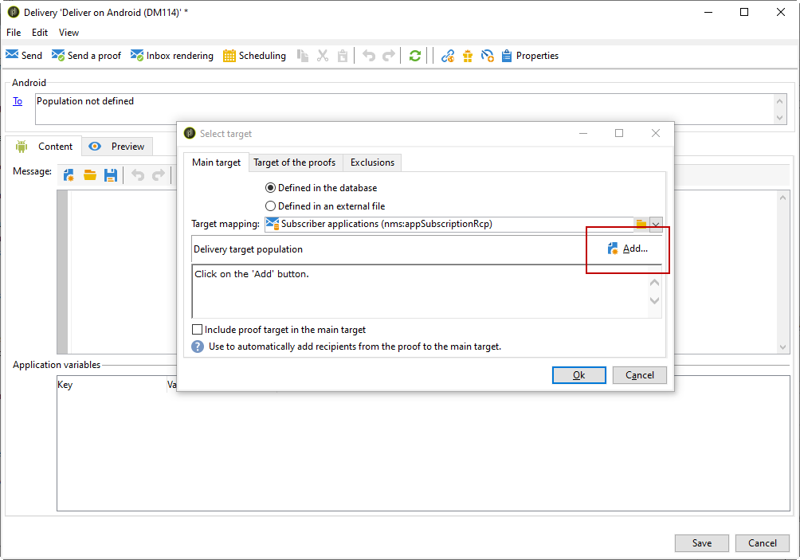

# Android 配置步骤

安装包后，您可以在Adobe Campaign Classic中定义Android应用程序设置。

>[!NOTE]
>
>要了解如何配置iOS应用程序以及如何创建iOS投放，请参阅此[部分](../../delivery/using/configuring-the-mobile-application.md)。

关键步骤包括：

1. [配置Android外部帐户](#configuring-external-account-android)
1. [配置Android服务](#configuring-android-service)
1. [在Campaign中创建移动设备应用程序](#creating-android-app)
1. [使用附加数据扩展应用程序模式](#extend-subscription-schema)

然后，您将能够[创建Android富通知](#creating-android-delivery)。

## 配置Android外部帐户{#configuring-external-account-android}

对于Android，提供了两个连接器：

* V1连接器，允许每个MTA子项有一个连接。
* V2连接器，允许与FCM服务器同时连接以提高吞吐量。

要选择要使用的连接器，请执行以下步骤：

1. 转到&#x200B;**[!UICONTROL Administration > Platform > External accounts]**。
1. 选择&#x200B;**[!UICONTROL Android routing]**&#x200B;外部帐户。
1. 在&#x200B;**[!UICONTROL Connector]**&#x200B;选项卡中，填写&#x200B;**[!UICONTROL JavaScript used in the connector]**&#x200B;字段：

   对于Android V2:https://localhost:8080/nms/jsp/androidPushConnectorV2.js

   >[!NOTE]
   >
   > 您也可以按照以下方式对其进行配置： https://localhost:8080/nms/jsp/androidPushConnector.js ，但我们建议您使用连接器版本2。

   

1. 对于Android V2,Adobe服务器配置文件(serverConf.xml)中还提供了一个额外的参数：

   * **maxGCMConnectPerChild**:每个子服务器启动的对FCM的并行HTTP请求的最大限制（默认为8）。

## 配置Android服务{#configuring-android-service}

 [了解如何在视频中配置Android服务](https://experienceleague.adobe.com/docs/campaign-classic-learn/getting-started-with-push-notifications-for-android/configuring-an-android-service-in-campaign.html?lang=en#configuring-an-android-service-and-creating-an-android-mobile-application-in-campaign)

1. 转到&#x200B;**[!UICONTROL Profiles and Targets > Services and subscriptions]**&#x200B;节点，然后单击&#x200B;**[!UICONTROL New]**。

   

1. 定义&#x200B;**[!UICONTROL Label]**&#x200B;和&#x200B;**[!UICONTROL Internal name]**。
1. 转到&#x200B;**[!UICONTROL Type]**&#x200B;字段并选择&#x200B;**[!UICONTROL Mobile application]**。

   >[!NOTE]
   >
   >默认的&#x200B;**[!UICONTROL Subscriber applications (nms:appSubscriptionRcp)]**&#x200B;目标映射已链接到收件人表。 如果要使用其他目标映射，则需要创建新的目标映射，并在服务的&#x200B;**[!UICONTROL Target mapping]**&#x200B;字段中输入该映射。 有关创建目标映射的更多信息，请参阅[配置指南](../../configuration/using/about-custom-recipient-table.md)。

   

1. 然后单击&#x200B;**[!UICONTROL Add]**&#x200B;按钮以选择应用程序类型。

   

1. 创建Android应用程序。 有关更多信息，请参阅此](../../delivery/using/configuring-the-mobile-application-android.md#creating-android-app)章节[。

## 创建Android移动应用程序{#creating-android-app}

创建服务后，您现在需要创建Android应用程序：

1. 在您新创建的服务中，单击&#x200B;**[!UICONTROL Add]**&#x200B;按钮以选择应用程序类型。

   

1. 选择&#x200B;**[!UICONTROL Create an Android application]**&#x200B;并输入&#x200B;**[!UICONTROL Label]**。

   

1. 确保通过SDK在Adobe Campaign和应用程序代码中定义相同的&#x200B;**[!UICONTROL Integration key]**。 有关更多信息，请参阅：[将Campaign SDK集成到移动应用程序](../../delivery/using/integrating-campaign-sdk-into-the-mobile-application.md)。

   >[!NOTE]
   >
   > **[!UICONTROL Integration key]**&#x200B;可通过字符串值完全自定义，但需要与SDK中指定的值完全相同。

1. 选择&#x200B;**[!UICONTROL API version]**:HTTP v1或HTTP（旧版）。 [此部分](#select-api-version)中详细介绍了这些配置

1. 填写&#x200B;**[!UICONTROL Firebase Cloud Messaging the Android connection settings]**&#x200B;字段。

1. 单击 **[!UICONTROL Finish]**，然后单击 **[!UICONTROL Save]**。您的Android应用程序现已准备就绪，可在Campaign Classic中使用。

默认情况下，Adobe Campaign会在&#x200B;**[!UICONTROL Subscriber applications (nms:appSubscriptionRcp)]**&#x200B;表的&#x200B;**[!UICONTROL User identifier]**(@userKey)字段中保存一个键。 利用此键，可将订阅链接到收件人。 要收集其他数据（例如复杂的协调键值），您需要应用以下配置：

### 选择API版本{#select-api-version}

创建服务和新的移动应用程序后，您需要根据所选的API版本配置移动应用程序。

* **HTTP v1** 配置在此部分 [中详述](../../delivery/using/configuring-the-mobile-application-android.md#android-service-httpv1)。
* **此部分** 中详细介绍了HTTP（旧版） 配置。

#### 配置HTTP v1 API{#android-service-httpv1}

要配置HTTP v1 API版本，请执行以下步骤：

1. 在&#x200B;**[!UICONTROL Mobile application creation wizard]**&#x200B;窗口的&#x200B;**[!UICONTROL API version]**&#x200B;下拉菜单中，选择&#x200B;**[!UICONTROL HTTPV1]**。

1. 单击&#x200B;**[!UICONTROL Load project json file to extract projet details...]**&#x200B;直接加载您的JSON密钥文件。 有关如何提取JSON文件的更多信息，请参阅此[page](https://firebase.google.com/docs/admin/setup#initialize-sdk)。

   您还可以手动输入以下详细信息：
   * **[!UICONTROL Project Id]**
   * **[!UICONTROL Private Key]**
   * **[!UICONTROL Client Email]**

   

1. 单击&#x200B;**[!UICONTROL Test the connection]**&#x200B;以检查您的配置是否正确以及营销服务器是否有权访问FCM。

   >[!CAUTION]
   >
   >对于中间源部署， **[!UICONTROL Test connection]**&#x200B;按钮将不检查MID服务器是否有权访问FCM服务器。

   

1. 作为一种选项，您可以根据需要使用某些&#x200B;**[!UICONTROL Application variables]**&#x200B;扩充推送消息的内容。 这些任务是完全可自定义的，并且是发送到移动设备的消息有效负荷的一部分。

1. 单击 **[!UICONTROL Finish]**，然后单击 **[!UICONTROL Save]**。您的Android应用程序现已准备就绪，可在Campaign Classic中使用。

以下是用于进一步个性化推送通知的FCM有效负载名称：

| 消息类型 | 可配置消息元素（FCM有效负载名称） | 可配置选项（FCM有效负载名称） |
|:-:|:-:|:-:|
| 数据消息 | N/A | validate_only |
| 通知消息 | 标题， body， android channel_id，图标，声音，标记，颜色， click_action，图像， ticker，置顶，可见性， notification_priority， notification_count   | validate_only |

 
 

#### 配置HTTP（旧版）API{#android-service-http}

要配置HTTP（旧版）API版本，请执行以下步骤：

1. 在&#x200B;**[!UICONTROL Mobile application creation wizard]**&#x200B;窗口的&#x200B;**[!UICONTROL API version]**&#x200B;下拉菜单中，选择&#x200B;**[!UICONTROL HTTP (legacy)]**。

1. 输入由移动应用程序开发人员提供的&#x200B;**[!UICONTROL Project key]**。

1. 作为一种选项，您可以根据需要使用某些&#x200B;**[!UICONTROL Application variables]**&#x200B;扩充推送消息的内容。 这些任务是完全可自定义的，并且是发送到移动设备的消息有效负荷的一部分。

   在以下示例中，我们添加&#x200B;**title**、**imageURL**&#x200B;和&#x200B;**iconURL**&#x200B;以创建富推送通知，然后向应用程序提供要在通知中显示的图像、标题和图标。

   

1. 单击 **[!UICONTROL Finish]**，然后单击 **[!UICONTROL Save]**。您的Android应用程序现已准备就绪，可在Campaign Classic中使用。

以下是用于进一步个性化推送通知的FCM有效负载名称：

| 消息类型 | 可配置消息元素（FCM有效负载名称） | 可配置选项（FCM有效负载名称） |
|:-:|:-:|:-:|
| 数据消息 | 不适用 | dryRun |
| 通知消息 | 标题， body， android_channel_id，图标，声音，标记，颜色， click_action   | dryRun |

 

## 扩展appsubscriptionRcp架构{#extend-subscription-schema}

 [了解如何在视频中扩展appsubscriptionRcp模式](https://experienceleague.adobe.com/docs/campaign-classic-learn/getting-started-with-push-notifications-for-android/extending-the-app-subscription-schema.html?lang=en#extending-the-app-subscription-schema-to-personalize-push-notifications)

您需要扩展&#x200B;**appsubscriptionRcp**&#x200B;以定义新的其他字段，以将应用程序中的参数存储在Campaign数据库中。 例如，这些字段将用于个性化。 操作步骤：

1. 创建&#x200B;**[!UICONTROL Subscriber applications (nms:appsubscriptionRcp)]**&#x200B;架构的扩展并定义新字段。 在[此页面](../../configuration/using/about-schema-edition.md)中了解有关模式扩展的更多信息

1. 在&#x200B;**[!UICONTROL Subscription parameters]**&#x200B;选项卡中定义映射。

   >[!CAUTION]
   >
   >确保&#x200B;**[!UICONTROL Subscription parameters]**&#x200B;选项卡中的配置名称与移动应用程序代码中的配置名称相同。 请参阅[将Campaign SDK集成到移动应用程序](../../delivery/using/integrating-campaign-sdk-into-the-mobile-application.md)一节。

## 创建Android富通知{#creating-android-delivery}

使用Firebase Cloud Messaging，您可以选择两种类型的消息：

* **[!UICONTROL Data message]**，由客户端应用程序处理。
    消息将直接发送到移动应用程序，该应用程序将生成Android通知并将通知显示到设备。数据消息仅包含您的自定义应用程序变量。

* **[!UICONTROL Notification message]**，由FCM SDK自动处理。
     FCM会代表客户端应用程序在用户设备上自动显示消息。通知消息包含一组预定义的参数和选项，但仍可以使用自定义应用程序变量进一步进行个性化。

有关Firebase Cloud Messaging消息类型的更多信息，请参阅[FCM文档](https://firebase.google.com/docs/cloud-messaging/concept-options#notifications_and_data_messages)。

### 创建数据消息{#creating-data-message}

1. 转到&#x200B;**[!UICONTROL Campaign management]** > **[!UICONTROL Deliveries]**。

1. 单击 **[!UICONTROL New]**。

   

1. 在&#x200B;**[!UICONTROL Delivery template]**&#x200B;下拉列表中选择&#x200B;**[!UICONTROL Deliver on Android (android)]**。 向投放中添加&#x200B;**[!UICONTROL Label]**。

1. 单击&#x200B;**[!UICONTROL To]**&#x200B;以定义要定位的群体。 默认情况下，将应用&#x200B;**[!UICONTROL Subscriber application]**&#x200B;目标映射。 单击&#x200B;**[!UICONTROL Add]**&#x200B;选择服务。

   

1. 在&#x200B;**[!UICONTROL Target type]**&#x200B;窗口中，选择&#x200B;**[!UICONTROL Subscribers of an Android mobile application]**&#x200B;并单击&#x200B;**[!UICONTROL Next]**。

1. 在&#x200B;**[!UICONTROL Service]**&#x200B;下拉列表中，选择您之前创建的服务，然后选择应用程序并单击&#x200B;**[!UICONTROL Finish]**。
根据配置步骤中添加的内容，会自动添加**[!UICONTROL Application variables]**。

   

1. 选择&#x200B;**[!UICONTROL data message]**&#x200B;作为&#x200B;**[!UICONTROL Message Type]**。

1. 编辑您的富通知。

   

1. 如果需要，您可以在之前配置的&#x200B;**[!UICONTROL Application variables]**&#x200B;中添加信息。 **[!UICONTROL Application variables]** 需要在Android服务中进行配置，并且是发送到移动设备的消息有效负荷的一部分。

1. 单击&#x200B;**[!UICONTROL Save]**&#x200B;并发送投放。

当在订阅者的Android移动设备上收到图像和网页时，应在推送通知中显示。

### 创建通知消息{#creating-notification-message}

>[!NOTE]
>
>通知消息的其他选项仅在HTTP v1 API配置中可用。 有关更多信息，请参阅此](../../delivery/using/configuring-the-mobile-application-android.md#android-service-httpv1)章节[。

 [了解如何在视频中创建Android推送通知](https://experienceleague.adobe.com/docs/campaign-classic-learn/getting-started-with-push-notifications-for-android/configuring-and-sending-push-notifications.html?lang=en#additional-resources)

1. 转到&#x200B;**[!UICONTROL Campaign management]** > **[!UICONTROL Deliveries]**。

1. 单击 **[!UICONTROL New]**。

   

1. 在&#x200B;**[!UICONTROL Delivery template]**&#x200B;下拉列表中选择&#x200B;**[!UICONTROL Deliver on Android (android)]**。 向投放中添加&#x200B;**[!UICONTROL Label]**。

1. 单击&#x200B;**[!UICONTROL To]**&#x200B;以定义要定位的群体。 默认情况下，将应用&#x200B;**[!UICONTROL Subscriber application]**&#x200B;目标映射。 单击&#x200B;**[!UICONTROL Add]**&#x200B;选择服务。

   

1. 在&#x200B;**[!UICONTROL Target type]**&#x200B;窗口中，选择&#x200B;**[!UICONTROL Subscribers of an Android mobile application]**&#x200B;并单击&#x200B;**[!UICONTROL Next]**。

1. 在&#x200B;**[!UICONTROL Service]**&#x200B;下拉列表中，选择您之前创建的服务，然后选择应用程序并单击&#x200B;**[!UICONTROL Finish]**。

   

1. 选择&#x200B;**[!UICONTROL notification message]**&#x200B;作为&#x200B;**[!UICONTROL Message Type]**。

1. 添加标题并编辑消息。 使用&#x200B;**[!UICONTROL Notification options]**&#x200B;个性化您的推送通知：

   * **[!UICONTROL Channel ID]**:设置通知的渠道ID。在收到具有此渠道ID的任何通知之前，应用程序必须使用此渠道ID创建渠道。
   * **[!UICONTROL Sound]**:设置设备收到通知时要播放的声音。
   * **[!UICONTROL Color]**:设置通知的图标颜色。
   * **[!UICONTROL Icon]**:将通知的图标设置为在用户档案的设备上显示。
   * **[!UICONTROL Tag]**:设置用于替换通知抽屉中现有通知的标识符。
   * **[!UICONTROL Click action]**:设置与用户单击您的通知关联的操作。

   有关&#x200B;**[!UICONTROL Notification options]**&#x200B;以及如何填写这些字段的更多信息，请参阅[FCM文档](https://firebase.google.com/docs/reference/fcm/rest/v1/projects.messages#androidnotification)。

   

1. 如果您的应用程序配置了HTTP v1 API协议，则可以使用以下&#x200B;**[!UICONTROL HTTPV1 additional options]**&#x200B;进一步个性化您的推送通知：

   * **[!UICONTROL Ticker]**:设置通知的滚动条文本。仅适用于设置为Android 5.0 Lollipop的设备。
   * **[!UICONTROL Image]**:设置要在通知中显示的图像URL。
   * **[!UICONTROL Notification Count]**:设置要直接在应用程序图标上显示的新未读信息数。
   * **[!UICONTROL Sticky]**:设置为true或false。如果设置为false，则当用户单击通知时，该通知将自动被取消。 如果设置为true，则即使用户单击通知，也仍会显示通知。
   * **[!UICONTROL Notification Priority]**:将通知的优先级设置为默认、最小、低或高。有关更多信息，请参阅[FCM文档](https://firebase.google.com/docs/reference/fcm/rest/v1/projects.messages#NotificationPriority)。
   * **[!UICONTROL Visibility]**:将通知的可见性级别设置为公共、私有或机密。有关更多信息，请参阅[FCM文档](https://firebase.google.com/docs/reference/fcm/rest/v1/projects.messages#visibility)。

   有关&#x200B;**[!UICONTROL HTTP v1 additional options]**&#x200B;以及如何填写这些字段的更多信息，请参阅[FCM文档](https://firebase.google.com/docs/reference/fcm/rest/v1/projects.messages#androidnotification)。

   

1. 如果需要，您可以在之前配置的&#x200B;**[!UICONTROL Application variables]**&#x200B;中添加信息。 **[!UICONTROL Application variables]** 需要在Android服务中进行配置，并且是发送到移动设备的消息有效负荷的一部分。

1. 单击&#x200B;**[!UICONTROL Save]**&#x200B;并发送投放。

当在订阅者的Android移动设备上收到图像和网页时，应在推送通知中显示。
