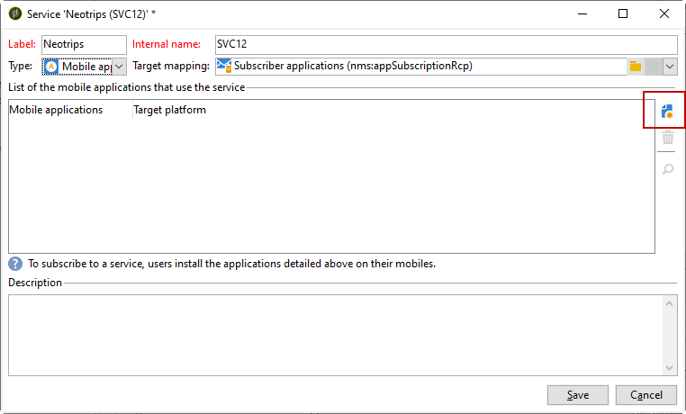

# Android 配置步骤

安装包后，您可以在Adobe Campaign Classic中定义Android应用程序设置。

>[!NOTE]
>
>要了解如何为iOS配置应用程序以及如何为iOS创建投放，请参阅此 [部分](configuring-the-mobile-application.md).

关键步骤包括：

1. [配置Android外部帐户](#configuring-external-account-android)
1. [配置Android服务](#configuring-android-service)
1. [在营销活动中创建移动应用程序](#creating-android-app)
1. [使用其他数据扩展应用程序架构](#extend-subscription-schema)

然后，您将能够 [创建Android富通知](create-notifications-android.md).

## 配置Android外部帐户 {#configuring-external-account-android}

对于Android，提供了两个连接器：

* 允许每个MTA子项一个连接的V1连接器。
* V2连接器允许同时连接到FCM服务器以提高吞吐量。

要选择要使用的连接器，请执行以下步骤：

1. 转到 **[!UICONTROL Administration > Platform > External accounts]**.
1. 选择 **[!UICONTROL Android routing]** 外部帐户。
1. 在 **[!UICONTROL Connector]** 选项卡，填写 **[!UICONTROL JavaScript used in the connector]** 字段：

   对于Android V2： https://localhost:8080/nms/jsp/androidPushConnectorV2.js

   >[!NOTE]
   >
   > 您也可以按照https://localhost:8080/nms/jsp/androidPushConnector.js进行配置，但我们建议您使用连接器版本2。

   

1. 对于Android V2，Adobe服务器配置文件(serverConf.xml)中还提供另一个参数：

   * **maxGCMConnectPerChild**：每个子服务器向FCM发起的并行HTTP请求的最大限制（默认为8个）。

## 配置Android服务 {#configuring-android-service}

 [了解如何在视频中配置Android服务](https://experienceleague.adobe.com/docs/campaign-classic-learn/getting-started-with-push-notifications-for-android/configuring-an-android-service-in-campaign.html#configuring-an-android-service-and-creating-an-android-mobile-application-in-campaign)

1. 转到 **[!UICONTROL Profiles and Targets > Services and subscriptions]** 节点并单击 **[!UICONTROL New]**.

   

1. 定义 **[!UICONTROL Label]** 和 **[!UICONTROL Internal name]**.
1. 转到 **[!UICONTROL Type]** 字段并选择 **[!UICONTROL Mobile application]**.

   >[!NOTE]
   >
   >默认 **[!UICONTROL Subscriber applications (nms:appSubscriptionRcp)]** 目标映射链接到收件人表。 如果要使用其他目标映射，则需要创建一个新的目标映射，并在以下位置输入该映射： **[!UICONTROL Target mapping]** 服务的字段。 有关创建目标映射的更多信息，请参阅 [本节](../../configuration/using/about-custom-recipient-table.md).

   

1. 然后单击 **[!UICONTROL Add]** 按钮选择应用程序类型。

   

1. 创建Android应用程序。 如需详细信息，请参阅[此部分](configuring-the-mobile-application-android.md#creating-android-app)。

## 创建Android移动应用程序 {#creating-android-app}

创建服务后，您现在需要创建Android应用程序：

1. 在新创建的服务中，单击 **[!UICONTROL Add]** 按钮选择应用程序类型。

   

1. 选择 **[!UICONTROL Create an Android application]** 并输入 **[!UICONTROL Label]**.

   

1. 确保相同 **[!UICONTROL Integration key]** 在Adobe Campaign中以及通过SDK在应用程序代码中定义。 如需详细信息，请参阅[此部分](integrating-campaign-sdk-into-the-mobile-application.md)。

   >[!NOTE]
   >
   > 此 **[!UICONTROL Integration key]** 可使用字符串值完全自定义，但需要与SDK中指定的值完全相同。

1. 选择 **[!UICONTROL API version]**：HTTP v1或HTTP（旧版）。 有关这些配置的详情，请参见 [本节](#select-api-version)

1. 填写 **[!UICONTROL Firebase Cloud Messaging the Android connection settings]** 字段。

1. 单击 **[!UICONTROL Finish]**，然后单击 **[!UICONTROL Save]**。您的Android应用程序现在已准备好用于Campaign Classic。

默认情况下，Adobe Campaign会将一个密钥保存在 **[!UICONTROL User identifier]** (@userKey)字段 **[!UICONTROL Subscriber applications (nms:appSubscriptionRcp)]** 表格。 利用此密钥，可将订阅链接到收件人。 要收集其他数据（如复杂的协调密钥），您需要应用以下配置：

### 选择API版本{#select-api-version}

在创建服务和新的移动应用程序后，您需要根据所选的API版本配置移动应用程序。

* **HTTP v1** 有关配置的详情，请参见 [本节](configuring-the-mobile-application-android.md#android-service-httpv1).
* **HTTP（旧版）** 有关配置的详情，请参见 [本节](configuring-the-mobile-application-android.md#android-service-http).

#### 配置HTTP v1 API{#android-service-httpv1}

要配置HTTP v1 API版本，请执行以下步骤：

1. 在您的 **[!UICONTROL Mobile application creation wizard]** 窗口，选择 **[!UICONTROL HTTPV1]** 在 **[!UICONTROL API version]** 下拉菜单。

1. 单击 **[!UICONTROL Load project json file to extract project details...]** 直接加载您的JSON密钥文件。 有关如何提取JSON文件的更多信息，请参阅 [此页面](https://firebase.google.com/docs/admin/setup#initialize-sdk).

   您还可以手动输入以下详细信息：
   * **[!UICONTROL Project Id]**
   * **[!UICONTROL Private Key]**
   * **[!UICONTROL Client Email]**

   

1. 单击 **[!UICONTROL Test the connection]** 以检查您的配置是否正确，以及营销服务器是否有权访问FCM。

   >[!CAUTION]
   >
   >对于中间源部署， **[!UICONTROL Test connection]** 按钮不会检查MID服务器是否有权访问FCM服务器。

   

1. 作为一个选项，您可以使用一些来扩充推送消息内容 **[!UICONTROL Application variables]** 如果需要。 这些都是完全可自定义的，并且是发送到移动设备的消息有效负载的一部分。

1. 单击 **[!UICONTROL Finish]**，然后单击 **[!UICONTROL Save]**。您的Android应用程序现在已准备好用于Campaign Classic。

以下是FCM有效负载名称，可用于进一步个性化推送通知：

| 消息类型 | 可配置消息元素（FCM有效负荷名称） | 可配置选项（FCM有效负荷名称） |
|:-:|:-:|:-:|
| 数据消息 | N/A | validate_only |
| 通知消息 | 标题，正文， android_channel_id，图标，声音，标记，颜色，点击操作，图像，滚动条，粘性，可见性，通知优先级，通知计数   | validate_only |

 
 

#### 配置HTTP（旧版） API{#android-service-http}

要配置HTTP（旧版） API版本，请执行以下步骤：

1. 在您的 **[!UICONTROL Mobile application creation wizard]** 窗口，选择 **[!UICONTROL HTTP (legacy)]** 在 **[!UICONTROL API version]** 下拉菜单。

1. 输入 **[!UICONTROL Project key]** 移动应用程序的开发人员提供的本地代码。

1. 作为一个选项，您可以使用一些来扩充推送消息内容 **[!UICONTROL Application variables]** 如果需要。 这些都是完全可自定义的，并且是发送到移动设备的消息有效负载的一部分。

   在以下示例中，我们添加 **标题**， **imageURL** 和 **iconURL** 以创建富推送通知，然后为应用程序提供要在通知中显示的图像、标题和图标。

   

1. 单击 **[!UICONTROL Finish]**，然后单击 **[!UICONTROL Save]**。您的Android应用程序现在已准备好用于Campaign Classic。

以下是FCM有效负载名称，可用于进一步个性化推送通知：

| 消息类型 | 可配置消息元素（FCM有效负荷名称） | 可配置选项（FCM有效负荷名称） |
|:-:|:-:|:-:|
| 数据消息 | N/A | dryRun |
| 通知消息 | title，正文， android_channel_id，图标，声音，标记，颜色， click_action   | dryRun |

 

## 扩展appsubscriptionRcp架构 {#extend-subscription-schema}

 [在视频中了解如何扩展appsubscriptionRcp架构](https://experienceleague.adobe.com/docs/campaign-classic-learn/getting-started-with-push-notifications-for-android/extending-the-app-subscription-schema.html#extending-the-app-subscription-schema-to-personalize-push-notifications)

您需要扩展 **appsubscriptionRcp** 定义新的附加字段，以将应用程序中的参数存储在Campaign数据库中。 例如，这些字段将用于个性化。 操作步骤：

1. 创建 **[!UICONTROL Subscriber applications (nms:appsubscriptionRcp)]** 架构并定义新字段。 在中了解有关架构扩展的更多信息 [此页面](../../configuration/using/about-schema-edition.md)

1. 在中定义映射 **[!UICONTROL Subscription parameters]** 选项卡。

   >[!CAUTION]
   >
   >确保配置名称位于 **[!UICONTROL Subscription parameters]** 选项卡与移动应用程序代码中的选项卡相同。 请参阅[此小节](integrating-campaign-sdk-into-the-mobile-application.md)。
