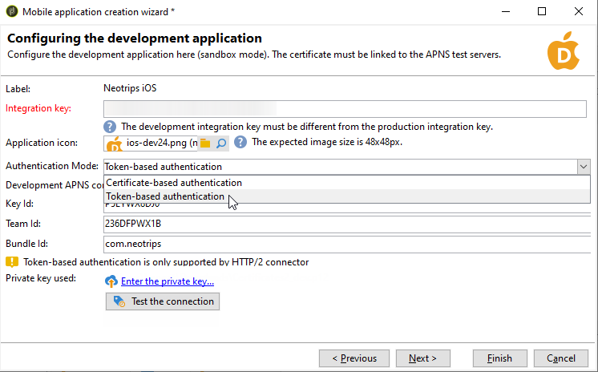

# iOS 配置步骤 {#configuring-the-mobile-application-in-adobe-campaign-ios}

安装包后，您可以在Adobe Campaign Classic中定义iOS应用程序设置。

关键步骤包括：

1. [配置iOS外部帐户](#configuring-external-account-ios)
1. [配置iOS服务](#configuring-ios-service)
1. [在Campaign中集成iOS移动应用程序](#creating-ios-app)

然后，您将能够 [为iOS设备创建推送通知](create-notifications-ios.md).

## 配置iOS外部帐户 {#configuring-external-account-ios}

对于iOS，iOS HTTP/2连接器会向HTTP/2 APN发送通知。

要配置此连接器，请执行以下步骤：

1. 转到 **[!UICONTROL Administration > Platform > External accounts]**.
1. 选择 **[!UICONTROL iOS routing]** 外部帐户。
1. 在 **[!UICONTROL Connector]** 选项卡，填写 **[!UICONTROL Access URL of the connector]** 字段，带有以下URL： ```http://localhost:8080/nms/jsp/iosHTTP2.jsp```

   

1. 单击 **[!UICONTROL Save]**。

您的iOS连接器现已配置完成。 您可以开始创建服务。

## 配置iOS服务 {#configuring-ios-service}

>[!CAUTION]
>
>在与AdobeSDK进行任何集成之前，必须已为“推送”操作配置应用程序。
>
>如果不是这种情况，请参阅 [此页面](https://developer.apple.com/documentation/usernotifications).

1. 转到 **[!UICONTROL Profiles and Targets > Services and subscriptions]** 节点并单击 **[!UICONTROL New]**.

   

1. 定义 **[!UICONTROL Label]** 和 **[!UICONTROL Internal name]**.
1. 转到 **[!UICONTROL Type]** 字段并选择 **[!UICONTROL Mobile application]**.

   >[!NOTE]
   >
   >默认 **[!UICONTROL Subscriber applications (nms:appSubscriptionRcp)]** 目标映射已链接到收件人表。 如果要使用其他目标映射，则需要创建一个新的目标映射，并在 **[!UICONTROL Target mapping]** 服务的字段。 有关创建目标映射的详细信息，请参阅 [配置指南](../../configuration/using/about-custom-recipient-table.md).

   

1. 然后单击 **[!UICONTROL Add]** 按钮选择应用程序类型。

   

1. 创建iOS开发和生产应用程序。 有关更多信息，请参阅此](configuring-the-mobile-application.md#creating-ios-app)章节[。

## 创建iOS移动应用程序 {#creating-ios-app}

创建服务后，在Campaign中创建您的iOS应用程序。 按照下面的步骤进行操作：

1. 在新创建的服务中，单击 **[!UICONTROL Add]** 按钮选择应用程序类型。

   

1. 出现以下窗口。 选择 **[!UICONTROL Create an iOS application]** 首先输入 **[!UICONTROL Label]**.

   

1. 作为一个选项，您可以使用一些来扩充推送消息内容 **[!UICONTROL Application variables]** 如果需要。 这些都是完全可自定义的，并且是发送到移动设备的消息有效负载的一部分。
在以下示例中，我们添加 **mediaURl** 和 **mediaExt** 以创建富推送通知，然后为应用程序提供要在通知中显示的图像。

   

1. 此 **[!UICONTROL Subscription parameters]** 选项卡允许您定义扩展为的映射 **[!UICONTROL Subscriber applications (nms:appsubscriptionRcp)]** 架构。

   >[!NOTE]
   >
   >请确保不要将相同的证书用于应用程序的开发版本（沙盒）和生产版本。

1. 此 **[!UICONTROL Sounds]** 选项卡允许您指定要播放的声音。 单击 **[!UICONTROL Add]** 和填充 **[!UICONTROL Internal name]** 字段，其中必须包含嵌入在应用程序中的文件的名称或系统声音的名称。

1. 单击 **[!UICONTROL Next]** 以开始配置开发应用程序。

1. 确保相同 **[!UICONTROL Integration key]** 在Adobe Campaign中以及通过SDK在应用程序代码中定义。 有关详细信息，请参见 [此页面](integrating-campaign-sdk-into-the-mobile-application.md). 此集成键特定于每个应用程序，允许您将移动应用程序链接到Adobe Campaign平台。

   >[!NOTE]
   >
   > 此 **[!UICONTROL Integration key]** 可使用字符串值完全自定义，但需要与SDK中指定的值完全相同。

1. 从以下图标中选择一个现成的图标： **[!UICONTROL Application icon]** 字段，用于将服务中的移动应用程序个性化。

1. 选择 **[!UICONTROL Authentication mode]**。请注意，您以后始终可以在 **[!UICONTROL Certificate]** 选项卡中。
   * **[!UICONTROL Certificate-based authentication]**：单击 **[!UICONTROL Enter the certificate...]**  然后选择您的p12密钥并输入由移动应用程序开发人员提供的密码。
   * **[!UICONTROL Token-based authentication]**：填写连接设置 **[!UICONTROL Key ID]**， **[!UICONTROL Team ID]** 和 **[!UICONTROL Bundle ID]** 然后，通过单击 **[!UICONTROL Enter the private key]**. 有关更多详细信息 **[!UICONTROL Token-based authentication]**，请参阅 [Apple文档](https://developer.apple.com/documentation/usernotifications/setting_up_a_remote_notification_server/establishing_a_token-based_connection_to_apns).

   >[!NOTE]
   >
   > Adobe建议使用 **[!UICONTROL Token-based authentication]** 用于iOS配置，因为此身份验证模式更安全，并且不会绑定到证书过期。

   

1. 您可以单击 **[!UICONTROL Test the connection]** 肯定是成功的。

1. 单击 **[!UICONTROL Next]** 以开始配置生产应用程序，并按照上面详述的相同步骤操作。

   

1. 单击 **[!UICONTROL Finish]**。

您的iOS应用程序现在已准备好用于Campaign Classic。
