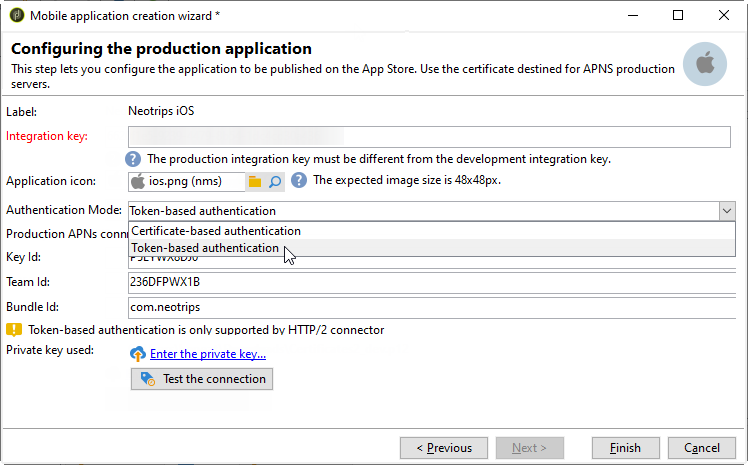

# iOS 配置步骤 {#configuring-the-mobile-application-in-adobe-campaign-ios}

安装包后，您可以在Adobe Campaign Classic定义iOS应用程序设置。

>[!NOTE]
>
>要了解如何配置Android应用程序以及如何创建Android投放，请参阅此 [部分](../../delivery/using/configuring-the-mobile-application-android.md)。

## 配置iOS外部帐户 {#configuring-external-account-ios}

对于iOS,iOS HTTP/2连接器会向HTTP/2 APN发送通知。

要配置此连接器，请执行以下步骤：

1. 转到 **[!UICONTROL Administration > Platform > External accounts]**。
1. Select the **[!UICONTROL iOS routing]** external account.
1. 在选 **[!UICONTROL Connector]** 项卡中，使用 **[!UICONTROL Access URL of the connector]** 以下URL填写字段： ```http://localhost:8080/nms/jsp/iosHTTP2.jsp```

   >[!NOTE]
   >
   > 从 Campaign 20.3 版本开始，弃用 iOS 旧版二进制连接器。如果您使用的是此连接器，则需要相应地调整实施。[了解详情](https://helpx.adobe.com/cn/campaign/kb/migrate-to-apns-http2.html)

   

1. 单击 **[!UICONTROL Save]**.

您的iOS连接器现已配置。 您可以开始创建服务。

## 配置iOS服务 {#configuring-ios-service}

>[!CAUTION]
>
>在与Adobe CampaignSDK进行任何集成之前，必须已为应用程序配置了推送操作。
>
>如果不是这种情况，请参 [阅本页](https://developer.apple.com/library/archive/documentation/NetworkingInternet/Conceptual/RemoteNotificationsPG/)。

1. 转到节 **[!UICONTROL Profiles and Targets > Services and subscriptions]** 点并单击 **[!UICONTROL New]**。

   

1. Define a **[!UICONTROL Label]** and an **[!UICONTROL Internal name]**.
1. 转到字段 **[!UICONTROL Type]** 并选择 **[!UICONTROL Mobile application]**。

   >[!NOTE]
   >
   >默认 **[!UICONTROL Subscriber applications (nms:appSubscriptionRcp)]** 目标映射链接到收件人表。 如果要使用其他目标映射，您需要创建新目标映射并在服务 **[!UICONTROL Target mapping]** 字段中输入它。 有关创建目标映射的详细信息，请参阅 [配置指南](../../configuration/using/about-custom-recipient-table.md)。

   

1. 然后，单击 **[!UICONTROL Add]** 按钮以选择应用程序类型。

   

1. 创建iOS开发和生产应用程序。 有关更多信息，请参阅此](../../delivery/using/configuring-the-mobile-application.md#creating-ios-app)章节[。

## 创建iOS移动应用程序 {#creating-ios-app}

创建服务后，您现在需要创建iOS应用程序：

1. 在新创建的服务中，单击 **[!UICONTROL Add]** 按钮以选择应用程序类型。

   

1. 出现以下窗口。 通过 **[!UICONTROL Create an iOS application]** 输入选择和开始 **[!UICONTROL Label]**。

   

1. 作为一种选项，您可以根据需要添加一些内容来丰富 **[!UICONTROL Application variables]** 推送消息内容。 这些是完全可自定义的，并且是发送到移动设备的消息有效负荷的一部分。
在以下示例中，我 **们添加mediaURl****** 和mediaExt以创建富推送通知，然后为应用程序提供要在通知中显示的图像。

   

1. 选 **[!UICONTROL Subscription parameters]** 项卡允许您定义具有模式扩展名的映 **[!UICONTROL Subscriber applications (nms:appsubscriptionRcp)]** 射。

   >[!NOTE]
   >
   >请确保对应用程序的开发版本（沙箱）和生产版本不使用同一证书。

1. 该选 **[!UICONTROL Sounds]** 项卡允许您指定要播放的声音。 单 **[!UICONTROL Add]** 击并填 **[!UICONTROL Internal name]** 充字段，该字段必须包含应用程序中嵌入的文件名称或系统声音的名称。

1. 单击 **[!UICONTROL Next]** 以开始配置开发应用程序。

1. 确保通过SDK **[!UICONTROL Integration key]** 在Adobe Campaign和应用程序代码中定义相同的内容。 有关此内容的详细信息，请参阅： [将活动SDK集成到移动应用程序中](../../delivery/using/integrating-campaign-sdk-into-the-mobile-application.md)。 此集成密钥是每个应用程序特有的，它允许您将移动应用程序链接到Adobe Campaign平台。

   >[!NOTE]
   >
   > 它 **[!UICONTROL Integration key]** 可以使用字符串值完全自定义，但必须与SDK中指定的值完全相同。

1. 从字段中选择一个现成的图标，在您的服 **[!UICONTROL Application icon]** 务中个性化移动应用程序。

1. 选择 **[!UICONTROL Authentication mode]**。请注意，以后您始终可以在移动应用程序的选项卡 **[!UICONTROL Certificate]** 中更改身份验证模式。
   * **[!UICONTROL Certificate-based authentication]**:单 **[!UICONTROL Enter the certificate...]** 击，然后选择p12键并输入由移动应用程序开发人员提供的口令。
   * **[!UICONTROL Token-based authentication]**:填写连接设 **[!UICONTROL Key ID]**&#x200B;置， **[!UICONTROL Team ID]** 然后 **[!UICONTROL Bundle ID]** 单击选择p8证书 **[!UICONTROL Enter the private key]**。 For more on **[!UICONTROL Token-based authentication]**, refer to [Apple documentation](https://developer.apple.com/documentation/usernotifications/setting_up_a_remote_notification_server/establishing_a_token-based_connection_to_apns).

   >[!NOTE]
   >
   > Adobe建议 **[!UICONTROL Token-based authentication]** 使用iOS配置，因为此身份验证模式更加安全，并且不绑定到证书过期。

   

1. 您可以单 **[!UICONTROL Test the connection]** 击以确保它成功。

1. 单击 **[!UICONTROL Next]** 以开始配置生产应用程序，然后按照上述步骤操作。

   

1. 单击 **[!UICONTROL Finish]**.

您的iOS应用程序现已准备好用于Campaign Classic。

## 创建iOS富通知 {#creating-ios-delivery}

在iOS 10或更高版本中，可以生成丰富通知。 Adobe Campaign可以使用允许设备显示丰富通知的变量发送通知。

您现在需要创建一个新投放并将其链接到您创建的移动应用程序。

1. 转到 **[!UICONTROL Campaign management]** > **[!UICONTROL Deliveries]**。

1. 单击 **[!UICONTROL New]**.

   

1. 在 **[!UICONTROL Deliver on iOS (ios)]** 下拉 **[!UICONTROL Delivery template]** 框中选择。 添加 **[!UICONTROL Label]** 投放。

1. 单击 **[!UICONTROL To]** 以定义要目标的人口。 默认情况下， **[!UICONTROL Subscriber application]** 应用目标映射。 单击 **[!UICONTROL Add]** 以选择之前创建的服务。

   

1. 在窗口 **[!UICONTROL Target type]** 中，选择 **[!UICONTROL Subscribers of an iOS mobile application (iPhone, iPad)]** 并单击 **[!UICONTROL Next]**。

1. 在下 **[!UICONTROL Service]** 拉框中，选择您之前创建的服务，然后选择您要目标的应用程序并单击 **[!UICONTROL Finish]**。
根据 **[!UICONTROL Application variables]** 在配置步骤中添加的内容，系统会自动添加。

   

1. 编辑您的丰富通知。

   

1. 选中编 **[!UICONTROL Mutable content]** 辑通知窗口中的复选框，以允许移动应用程序下载媒体内容。

1. 单击 **[!UICONTROL Save]** 并发送投放。

当在用户的移动iOS设备上收到图像和网页时，应在推送通知中显示。


