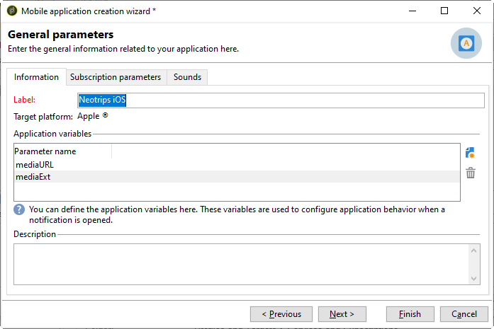

# 在 Adobe Campaign 中配置移动应用程序 {#configuring-the-mobile-application-in-adobe-campaign}

您可以根据销售在线假日套餐的公司找到以下配置示例。 他的移动应用程序(Neotrips)有两种版本可供客户使用：适用于Android的Neotrips和适用于iOS的Neotrips。 要在Adobe Campaign中配置移动应用程序，您需要：

* 为Neotrips移 **[!UICONTROL Mobile application]** 动应用程序创建类型信息服务。
* 将应用程序的iOS和Android版本添加到此服务。
* 为iOS和Android创建投放。

>[!NOTE]
>
>转到服务 **[!UICONTROL Subscriptions]** 的选项卡，以视图订阅者对服务的列表，即在其移动设备上安装应用程序并同意接收通知的所有用户。

## 使用iOS配置移动应用程序 {#configuring-the-mobile-application-ios}

>[!CAUTION]
>
>在与Adobe CampaignSDK进行任何集成之前，必须已为应用程序配置了推送操作。
>
>如果不是这种情况，请参 [阅本页](https://developer.apple.com/library/archive/documentation/NetworkingInternet/Conceptual/RemoteNotificationsPG/)。

### 第1步：安装包 {#installing-package-ios}

1. 从导入向导客户端控制台 **[!UICONTROL Tools > Advanced > Package import...]** 中访问包Adobe Campaign。

   

1. 选择 **[!UICONTROL Install a standard package]**。

1. 在显示的列表中，选中 **[!UICONTROL Mobile App Channel]**。

   

1. 单 **[!UICONTROL Next]**&#x200B;击，然 **[!UICONTROL Start]** 后开始包安装。

   安装包后，进度栏显示 **100%** ，您可以在安装日志中看到以下消息： **[!UICONTROL Installation of packages successful]**.

   

1. **[!UICONTROL Close]** 安装窗口。

### 第2步：配置iOS外部帐户 {#configuring-external-account-ios}

对于iOS，有两个连接器可用：

* iOS二进制连接器在传统二进制APNS服务器上发送通知。
* iOS HTTP/2连接器向HTTP/2 APNS发送通知。

要选择要使用的连接器，请执行以下步骤：

1. 转到 **[!UICONTROL Administration > Platform > External accounts]**。
1. Select the **[!UICONTROL iOS routing]** external account.
1. 在选项卡 **[!UICONTROL Connector]** 中，填写以下字 **[!UICONTROL Access URL of the connector]** 段：

   对于iOS HTTP2:http://localhost:8080/nms/jsp/iosHTTP2.jsp

   

   >[!NOTE]
   >
   > 您也可以按照以下方式配置它：https://localhost:8080/nms/jsp/ios.jsp，但我们建议您使用连接器的版本2。

1. 单击 **[!UICONTROL Save]**.

您的iOS连接器现已配置。 您可以开始创建服务。

### 第3步：配置iOS服务 {#configuring-ios-service}

1. 转到节 **[!UICONTROL Profiles and Targets > Services and subscriptions]** 点并单击 **[!UICONTROL New]**。

   

1. Define a **[!UICONTROL Label]** and an **[!UICONTROL Internal name]**.
1. 转到字段 **[!UICONTROL Type]** 并选择 **[!UICONTROL Mobile application]**。

   >[!NOTE]
   >
   >默认 **[!UICONTROL Subscriber applications (nms:appSubscriptionRcp)]** 目标映射链接到收件人表。 如果要使用其他目标映射，您需要创建新目标映射并在服务 **[!UICONTROL Target mapping]** 字段中输入它。 有关创建目标映射的详细信息，请参阅 [配置指南](../../configuration/using/about-custom-recipient-table.md)。

   

1. 然后，单击 **[!UICONTROL Add]** 按钮以选择应用程序类型。

   

1. 出现以下窗口。 通过 **[!UICONTROL Create an iOS application]** 输入选择和开始 **[!UICONTROL Label]**。

   

1. 作为一种选项，您可以根据需要添加一些内容来丰富 **[!UICONTROL Application variables]** 推送消息内容。 这些是完全可自定义的，并且是发送到移动设备的消息有效负荷的一部分。
在以下示例中，我 **们添加mediaURl****** 和mediaExt以创建富推送通知，然后为应用程序提供要在通知中显示的图像。

   

1. 选 **[!UICONTROL Subscription parameters]** 项卡允许您定义具有模式扩展名的映 **[!UICONTROL Subscriber applications (nms:appsubscriptionRcp)]** 射。

   >[!NOTE]
   >
   >请确保对应用程序的开发版本（沙箱）和生产版本不使用同一证书。

1. 该选 **[!UICONTROL Sounds]** 项卡允许您指定要播放的声音。 单 **[!UICONTROL Add]** 击并填 **[!UICONTROL Internal name]** 充字段，该字段必须包含应用程序中嵌入的文件名称或系统声音的名称。

1. 单击 **[!UICONTROL Next]** 以开始配置开发应用程序。

1. 确保通过SDK **[!UICONTROL Integration key]** 在Adobe Campaign和应用程序代码中定义相同的内容。 有关此内容的详细信息，请参阅： [将活动SDK集成到移动应用程序中](../../delivery/using/integrating-campaign-sdk-into-the-mobile-application.md)。 此集成密钥是每个应用程序特有的，它允许您将移动应用程序链接到Adobe Campaign平台。

   >[!NOTE]
   >
   > 它 **[!UICONTROL Integration key]** 可以使用字符串值完全自定义，但必须与SDK中指定的值完全相同。

1. 从字段中选择一个现成的图标，在您的服务中 **[!UICONTROL Application icon]** 个性化移动应用程序。

1. 单击链 **[!UICONTROL Enter the certificate...]** 接，然后选择身份验证证书并输入由移动应用程序开发人员提供的密码。 您可以单 **[!UICONTROL Test the connection]** 击以确保它成功。

   >[!NOTE]
   >
   >Apple要求同一移动应用程序的开发和生产版本有不同的证书。 您需要在Adobe Campaign中配置两个单独的应用程序。

   

1. 单击 **[!UICONTROL Next]** 以开始配置生产应用程序，然后按照上述步骤操作。

   

1. 单击 **[!UICONTROL Finish]**。您的iOS应用程序现已准备好用于Campaign Classic。

### 第4步：创建iOS富通知 {#creating-ios-delivery}

在iOS 10或更高版本中，可以生成丰富通知。 Adobe Campaign可以使用允许设备显示丰富通知的变量发送通知。

您现在需要创建一个新投放并将其链接到您创建的移动应用程序。

1. 转到 **[!UICONTROL Campaign management]** > **[!UICONTROL Deliveries]**。

1. 单击 **[!UICONTROL New]**.

   

1. 在 **[!UICONTROL Deliver on iOS (ios)]** 下拉 **[!UICONTROL Delivery template]** 框中选择。 添加 **[!UICONTROL Label]** 投放。

1. 单击 **[!UICONTROL To]** 以定义要目标的人口。 默认情况下， **[!UICONTROL Subscriber application]** 应用目标映射。 单击 **[!UICONTROL Add]** 以选择之前创建的服务。

   

1. 在窗口 **[!UICONTROL Target type]** 中，选择 **[!UICONTROL Subscribers of an iOS mobile application (iPhone, iPad)]** 并单击 **[!UICONTROL Next]**。

1. 在下 **[!UICONTROL Service]** 拉框中，选择您之前创建的服务，然后选择您要目标的应用程序并单击 **[!UICONTROL Finish]**。
根据 **[!UICONTROL Application variables]** 在配置步骤中添加的内容，系统会自动添加。

   

1. 编辑您的丰富通知。

   

1. 选中编 **[!UICONTROL Mutable content]** 辑通知窗口中的复选框，以允许移动应用程序下载媒体内容。

1. 单击 **[!UICONTROL Save]** 并发送投放。

当在用户的移动iOS设备上收到图像和网页时，应在推送通知中显示。

## 使用Android配置移动应用程序 {#configuring-the-mobile-application-android}

### 第1步：安装包 {#installing-package-android}

1. 从导入向导客户端控制台 **[!UICONTROL Tools > Advanced > Package import...]** 中访问包Adobe Campaign。

   

1. 选择 **[!UICONTROL Install a standard package]**。

1. 在显示的列表中，选中 **[!UICONTROL Mobile App Channel]**。

   

1. 单 **[!UICONTROL Next]**&#x200B;击，然 **[!UICONTROL Start]** 后开始包安装。

   安装包后，进度栏显示 **100%** ，您可以在安装日志中看到以下消息： **[!UICONTROL Installation of packages successful]**.

   

1. **[!UICONTROL Close]** 安装窗口。

### 第2步：配置Android外部帐户 {#configuring-external-account-android}

对于Android，有两个连接器可用：

* V1连接器，允许每个MTA子项连接一个。
* V2连接器允许与FCM服务器同时连接以提高吞吐量。

要选择要使用的连接器，请执行以下步骤：

1. 转到 **[!UICONTROL Administration > Platform > External accounts]**。
1. Select the **[!UICONTROL Android routing]** external account.
1. 在选项卡 **[!UICONTROL Connector]** 中，填写以下字 **[!UICONTROL JavaScript used in the connector]** 段：

   对于Android V2:https://localhost:8080/nms/jsp/androidPushConnectorV2.js

   >[!NOTE]
   >
   > 您也可以按照以下方式配置它：https://localhost:8080/nms/jsp/androidPushConnector.js，但我们建议您使用连接器的版本2。

   

1. 对于Android V2,Adobe服务器配置文件(serverConf.xml)中还提供一个附加参数：

   * **maxGCMConnectPerChild**:每个子服务器启动的对FCM的并行HTTP请求的最大限制（默认为8）。

### 第3步：配置Android服务 {#configuring-android-service}

1. 转到节 **[!UICONTROL Profiles and Targets > Services and subscriptions]** 点并单击 **[!UICONTROL New]**。

   

1. Define a **[!UICONTROL Label]** and an **[!UICONTROL Internal name]**.
1. 转到字段 **[!UICONTROL Type]** 并选择 **[!UICONTROL Mobile application]**。

   >[!NOTE]
   >
   >默认 **[!UICONTROL Subscriber applications (nms:appSubscriptionRcp)]** 目标映射链接到收件人表。 如果要使用其他目标映射，您需要创建新目标映射并在服务 **[!UICONTROL Target mapping]** 字段中输入它。 有关创建目标映射的详细信息，请参阅 [配置指南](../../configuration/using/about-custom-recipient-table.md)。

   

1. 然后，单击 **[!UICONTROL Add]** 按钮以选择应用程序类型。

   

1. 选择 **[!UICONTROL Create an Android application]**。

   

1. 输入 **[!UICONTROL Label]**。

1. 确保通过SDK **[!UICONTROL Integration key]** 在Adobe Campaign和应用程序代码中定义相同的内容。 有关此内容的详细信息，请参阅： [将活动SDK集成到移动应用程序中](../../delivery/using/integrating-campaign-sdk-into-the-mobile-application.md)。

   >[!NOTE]
   >
   > 它 **[!UICONTROL Integration key]** 可以使用字符串值完全自定义，但必须与SDK中指定的值完全相同。

1. 从字段中选择一个现成的图标，在您的服务中 **[!UICONTROL Application icon]** 个性化移动应用程序。

1. 输入应用程序的连接设置：输入由移动应用程序开发人员提供的项目密钥。

1. 作为一种选项，您可以根据需要添加一些内容来丰富 **[!UICONTROL Application variables]** 推送消息内容。 这些是完全可自定义的，并且是发送到移动设备的消息有效负荷的一部分。

   在以下示例中，我们添 **加标题**、 **imageURL** 和 **** iconURL以创建富推送通知，然后为应用程序提供要在通知中显示的图像、标题和图标。

   

1. 单击 **[!UICONTROL Finish]**，然后单击 **[!UICONTROL Save]**。您的Android应用程序现已准备好用于Campaign Classic。

默认情况下，Adobe Campaign在表的( **[!UICONTROL User identifier]** @userKey)字段中保存一 **[!UICONTROL Subscriber applications (nms:appSubscriptionRcp)]** 个键。 此键允许您将订阅链接到收件人。 要收集其他合并关键项（如复杂数据），您需要应用以下配置：

1. 创建模式的扩 **[!UICONTROL Subscriber applications (nms:appsubscriptionRcp)]** 展并定义新字段。
1. 在选项卡中定义 **[!UICONTROL Subscription parameters]** 映射。
   >[!CAUTION]
   >
   >确保选项卡中的配 **[!UICONTROL Subscription parameters]** 置名称与手机应用程序代码中的配置名称相同。 请参阅将 [活动SDK集成到移动应用程序部](../../delivery/using/integrating-campaign-sdk-into-the-mobile-application.md) 分。

### 第4步：创建Android富通知 {#creating-android-delivery}

您现在需要创建一个新投放并将其链接到您创建的移动应用程序。

1. 转到 **[!UICONTROL Campaign management]** > **[!UICONTROL Deliveries]**。

1. 单击 **[!UICONTROL New]**.

   

1. 在 **[!UICONTROL Deliver on Android (android)]** 下拉 **[!UICONTROL Delivery template]** 框中选择。 添加 **[!UICONTROL Label]** 投放。

1. 单击 **[!UICONTROL To]** 以定义要目标的人口。 默认情况下， **[!UICONTROL Subscriber application]** 应用目标映射。 单击 **[!UICONTROL Add]** 以选择之前创建的服务。

   

1. 在窗口 **[!UICONTROL Target type]** 中，选择Android移动应用程序的订阅者并单击 **[!UICONTROL Next]**。

1. 在下拉 **[!UICONTROL Service]** 列表中，选择您之前创建的服务，然后选择应用程序并单击 **[!UICONTROL Finish]**。
根据 **[!UICONTROL Application variables]** 在配置步骤中添加的内容，系统会自动添加。

   

1. 编辑您的丰富通知。

   

1. 单击 **[!UICONTROL Save]** 并发送投放。

当在用户的移动Android设备上收到图像和网页时，应在推送通知中显示。

