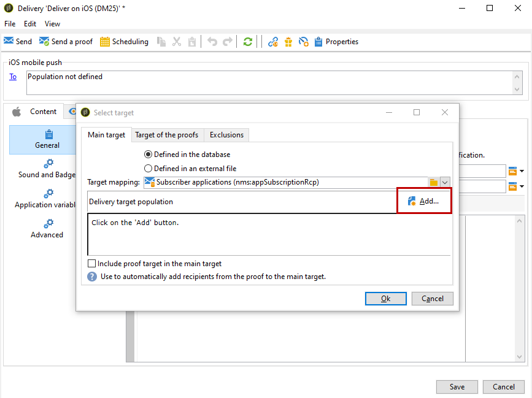

# iOS 配置步骤 {#configuring-the-mobile-application-in-adobe-campaign-ios}

安装包后，您可以在Adobe Campaign Classic中定义iOS应用程序设置。

>[!NOTE]
>
>要了解如何配置Android应用程序以及如何创建Android投放，请参阅此[部分](../../delivery/using/configuring-the-mobile-application-android.md)。

## 配置iOS外部帐户{#configuring-external-account-ios}

对于iOS，iOS HTTP/2连接器会向HTTP/2 APN发送通知。

要配置此连接器，请执行以下步骤：

1. 转到&#x200B;**[!UICONTROL Administration > Platform > External accounts]**。
1. 选择&#x200B;**[!UICONTROL iOS routing]**&#x200B;外部帐户。
1. 在&#x200B;**[!UICONTROL Connector]**&#x200B;选项卡中，使用以下URL填写&#x200B;**[!UICONTROL Access URL of the connector]**&#x200B;字段：```http://localhost:8080/nms/jsp/iosHTTP2.jsp```

   

1. 单击 **[!UICONTROL Save]**.

您的iOS连接器现已配置。 您可以开始创建服务。

## 配置iOS服务{#configuring-ios-service}

>[!CAUTION]
>
>在与Adobe Campaign SDK进行任何集成之前，必须已为应用程序配置了推送操作。
>
>如果不是这样，请参阅[此页](https://developer.apple.com/documentation/usernotifications)。

1. 转到&#x200B;**[!UICONTROL Profiles and Targets > Services and subscriptions]**&#x200B;节点并单击&#x200B;**[!UICONTROL New]**。

   

1. 定义&#x200B;**[!UICONTROL Label]**&#x200B;和&#x200B;**[!UICONTROL Internal name]**。
1. 转到&#x200B;**[!UICONTROL Type]**&#x200B;字段并选择&#x200B;**[!UICONTROL Mobile application]**。

   >[!NOTE]
   >
   >默认&#x200B;**[!UICONTROL Subscriber applications (nms:appSubscriptionRcp)]**&#x200B;目标映射链接到收件人表。 如果要使用其他目标映射，则需要创建新目标映射，并在服务的&#x200B;**[!UICONTROL Target mapping]**&#x200B;字段中输入它。 有关创建目标映射的详细信息，请参阅[配置指南](../../configuration/using/about-custom-recipient-table.md)。

   

1. 然后单击&#x200B;**[!UICONTROL Add]**&#x200B;按钮以选择应用程序类型。

   

1. 创建iOS开发和生产应用程序。 有关更多信息，请参阅此](../../delivery/using/configuring-the-mobile-application.md#creating-ios-app)章节[。

## 创建iOS移动应用程序{#creating-ios-app}

创建服务后，您现在需要创建iOS应用程序：

1. 在新创建的服务中，单击&#x200B;**[!UICONTROL Add]**&#x200B;按钮以选择应用程序类型。

   

1. 出现以下窗口。 输入&#x200B;**[!UICONTROL Label]**，选择&#x200B;**[!UICONTROL Create an iOS application]**&#x200B;和开始。

   

1. 作为一种选项，您可以根据需要使用某些&#x200B;**[!UICONTROL Application variables]**来丰富推送消息内容。 这些是完全可自定义的，并且是发送到移动设备的消息有效负荷的一部分。
在以下示例中，我们添加**mediaURl**&#x200B;和&#x200B;**mediaExt**&#x200B;以创建富推送通知，然后向应用程序提供要在通知中显示的图像。

   

1. **[!UICONTROL Subscription parameters]**&#x200B;选项卡允许您定义扩展为&#x200B;**[!UICONTROL Subscriber applications (nms:appsubscriptionRcp)]**&#x200B;模式的映射。

   >[!NOTE]
   >
   >请确保对应用程序的开发版本（沙箱）和生产版本不使用相同的证书。

1. **[!UICONTROL Sounds]**&#x200B;选项卡允许您指定要播放的声音。 单击&#x200B;**[!UICONTROL Add]**&#x200B;并填写&#x200B;**[!UICONTROL Internal name]**&#x200B;字段，该字段必须包含嵌入应用程序中的文件名称或系统声音的名称。

1. 单击&#x200B;**[!UICONTROL Next]**&#x200B;以开始配置开发应用程序。

1. 确保通过SDK在Adobe Campaign和应用程序代码中定义相同的&#x200B;**[!UICONTROL Integration key]**。 有关详细信息，请参阅：[将活动 SDK集成到移动应用程序](../../delivery/using/integrating-campaign-sdk-into-the-mobile-application.md)中。 此集成密钥特定于每个应用程序，允许您将移动应用程序链接到Adobe Campaign平台。

   >[!NOTE]
   >
   > **[!UICONTROL Integration key]**&#x200B;可完全自定义字符串值，但必须与SDK中指定的值完全相同。

1. 从&#x200B;**[!UICONTROL Application icon]**&#x200B;字段中选择现成的图标之一，以个性化服务中的移动应用程序。

1. 选择 **[!UICONTROL Authentication mode]**。请注意，以后您始终可以在移动应用程序的&#x200B;**[!UICONTROL Certificate]**&#x200B;选项卡中更改身份验证模式。
   * **[!UICONTROL Certificate-based authentication]**:单 **[!UICONTROL Enter the certificate...]**  击，然后选择p12键并输入由移动应用程序开发人员提供的密码。
   * **[!UICONTROL Token-based authentication]**:填写连接设置， **[!UICONTROL Key ID]**&#x200B;然 **[!UICONTROL Team ID]** 后 **[!UICONTROL Bundle ID]** 单击选择您的p8证书 **[!UICONTROL Enter the private key]**。有关&#x200B;**[!UICONTROL Token-based authentication]**&#x200B;的详细信息，请参阅[Apple文档](https://developer.apple.com/documentation/usernotifications/setting_up_a_remote_notification_server/establishing_a_token-based_connection_to_apns)。

   >[!NOTE]
   >
   > Adobe建议对iOS配置使用&#x200B;**[!UICONTROL Token-based authentication]**，因为此身份验证模式更加安全，并且不绑定到证书过期。

   

1. 可单击&#x200B;**[!UICONTROL Test the connection]**&#x200B;以确保成功。

1. 单击&#x200B;**[!UICONTROL Next]**&#x200B;以开始配置生产应用程序，并按照上述步骤操作。

   

1. 单击 **[!UICONTROL Finish]**.

您的iOS应用程序现已准备好用于Campaign Classic。

## 创建iOS富通知{#creating-ios-delivery}

在iOS 10或更高版本中，可以生成富通知。 Adobe Campaign可以使用允许设备显示丰富通知的变量发送通知。

您现在需要创建一个新投放并将其链接到您创建的移动应用程序。

1. 转到&#x200B;**[!UICONTROL Campaign management]** > **[!UICONTROL Deliveries]**。

1. 单击 **[!UICONTROL New]**.

   

1. 在&#x200B;**[!UICONTROL Delivery template]**&#x200B;下拉列表中选择&#x200B;**[!UICONTROL Deliver on iOS (ios)]**。 将&#x200B;**[!UICONTROL Label]**&#x200B;添加到投放。

1. 单击&#x200B;**[!UICONTROL To]**&#x200B;定义要目标的人口。 默认情况下，应用&#x200B;**[!UICONTROL Subscriber application]**&#x200B;目标映射。 单击&#x200B;**[!UICONTROL Add]**&#x200B;以选择之前创建的服务。

   

1. 在&#x200B;**[!UICONTROL Target type]**&#x200B;窗口中，选择&#x200B;**[!UICONTROL Subscribers of an iOS mobile application (iPhone, iPad)]**&#x200B;并单击&#x200B;**[!UICONTROL Next]**。

1. 在&#x200B;**[!UICONTROL Service]**&#x200B;下拉列表中，选择您之前创建的服务，然后选择要目标的应用程序，然后单击&#x200B;**[!UICONTROL Finish]**。
根据在配置步骤中添加的内容，会自动添加**[!UICONTROL Application variables]**。

   

1. 编辑您的富通知。

   

1. 选中编辑通知窗口中的&#x200B;**[!UICONTROL Mutable content]**&#x200B;框，允许移动应用程序下载媒体内容。

1. 单击&#x200B;**[!UICONTROL Save]**&#x200B;并发送投放。

当在用户的移动iOS设备上收到图像和网页时，应在推送通知中显示。


