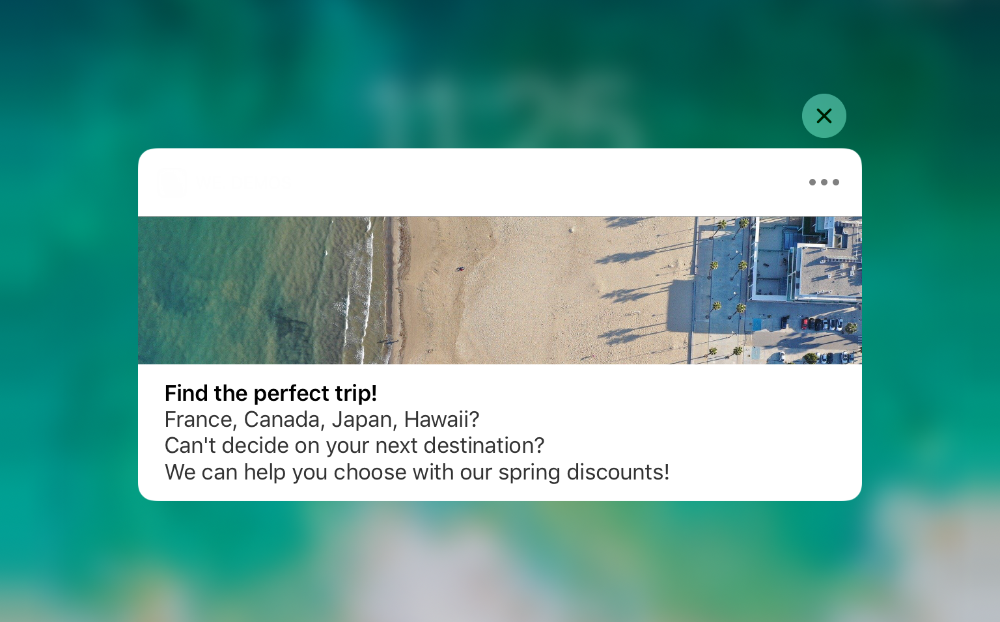

# 创建iOS通知{#create-notifications-ios}

本节详细介绍特定于iOS通知交付的元素。 有关投放创建的全局概念，请参阅 [此部分](steps-about-delivery-creation-steps.md).

首先创建新投放。

要为iOS设备创建推送通知，请执行以下步骤：

1. 选择 **[!UICONTROL Deliver on iOS]** 投放模板。

   

1. 要定义通知的目标，请单击 **[!UICONTROL To]** 链接，然后单击 **[!UICONTROL Add]**.

   

   >[!NOTE]
   >
   >选择投放的目标群体时的详细过程，请参见 [此部分](steps-defining-the-target-population.md).
   >
   >有关使用个性化字段的更多信息，请参阅 [此部分](about-personalization.md).
   >
   >欲知关于种子清单的详情，请参阅 [关于种子地址](about-seed-addresses.md).

1. 选择 **[!UICONTROL Subscribers of an iOS mobile application (iPhone, iPad)]**，选择与移动应用程序相关的服务（在本例中为Neotrips），然后选择应用程序的iOS版本。

   

1. 选择通知类型： **[!UICONTROL Alert]**, **[!UICONTROL Badge]**&#x200B;或 **[!UICONTROL Alert and badge]** 或 **[!UICONTROL Silent Push]**.

   

   >[!NOTE]
   >
   >的 **静默推送** 模式允许向移动应用程序发送“静默”通知。 用户未知晓通知的到达。 它将直接转给应用程序。

1. 在 **[!UICONTROL Title]** 字段，输入要在通知中显示的标题标签。 它将仅显示在通知中心提供的通知列表中。 利用此字段，可定义 **标题** iOS通知有效负载的参数。

1. 如果使用HTTP/2连接器，则可以添加子标题( **字幕** iOS通知有效负载的参数)。 请参阅 [此部分](configuring-the-mobile-application.md).

1. 然后，输入 **[!UICONTROL Message]** 和 **[!UICONTROL Value of the badge]** 基于所选通知类型。

   

   >[!NOTE]
   >
   >**[!UICONTROL Badge]** 和 **[!UICONTROL Alert and badge]** 类型通知允许您修改徽章的值（移动设备应用程序徽标上方的数字）。 要刷新标记，您只需输入0作为值。 如果字段为空，则标记值不会更改。

1. 单击 **[!UICONTROL Insert emoticon]** 图标将表情符号插入推送通知。 要自定义表情符号列表，请参阅 [此部分](customizing-emoticon-list.md)

1. 的 **[!UICONTROL Action button]** 用于为警报通知中显示的操作按钮定义标签(**action_loc_key** 字段)。 如果您的iOS应用程序管理可本地化的字符串(**Localizable.strings**)，则在此字段中输入相应的键。 如果您的应用程序不管理可本地化的文本，请输入要在操作按钮上显示的标签。 有关可本地化字符串的更多信息，请参阅 [Apple文档](https://developer.apple.com/library/archive/documentation/NetworkingInternet/Conceptual/RemoteNotificationsPG/CreatingtheNotificationPayload.html#//apple_ref/doc/uid/TP40008194-CH10-SW1) .
1. 在 **[!UICONTROL Play a sound]** 字段中，选择要在收到通知时由移动终端播放的声音。

   >[!NOTE]
   >
   >必须在应用程序中包含声音，并在创建服务时定义声音。 请参阅[此小节](configuring-the-mobile-application.md#configuring-external-account-ios)。

1. 在 **[!UICONTROL Application variables]** 字段，输入每个变量的值。 应用程序变量允许您定义通知行为：例如，您可以配置在用户激活通知时显示的特定应用程序屏幕。

   >[!NOTE]
   >
   >应用程序变量必须在移动应用程序的代码中定义，并在服务创建期间输入。 如需详细信息，请参阅[此部分](configuring-the-mobile-application.md)。

1. 配置通知后，单击 **[!UICONTROL Preview]** 选项卡来预览通知。

   

   >[!NOTE]
   >
   >未在Adobe Campaign中定义通知样式（横幅或警报）。 这取决于用户在其iOS设置中选择的配置。 但是，Adobe Campaign允许您预览每种类型的通知样式。 单击右下方的箭头，从一种样式切换到另一种样式。
   >
   >预览使用iOS 10的外观。

要发送校样并发送最终投放，请使用与电子邮件投放相同的流程。

发送消息后，您可以监控和跟踪投放内容。 有关更多信息，请参阅一下章节。

* [推送通知隔离](understanding-quarantine-management.md#push-notification-quarantines)
* [监测投放](about-delivery-monitoring.md)
* [了解投放失败](understanding-delivery-failures.md)

## 创建iOS富通知 {#creating-ios-delivery}

使用iOS 10或更高版本，可以生成富通知。 Adobe Campaign可以使用允许设备显示丰富通知的变量发送通知。

现在，您需要创建新投放并将其链接到您创建的移动应用程序。

1. 转到 **[!UICONTROL Campaign management]** > **[!UICONTROL Deliveries]**.

1. 单击 **[!UICONTROL New]**。

   

1. 选择 **[!UICONTROL Deliver on iOS (ios)]** 在 **[!UICONTROL Delivery template]** 下拉菜单。 添加 **[!UICONTROL Label]** 投放。

1. 单击 **[!UICONTROL To]** 定义要定位的群体。 默认情况下， **[!UICONTROL Subscriber application]** 目标映射。 单击 **[!UICONTROL Add]** 来选择我们之前创建的服务。

   

1. 在 **[!UICONTROL Target type]** 窗口，选择 **[!UICONTROL Subscribers of an iOS mobile application (iPhone, iPad)]** 单击 **[!UICONTROL Next]**.

1. 在 **[!UICONTROL Service]** 下拉列表，选择您之前创建的服务，然后选择要定位的应用程序并单击 **[!UICONTROL Finish]**.
的 **[!UICONTROL Application variables]** 将根据在配置步骤中添加的内容自动添加。

   

1. 编辑您的富通知。

   

1. 检查 **[!UICONTROL Mutable content]** 框，以允许移动设备应用程序下载媒体内容。

1. 单击 **[!UICONTROL Save]** 并发送投放内容。

当在订阅者的移动iOS设备上收到图像和网页时，应在推送通知中显示。

