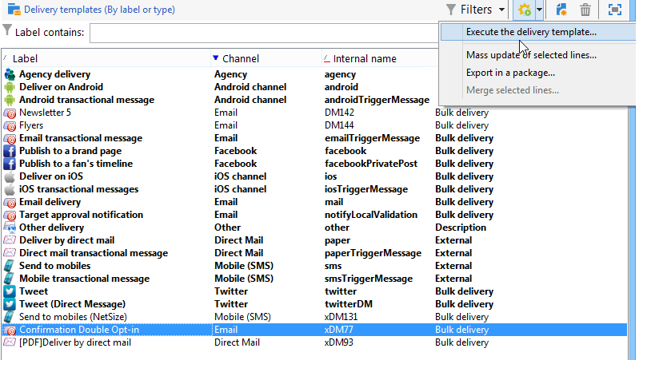

# 从模板创建投放{#creating-a-delivery-from-a-template}

## 将模板链接到投放 {#linking-the-template-to-a-delivery}

要基于现有模板创建投放，请从可用投放模板的列表中选择模板。

否则，请单 **[!UICONTROL Select link]** 击字段右侧的文件夹以浏览树。

从字段中选择所 **[!UICONTROL Folder]** 需的目录，或单 **[!UICONTROL Display sub-levels]** 击图标以显示当前目录子树中目录的内容。

选择要使用的投放模板，然后单击 **[!UICONTROL Ok]**。

## 执行模板 {#executing-the-template}

您可以直接从模板列表启动模板的执行，而无需先创建投放。 为此，请选择要执行的模板并右键单击。 选择 **[!UICONTROL Actions>Execute the delivery template...]**。

您还可以使用 **[!UICONTROL File>Actions>Execute the delivery template...]**。

输入投放参数，然后单击 **[!UICONTROL Send]**。

此操作会在附加到模板的文件夹中生成投放。 此投放的名称是从中创建该投放模板的名称。

>[!NOTE]
>
>有关配置投放的更多信息，请参 [阅定义电子邮件内容](../../delivery/using/defining-the-email-content.md)。
