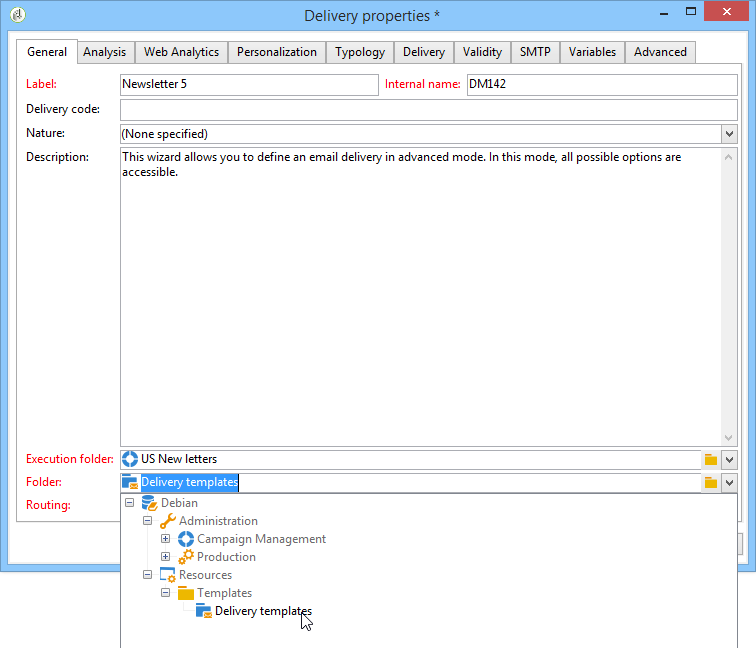

# 创建投放模板{#creating-a-delivery-template}

 [在视频中发现此功能](#delivery-template-video)

## 将现有投放转换为模板 {#converting-an-existing-delivery-to-a-template}

可以将投放转换为模板，以便执行新的重复投放操作。 要将投放转换为模板，请从投放列表中选择它，可通过 **[!UICONTROL Campaign management]** 树的节点。

右键单击并选择 **[!UICONTROL Actions > Save as template...]**.

此操作将从选定的投放创建投放模板。 您必须输入保存该文件夹的文件夹(在 **[!UICONTROL Folder]** 字段)以及创建基于此模板创建投放的文件夹(在 **[!UICONTROL Execution folder]** 字段。

有关配置模式的详细信息，请参阅 [将模板链接到投放](creating-a-delivery-from-a-template.md#linking-the-template-to-a-delivery).

## 创建新模板 {#creating-a-new-template}

要配置投放模板，请执行以下步骤：

1. 打开营销活动资源管理器。
1. 在 **资源** 文件夹，选择 **模板** then **投放模板**.

   

1. 单击 **新建** ，以创建新投放模板。

   

1. 修改 **标签** 和 **内部名称** 的子菜单。
1. 保存并重新打开模板。
1. 单击 **属性** 按钮，然后根据您的要求修改值。

   

1. 在 **常规** ，确认或更改 **执行文件夹**, **文件夹**&#x200B;和 **路由** 下拉菜单。

   

1. 完成 **电子邮件参数** 类别。
1. 添加 **HTML内容** 要个性化您的模板，您可以显示镜像页面链接和退订链接。
1. 选择 **预览** 选项卡。 在 **测试个性化** 下拉菜单，选择 **收件人** 以预览模板作为所选配置文件。

   

1. 单击&#x200B;**保存**。您的模板现已准备就绪，可在投放中使用。

>[!NOTE]
>
>为避免出现配置错误，我们建议您复制本机模板并更改其属性，而不是创建新模板。

## 教程视频 {#delivery-template-video}

### 如何配置投放模板

以下视频演示了如何为临时投放配置模板。

>[!VIDEO](https://video.tv.adobe.com/v/24066?quality=12)

### 如何设置投放模板属性

以下视频演示了如何设置投放模板属性，并详细说明了每个属性。

>[!VIDEO](https://video.tv.adobe.com/v/24067?quality=12)

### 如何部署临时投放模板

此视频介绍如何部署临时电子邮件投放模板，并说明电子邮件投放与投放工作流之间的区别。

>[!VIDEO](https://video.tv.adobe.com/v/24065?quality=12)

提供了其他Campaign Classic操作方法视频 [此处](https://experienceleague.adobe.com/docs/campaign-classic-learn/tutorials/overview.html?lang=zh-Hans).
