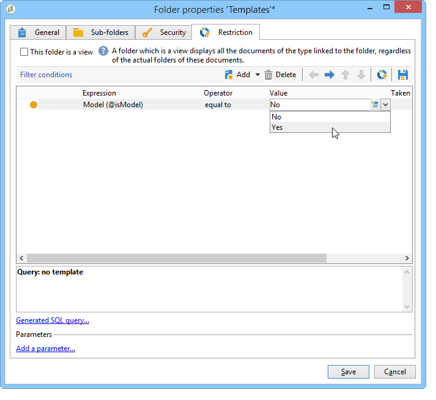

# 创建种子地址{#creating-seed-addresses}

种子地址不是通过标准配置文件和目标进行管理，而是在Adobe Campaign层次结构&#x200B;**[!UICONTROL Resources > Campaign management > Seed addresses]**&#x200B;的专用节点中进行管理。

您可以创建子文件夹以组织种子地址。 为此，请右键单击&#x200B;**[!UICONTROL Seed addresses]**&#x200B;节点并选择&#x200B;**[!UICONTROL Create a new 'Seed addresses' folder]**。 命名子文件夹，然后按&#x200B;**[!UICONTROL Enter]**&#x200B;进行验证。 您现在可以创建种子地址或将种子地址复制到此子文件夹。 有关详细信息，请参阅[定义地址](#defining-addresses)。

通过Adobe Campaign，您还可以创建种子地址模板，这些模板将导入投放或营销活动中，并根据相关投放和营销活动的具体需求进行调整。 请参阅[创建种子地址模板](#creating-seed-address-templates)。

## 定义地址 {#defining-addresses}

要创建种子地址，请执行以下步骤：

1. 单击种子地址列表上方的&#x200B;**[!UICONTROL New]**&#x200B;按钮。
1. 在&#x200B;**[!UICONTROL Recipient]**&#x200B;选项卡的匹配字段中输入链接到地址的数据。 可用字段对应于投放收件人（nms：recipient表）用户档案中的标准字段：姓名、名字和电子邮件等。

   >[!NOTE]
   >
   >地址的标签会自动填入您定义的姓氏和名字。
   >
   >创建种子地址时，无需输入每个选项卡的所有字段。 在投放分析期间随机输入缺少的个性化元素。

   

1. 在&#x200B;**[!UICONTROL Address fields]**&#x200B;选项卡中，输入将在分析阶段（在&#x200B;**[!UICONTROL nms:broadLog]**&#x200B;表中）插入投放日志中的值。

1. 在&#x200B;**[!UICONTROL Additional data]**&#x200B;选项卡中，输入用于数据管理工作流中创建的投放且要为其分配特定值的个性化数据。

   >[!NOTE]
   >
   >请确保在&#x200B;**[!UICONTROL Enrichment]**&#x200B;活动中定义了其他目标数据，且别名以“@”开头。 否则，您将无法在投放活动中将它们与种子地址正确一起使用。

## 创建种子地址模板 {#creating-seed-address-templates}

要创建将导入的地址模板，并且可能会针对每次投放进行修改，该过程与定义新种子地址时的过程相同。 唯一的区别是种子地址模板地址必须存储在“模板”类型文件夹中。

要定义模板文件夹，请应用以下流程：

1. 创建新的&#x200B;**[!UICONTROL Seed addresses]**&#x200B;类型文件夹，右键单击该文件夹，然后选择&#x200B;**[!UICONTROL Properties...]**。

   

1. 单击&#x200B;**[!UICONTROL Restriction]**&#x200B;选项卡并添加以下筛选条件： **@isModel = true**。

   

   存储在此文件夹中的地址现在可用作地址模板。 您可以将它们导入投放或营销活动中，并根据相关投放和营销活动的特定需求进行调整（请参阅[添加种子地址](adding-seed-addresses.md)）。
