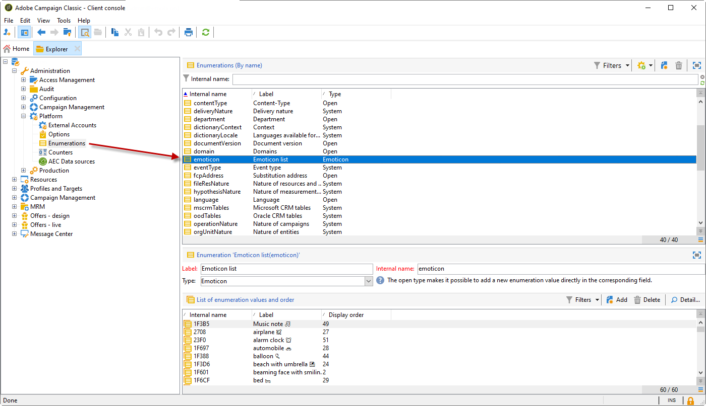

# 自定义表情符号列表 {#customize-emoticons}

弹出式窗口中显示的表情符号列表由枚举规则，允许您在列表中显示值，以限制用户对给定字段的选择。
表情符号列表顺序可以自定义，您也可以向列表添加其他表情符号。
表情符号可用于电子邮件和推送以了解详情，请参阅此处 [页面](defining-the-email-content.md#inserting-emoticons).

## 添加新表情符号 {#add-new-emoticon}

>[!CAUTION]
>
>表情符号列表不能显示超过81个条目。

1. 从中选择要添加的新表情符号 [页面](https://unicode.org/emoji/charts/full-emoji-list.html). 请注意，它必须与不同的平台（如浏览器和操作系统）兼容。

1. 从 **[!UICONTROL Explorer]**，选择 **[!UICONTROL Administration]** > **[!UICONTROL Platform]** > **[!UICONTROL Enumerations]** 然后单击 **[!UICONTROL Emoticon list]** 现成的明细列表。

   >[!NOTE]
   >
   >现成的枚举只能由Adobe Campaign Classic控制台的管理员管理。

   

1. 单击 **[!UICONTROL Add]**。

1. 填写以下字段：

   * **[!UICONTROL U+]**：您新表情符号的代码。 您可以在此找到表情符号代码列表 [页面](https://unicode.org/emoji/charts/full-emoji-list.html).
为避免出现兼容性问题，我们建议您选择在浏览器和每个操作系统上支持的表情符号。

   * **[!UICONTROL Label]**：新表情符号的标签。

   

1. 单击 **[!UICONTROL Ok]** 则 **[!UICONTROL Save]** 配置完成后。
你的新表情符号会自动放在商店里。

1. 要将其显示在 **[!UICONTROL Insert emoticon]** 在投放窗口内，双击新创建的表情符号，以将其选中。

1. 在 **[!UICONTROL Display order]** 您的新表情符号的显示顺序下拉列表。 请注意，通过选择已分配的显示顺序，现有表情符号将自动移至商店。

    在本例中，我们选择了显示订单号61，这意味着如果某个条目已经具有此订单，则它会自动移至商店，并且我们的新条目将在枚举列表中占据该条目的位置。

   

1. 您的新表情符号现已添加到 **[!UICONTROL Insert emoticon list]** 现成的明细列表。 您可以更改其 **[!UICONTROL Display order]** 任何时间，如果您不再需要它，可将其移至商店。

1. 要考虑您的更改，请断开连接，然后重新与Adobe Campaign Classic连接。 如果您的新表情符号仍未出现在 **[!UICONTROL Insert emoticon]** 弹出窗口，您可能需要清除缓存。 有关更多信息，请参阅此](../../platform/using/faq-campaign-config.md#perform-soft-cache-clear)章节[。

1. 您的新表情符号现在可以在以下网站的信息投放中找到： **[!UICONTROL Insert emoticon]** 弹出窗口（位于前面步骤中配置的第61位）。 有关如何在投放中使用表情符号的更多信息，请参阅此 [页面](defining-the-email-content.md#inserting-emoticons).

   

1. 如果您的 **[!UICONTROL Insert emoticon]** 弹出窗口，这意味着它们未正确配置。 检查您的 **[!UICONTROL U+]** 代码或 **[!UICONTROL Display order]** 是正确的 **[!UICONTROL Emoticon list]**.

   
