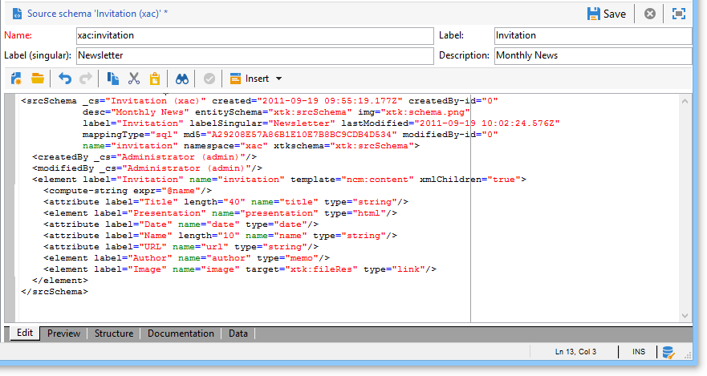

# 在Campaign中使用数据模式{#data-schemas}


以下是关于在Adobe Campaign中使用数据模式的一些一般原则。

有关在Adobe Campaign中创建和配置数据模式的更多信息，请参阅 [此部分](../../configuration/using/about-schema-edition.md).

## 模式结构 {#schema-structure}

数据架构的XML文档必须包含 **`<srcschema>`** 根元素，其中 **name** 和 **命名空间** 属性来填充架构名称及其命名空间。

```
<srcSchema name="schema_name" namespace="namespace">
...
</srcSchema>
```

架构的入口点是其主要元素。 很容易识别，因为它与架构同名，并且应该是根元素的子元素。 内容的描述以此元素开头。

在内容管理架构中，主元素由以下行表示：

```
<element name="book" template="ncm:content" xmlChildren="true">
```

的 **模板** 通过在主元素中输入的属性，您可以将具有通用属性的架构扩展到所有内容定义，如名称、创建日期、作者、关联字符串等。

这些属性在 **ncm:content** 架构。

>[!NOTE]
>
>存在 **xmlChildren** 属性指示通过主元素输入的数据结构存储在内容实例的XML文档中。

>[!CAUTION]
>
>创建新架构或在架构扩展期间，您需要为整个架构保留相同的主键序列值(@pkSequence)。

## 数据类型 {#data-types}

以下是内容管理架构的示例，其中填充了以下类型：

```
<srcSchema name="book" namespace="cus">
  <element name="book" template="ncm:content" xmlChildren="true">
    <attribute name="title" type="string"/>
    <attribute name="date" type="date"/>
    <attribute name="language" type="string"/>
    <element name="chapter">
      <attribute name="name" type="string"/>
      <element name="page" type="string>
        <attribute name="number" type="short"/>
      </element>
    </element>
  </element>
</element>
```

## 属性 {#properties}

可以使用各种属性来丰富 **`<element>`** 和 **`<attribute>`** 数据架构的元素。

内容管理中使用的主要属性如下：

* **标签**:简短描述，
* **desc**:长描述，
* **默认**:表达式在内容创建时返回默认值，
* **userEnum**:用于存储和显示通过此字段输入的值的自由枚举，
* **枚举**:修复了在预先知道可能值列表时使用的枚举。

以下是我们的示例架构，其中填充了以下属性：

```
<srcSchema name="book" namespace="cus">
  <enumeration name="language" basetype="string" default="eng">    
    <value name="fra" label="French"/>    
    <value name="eng" label="English"/>   
  </enumeration>

  <element name="book" label="Book" desc="Example book" template="ncm:content" xmlChildren="true">
    <attribute name="title" type="string" label="Title" default="'New book'"/>
    <attribute name="date" type="date" default="GetDate()"/>
    <attribute name="language" type="string" label="Language" enum="language"/>
    <element name="chapter" label="Chapter">
      <attribute name="name" type="string" label="Name" desc="Name of chapter"/>
      <element name="page" type="string" label="Page" desc="Page content">
        <attribute name="number" type="short" label="Number" default="CounterValue('numPage')"/>
      </element>
    </element>
  </element>
</srcSchema>
```

## 收藏集元素 {#collection-elements}

集合是具有相同名称和相同层次结构级别的元素列表。

在本例中， **`<chapter>`** 和 **`<page>`** 元素是收藏集元素。 的 **未绑定** 因此，必须将属性添加到这些元素的定义中：

```
<element name="chapter" label="Chapter" unbound="true" ordered="true">
```

```
<element name="page" type="string" label="Page" desc="Content of page" unbound="true">
```

>[!NOTE]
>
>存在 **ordered=&quot;true&quot;** 属性允许您对插入的集合元素进行排序。

## 元素引用 {#element-referencing}

元素引用在内容架构中非常常用。 它允许您对 **`<element>`** 元素，以便可以在具有相同结构的其他元素上引用该元素。

的 **ref** 必须使用引用元素的路径(XPath)完成要引用的元素上的属性。

**示例**:添加 **附录** 与 **`<chapter>`** 示例架构的元素。

```
<srcSchema name="book" namespace="cus">
  <element name="section">
    <attribute name="name" type="string" label="Name" desc="Name"/>
    <element name="page" type="string" label="Page" desc="Content of page">
      <attribute name="number" type="short" label="Number" default="CounterValue('numPage')"/>
    </element>

  <element name="book" label="Book" desc="Example book" template="ncm:content" xmlChildren="true">
    <attribute name="title" type="string" label="Title" default="'New book'"/>
    <attribute name="date" type="date" default="GetDate()"/>
    <attribute name="language" type="string" label="Language" enum="language"/>
    <element name="chapter" label="Chapter" ref="section"/>
    <element name="appendix" label="Appendix" ref="section"/>
  </element>
</srcSchema>
```

章节结构将移至主元素外部名为“section”的元素。 章节和节引用“section”元素。

## 计算字符串 {#compute-string}

A **计算字符串** 是用于构建表示内容实例的字符串的XPath表达式。

以下是我们的示例模式及其 **计算字符串**:

```
<srcSchema name="book" namespace="cus">
  <element name="book" label="Book" desc="Example book" template="ncm:content" xmlChildren="true">
    <compute-string expr="@name"/>
    ...
  </element>
</srcSchema>
```

## 编辑模式 {#editing-schemas}

编辑字段允许您输入源架构的XML内容：



保存源架构后，将自动启动扩展架构生成。

>[!NOTE]
>
>的 **名称** 编辑控件允许您输入架构的键，其中包含名称和命名空间。 的 **name** 和 **命名空间** 架构根元素的属性会在架构的XML edit字段中自动更新。
