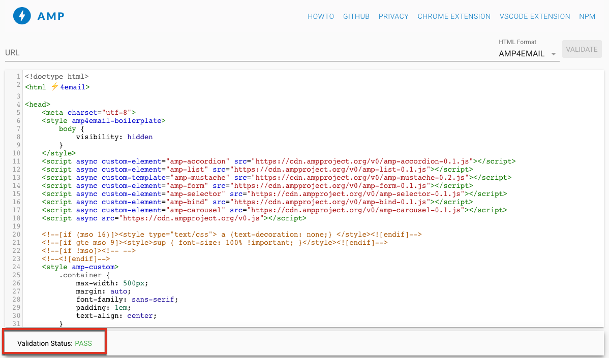

# 定义交互式内容{#defining-interactive-content}

Adobe Campaign允许您尝试新的交互式 [AMP for Email](https://amp.dev/about/email/) ，该格式允许在特定条件下发送动态电子邮件。

>[!CAUTION]
>
>* 此功能是Adobe Campaign中的测试版功能。
>* AMP for Email是一种新的开放源格式，它使开发人员能创建动态和交互式电子邮件。 目前，两家电子邮件提供商都支持它：Gmail和Outlook。
>
>
因此，您只能：
>* 测试将AMP电子邮件传送到正确配置的特定Gmail或Outlook地址。
>* 向Google注册后，将AMP电子邮件发送到任何Gmail地址，向Microsoft注册后，将AMP电子邮件发送到任何Outlook地址。
>
>
请参 [阅定位AMP电子邮件](#targeting-amp-email)。

此功能可通过Adobe Campaign中的专用包获得。 要使用它，必须安装此包。 完成后，重新启动服务器以考虑要考虑的包。

对于混合和托管架构，包需要安装在所有服务器上，包括 [中间源服务器和执](../../installation/using/mid-sourcing-server.md) 行实例 。 联系您的客户经理。

观看此 [视频](https://docs.adobe.com/content/help/en/campaign-learn/campaign-classic-tutorials/sending-messages/email-channel/defining-interactive-email-content-with-amp.html) ，了解如何在Adobe Campaign中激活AMP并了解使用情况。

## 关于AMP for Email {#about-amp-for-email}

电子邮 **件AMP的新格式允许在邮件中包含AMP组件** ，以增强具有丰富可操作内容的电子邮件体验。 借助直接在电子邮件中提供的现代应用程序功能，收件人可以与邮件本身中的内容进行动态交互。

例如：
* 使用AMP编写的电子邮件可以包含交互式元素，如图像轮盘。
* 内容在消息中保持最新。
* 收件人可以采取类似响应表单的操作，而无需离开其收件箱。

AMP for Email与现有电子邮件兼容。 除了HTML和／或纯文本，邮件的AMP版本还作为新的MIME部分嵌入到电子邮件中，从而确保所有电子邮件客户端之间的兼容性。

有关AMP的电子邮件格式、规范和要求的详细信息，请参阅 [AMP开发人员文档](https://amp.dev/documentation/guides-and-tutorials/learn/email-spec/amp-email-format/?format=email)。

## 将AMP用于电子邮件与Adobe Campaign结合使用的关键步骤 {#key-steps-to-use-amp}

要使用Adobe Campaign成功测试和发送AMP电子邮件，请执行以下步骤：
1. 安装包 **[!UICONTROL AMP support (Beta)]** 。 请参 [阅安装Campaign标准包](../../installation/using/installing-campaign-standard-packages.md)。
1. 在Adobe Campaign中创建电子邮件并构建AMP内容。 请参 [阅使用Adobe Campaign构建AMP电子邮件内容](#build-amp-email-content)。
1. 确保遵循支持AMP格式的电子邮件提供商的所有交付要求。

   >[!NOTE]
   >
   >AMP for email可作为测试用途的测试版功能提供。 目前，只有两家电子邮件提供商支持测试此格式（Gmail和Outlook）。

   请参 [阅AMP了解电子邮件发送要求](#amp-for-email-delivery-requirements)。

1. 在定义目标时，请确保选择能够显示AMP格式的收件人。

   >[!NOTE]
   >
   >目前，您只能测试向特定电子邮件地址发送AMP电子邮件的过程，这些电子邮件地址已正确配置，或者在向参与AMP Beta计划的电子邮件提供商注册之后。

   请参 [阅定位AMP电子邮件](#targeting-amp-email)。

1. 按您通常的方式发送电子邮件。 请参 [阅发送AMP电子邮件](#sending-amp-email)。

## 在Adobe Campaign中构建AMP电子邮件内容 {#build-amp-email-content}

要使用AMP格式构建电子邮件，请执行以下步骤。

>[!CAUTION]
>
>确保遵循AMP的电子邮件要求和AMP开发人员文档中详细 [的规范](https://amp.dev/documentation/guides-and-tutorials/learn/email_fundamentals/?format=email)。 您还可以查阅 [AMP以了解电子邮件最佳实践](https://amp.dev/documentation/guides-and-tutorials/develop/amp_email_best_practices/?format=email)。

1. 创建电子邮件分发时，请选择任何模板。

   >[!NOTE]
   >
   >特定的AMP模板包含您可以使用的主要容量的示例：产品列表、传送、双重加入、调查和高级服务器请求。

1. 单击选 **[!UICONTROL AMP content]** 项卡。

   

1. 编辑AMP内容以满足您的需求。

   >[!NOTE]
   >
   >有关构建您的第一封AMP电子邮件的更多信息，请参阅 [AMP开发人员文档](https://amp.dev/documentation/guides-and-tutorials/start/create_email/?format=email)。

   例如，您可以使用AMP模板中的产品列表组件，并维护第三方系统甚至Adobe Campaign中的产品列表。 每当您调整价格或其他元素时，当收件人再次打开其邮箱中的电子邮件时，该元素会自动反映出来。

1. 根据需要个性化您的AMP内容，就像您通常在Adobe Campaign中使用HTML格式那样，该格式包含个性化字段和个性化基块。

   

1. 完成编辑后，选择整个AMP内容并将其复制粘贴到基于 [AMP web的验证程序或类似网站](https://validator.ampproject.org) 。

   >[!NOTE]
   >
   >确保从屏 **幕顶部的下拉列表中选择AMP4 EMAIL** 。

   

   所有错误都将内联标记。

   >[!NOTE]
   >
   >Adobe Campaign AMP编辑器不设计用于内容验证。 使用外部网站(如基于 [AMP web的验证程序](https://validator.ampproject.org) )检查您的内容是否正确。

1. 根据需要进行修改，直到AMP内容通过验证。

   

1. 将已验证的内容复制粘贴到 [AMP Playproady或类似网站](https://playground.amp.dev) ，以预览您的内容。

   >[!NOTE]
   >
   >确保从屏幕顶 **部的下拉列表中选择** “电子邮件AMP”。

   

   >[!NOTE]
   >
   >您无法直接在Adobe Campaign中预览AMP内容。 使用外部网站，如 [AMP Playground](https://playground.amp.dev)。

1. 返回Adobe Campaign，并将验证的内容复制粘贴到选项 **[!UICONTROL AMP content]** 卡中。

1. 切换到或选 **[!UICONTROL HTML content]** 项卡， **[!UICONTROL Text content]** 并为这两种格式中的至少一种定义内容。

   >[!CAUTION]
   >
   >如果电子邮件中除AMP内容之外不包含HTML或纯文本版本，则无法发送它。

## AMP for Email delivery requirements {#amp-for-email-delivery-requirements}

在Adobe Campaign中构建AMP内容时，您必须遵守特定于收件人电子邮件提供商的要发送的动态电子邮件的条件。

目前，两个电子邮件提供商支持测试此格式：Gmail和Outlook。

在Gmail帐户上测试AMP格式传送所需的所有步骤和规范在相应的 [Gmail开发人员文档和](https://developers.google.com/gmail/ampemail?)[Outlook开发人员文档中有详细说明](https://docs.microsoft.com/en-gb/outlook/amphtml/)。

特别是，必须满足以下要求：
* 遵循Gmail和 [Outlook的特定AMP安](https://developers.google.com/gmail/ampemail/security-requirements) 全要 [求](https://docs.microsoft.com/en-gb/outlook/amphtml/security-requirements)。
* AMP MIME部分必须包含有 [效的AMP文档](https://amp.dev/documentation/guides-and-tutorials/learn/validation-workflow/validate_emails/?format=email)。
* AMP MIME部分必须小于100KB。

您还可以查阅Tips [和Gmail的已知限制](https://developers.google.com/gmail/ampemail/tips) ，以及 [AMP的Outlook最佳实践](https://docs.microsoft.com/en-gb/outlook/amphtml/best-practices)。

## 定位AMP电子邮件 {#targeting-amp-email}

AMP for Email是作为测试版提供的，目前您可以尝试通过两个步骤发送AMP电子邮件：

1. Adobe Campaign允许您测试将AMP驱动的动态电子邮件发送到正确配置的选定电子邮件地址，以验证其内容和行为。 请参 [阅测试选定地址的AMP电子邮件传送](#testing-amp-delivery-for-selected-addresses)。
1. 测试后，您可以向相关电子邮件提供商注册，将您的发送者域列入白名单，从而将分发或营销活动作为电子邮件测试版AMP的一部分发送。 请参 [阅通过向电子邮件提供商注册来传送AMP电子邮件](#delivering-amp-emails-by-registering)。

### 测试选定地址的AMP电子邮件传送 {#testing-amp-delivery-for-selected-addresses}

您可以测试将动态消息从Adobe Campaign发送到选定的电子邮件地址。

>[!NOTE]
>
>目前，只有Gmail和Outlook支持测试AMP格式。

在执行此操作之前，您必须将您用来从Adobe Campaign传送的目标Gmail和Outlook帐户的发件人地址列入白名单。

操作步骤：
1. 确保为相关电子邮件提供商选中了启用动态电子邮件的选项。
1. 复制分发字段中显示的发件人地址， **[!UICONTROL From]** 并将其粘贴到电子邮件提供商帐户设置的相应部分。

有关更多详细信息，请查阅 [Gmail开发人员文档](https://developers.google.com/gmail/ampemail/testing-dynamic-email) 和 [Outlook开发人员文档](https://docs.microsoft.com/en-gb/outlook/amphtml/register-outlook#individual-mailbox-registration)。

### 通过向电子邮件提供商注册来传送AMP电子邮件 {#delivering-amp-emails-by-registering}

您可以尝试向参加AMP Beta计划的电子邮件提供商注册以将您的发送者域列入白名单，从而提供动态电子邮件。

>[!NOTE]
>
>目前，只有Gmail和Outlook支持AMP格式。

使用几个地址进行测试后，您可以向任何Gmail或Outlook地址发送AMP电子邮件。 为此，你必须向谷歌或微软恭敬地注册，等待他们的回答。

按照 [Gmail开发人员文档和Outlook开发人员文档中](https://developers.google.com/gmail/ampemail/register)[提供的步骤操作](https://docs.microsoft.com/en-gb/outlook/amphtml/register-outlook#global-registration)。 成功注册后，您将成为授权的发送方。

## 发送AMP电子邮件 {#sending-amp-email}

AMP内容和备用准备就绪后，在定义了兼容目标后，您可以像通常那样发送电子邮件。

目前，在某些情况下，只有Gmail和Outlook支持AMP格式。 您可以定位其他电子邮件提供商的地址，但他们会收到HTML或纯文本版本的电子邮件。

>[!NOTE]
>
>如果电子邮件中除AMP内容之外不包含HTML或纯文本版本，则无法发送它。

匹配的收件人将在其邮箱中显示电子邮件的AMP版本。

例如，如果您在电子邮件中包含产品列表，则在第三方系统中编辑价格时，每次收件人在其邮箱中再次打开电子邮件时，价格都会自动调整。

>[!NOTE]
>
>您可以创建邮件处理规则，以防止特定域接收AMP电子邮件。 请参阅 [管理电子邮件格式](../../installation/using/email-deliverability.md#managing-email-formats)。
>
>默认情况 **[!UICONTROL AMP inclusion]** 下，选项设置为 **[!UICONTROL No]**。
