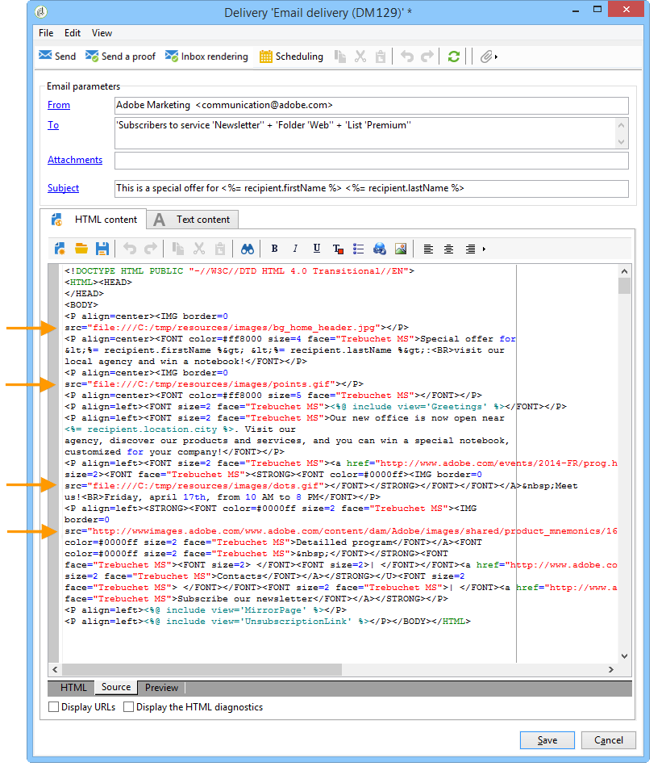

# 定义电子邮件内容 {#defining-the-email-content}

## 发件人 {#sender}

要定义将显示在发送邮件标题中的发件人的名称和地址，请单击&#x200B;**[!UICONTROL From]**&#x200B;链接。

利用此窗口，可输入创建电子邮件标题所需的所有信息。 此信息可以个性化。要实现此目的，请使用输入字段右侧的按钮插入个性化字段。

要了解如何插入和使用个性化字段，请参阅[关于个性化](about-personalization.md)一节。

>[!NOTE]
>
>* 默认情况下，发件人的地址将用于回复。
>* 标头参数不得为空。 默认情况下，它们包含配置部署向导时输入的值。 有关详细信息，请参阅[安装指南](../../installation/using/deploying-an-instance.md)。
>* 发送者的地址是允许发送电子邮件的强制地址（RFC标准）。
>* Adobe Campaign检查输入的电子邮件地址的语法。

>[!IMPORTANT]
>
>在由互联网访问提供商(ISP)为打击未经请求的电子邮件（垃圾邮件）而实施的检查的上下文中，Adobe建议创建与为投放和回复指定的地址对应的电子邮件帐户。 请咨询消息系统管理员。

## 消息主题 {#message-subject}

消息的主题在相应的字段中配置。 您可以直接在字段中输入该脚本，也可以单击&#x200B;**[!UICONTROL Subject]**&#x200B;链接以输入脚本。 个性化链接允许您在主题中插入数据库字段。

>[!IMPORTANT]
>
>消息主题是强制性的。

发送消息后，字段内容将替换为收件人用户档案中的值。

例如，在以上消息中，将使用每个收件人的用户档案数据为消息的主题进行个性化。

>[!NOTE]
>
>[关于个性化](about-personalization.md)中介绍了个性化字段的使用情况。

您还可以使用&#x200B;**[!UICONTROL Insert emoticon]**&#x200B;弹出窗口将表情符号插入主题行。

## 消息内容 {#message-content}

>[!IMPORTANT]
>
>出于隐私原因，我们建议对所有外部资源使用HTTPS。

消息的内容在投放配置窗口的下半部分中定义。

默认情况下，根据收件人首选项，消息以HTML或文本格式发送。 我们建议以这两种格式创建内容，以确保消息能够在任何邮件系统中正确显示。 有关更多信息，请参阅[选择消息格式](#selecting-message-formats)。

* 要导入HTML内容，请使用&#x200B;**[!UICONTROL Open]**&#x200B;按钮。 您还可以将源代码直接粘贴到&#x200B;**[!UICONTROL Source]**&#x200B;子选项卡中。

   如果您使用的是[数字内容编辑器](../../web/using/about-campaign-html-editor.md)(DCE)，请参阅[选择内容模板](../../web/using/use-case--creating-an-email-delivery.md#step-3---selecting-a-content)。

   >[!IMPORTANT]
   >
   >必须事先创建HTML内容，然后将其导入Adobe Campaign。 HTML编辑器不适用于内容创建。

   **[!UICONTROL Preview]**&#x200B;子选项卡允许您查看收件人的每个内容的呈现。 个性化字段和内容的条件元素将替换为选定用户档案的相应信息。

   利用工具栏按钮，可访问HTML页面的标准操作和格式参数。

   

   您可以在Adobe Campaign的本地文件或图像库的消息中插入图像。 要执行此操作，请单击&#x200B;**[!UICONTROL Image]**&#x200B;图标，然后选择相应的选项。

   

   可以通过文件夹树中的&#x200B;**[!UICONTROL Resources>Online>Public resources]**&#x200B;文件夹访问库图像。 另请参阅[添加图像](#adding-images)。

   利用工具栏中的最后一个按钮可插入个性化字段。

   >[!NOTE]
   >
   >[关于个性化](about-personalization.md)中介绍了个性化字段的使用情况。

   通过页面底部的选项卡，可显示所创建页面的HTML代码，并查看消息的个性化呈现。 要启动此显示屏，请单击&#x200B;**[!UICONTROL Preview]** ，然后使用工具栏中的&#x200B;**[!UICONTROL Test personalization]**&#x200B;按钮选择收件人。 您可以从定义的目标中选择收件人或选择其他收件人。

   

   您可以验证HTML消息。 您还可以查看电子邮件标题的内容。

   

* 要导入文本内容，请使用&#x200B;**[!UICONTROL Open]**&#x200B;按钮或&#x200B;**[!UICONTROL Text Content]**&#x200B;选项卡输入以文本格式显示的消息内容。 使用工具栏按钮访问对内容的操作。 使用最后一个按钮可插入个性化字段。

   

   对于HTML格式，单击页面底部的&#x200B;**[!UICONTROL Preview]**&#x200B;选项卡可查看消息的个性化呈现。

   

## 定义互动内容 {#amp-for-email-format}

Adobe Campaign允许您尝试新的交互式[AMP for Email](https://amp.dev/about/email/)格式，该格式允许在特定条件下发送动态电子邮件。

有关更多信息，请参阅[此章节](defining-interactive-content.md)。

## 使用内容管理 {#using-content-management}

您可以直接在投放向导中使用内容管理表单定义投放的内容。 要实现此目的，必须在投放属性的&#x200B;**[!UICONTROL Advanced]**&#x200B;选项卡中引用要使用的内容管理的发布模板。

您还可以使用额外的选项卡输入内容，这些内容将根据内容管理规则自动进行集成和格式化。

>[!NOTE]
>
>有关Adobe Campaign中内容管理的更多信息，请参阅[此部分](about-content-management.md)。

## 插入表情符号 {#inserting-emoticons}

您可以在电子邮件内容中插入表情符号。

1. 单击&#x200B;**[!UICONTROL Insert emoticon]**&#x200B;图标。
1. 从弹出窗口中选择一个表情符号。

   

1. 完成后单击&#x200B;**[!UICONTROL Close]**&#x200B;按钮。

要自定义表情符号列表，请参阅此[页面](customizing-emoticon-list.md)。

## 添加图像 {#adding-images}

HTML格式的电子邮件投放可以包含图像。 在投放向导中，您可以导入包含图像的HTML页面，或通过&#x200B;**[!UICONTROL Image]**&#x200B;图标使用HTML编辑器直接插入图像。

图像可以是：

* 本地图像或从服务器调用的图像
* 存储在Adobe Campaign公共资源库中的图像

   可通过Adobe Campaign层级的&#x200B;**[!UICONTROL Resources > Online]**&#x200B;节点访问公共资源。 它们分组到库中，并可包含在电子邮件中，但也可用于营销活动或任务，或内容管理。

* 与Adobe Experience Cloud共享的资产。 请参阅[此小节](../../integrations/using/sharing-assets-with-adobe-experience-cloud.md)。

>[!IMPORTANT]
>
>要使用投放向导在电子邮件中包含图像，必须将Adobe Campaign实例配置为启用公共资源管理。 可以从部署向导中执行此过程。 有关配置的详细信息，请参阅[此部分](../../installation/using/deploying-an-instance.md)。

利用投放向导，可向消息内容中添加本地图像或库中存储的图像。 要实现此目的，请单击HTML内容工具栏中的&#x200B;**[!UICONTROL Image]**&#x200B;按钮。

>[!IMPORTANT]
>
>为了让收件人能够查看他们收到的消息中包含的图像，这些消息必须在可从外部访问的服务器上可用。

要通过投放向导管理图像，请执行以下操作：

1. 单击工具栏中的&#x200B;**[!UICONTROL Tracking & Images]**图标。
   

1. 在&#x200B;**[!UICONTROL Images]**&#x200B;选项卡中选择&#x200B;**[!UICONTROL Upload images]**。
1. 然后，您可以选择是否要在电子邮件中包含图像。
   

* 您可以手动上传图像，而无需等待投放分析阶段。 为此，请单击&#x200B;**[!UICONTROL Upload the images straightaway...]**&#x200B;链接。
* 您可以指定其他路径以访问跟踪服务器上的图像。 要实现此目的，请在&#x200B;**[!UICONTROL Images URL]**&#x200B;字段中输入。 此值将覆盖安装向导参数中定义的值。

在投放向导中打开包含图像的HTML内容时，系统会显示一条消息，提示您可以根据投放参数立即上传图像。

>[!IMPORTANT]
>
>* 在手动上传或发送消息期间，会修改图像访问路径。
> 
>* 为避免出现性能问题，如果您包含从个性化URL中以[attachment](attaching-files.md)形式动态下载的图像，则默认情况下，每个图像大小不应超过100,000字节。 此建议的阈值可从[Campaign Classic选项列表](../../installation/using/configuring-campaign-options.md#delivery)中配置。

**用例：发送包含图像的消息**

以下是包含四张图像的投放示例：

这些图像来自本地目录或网站，您可以通过&#x200B;**[!UICONTROL Source]**&#x200B;选项卡进行验证。

单击&#x200B;**[!UICONTROL Tracking & Images]**&#x200B;图标，然后单击&#x200B;**[!UICONTROL Images]**&#x200B;选项卡以开始检测消息中的图像。

对于检测到的每个图像，您可以查看其状态：

* 如果图像存储在本地或位于另一台服务器上，即使此服务器从外部（例如在互联网网站上）可见，也会被检测为&#x200B;**[!UICONTROL Not yet online]**。
* 如果在创建其他投放时之前上传了图像，则会将其检测为&#x200B;**[!UICONTROL Already online]**。
* 在部署向导中，您可以定义未启用图像检测的URL:上传这些图像将为&#x200B;**[!UICONTROL Skipped]**。

>[!NOTE]
>
>图像是通过其内容而不是访问路径来标识的。 这意味着先前以不同名称或不同目录中上传的图像将被检测为&#x200B;**[!UICONTROL Already online]**。

在分析阶段，图像会自动上传到服务器，以便从外部访问它们，但本地图像必须预先上传。

您可以继续工作并上传图像，以便其他Adobe Campaign操作员能够查看它们。 如果您能够协作，您可能会发现此功能非常有用。 为此，请单击&#x200B;**[!UICONTROL Upload the images straightaway...]**&#x200B;将图像上传到服务器。

>[!NOTE]
>
>然后，会修改电子邮件中图像的URL，特别是其名称。

图像联机后，您可以从消息的&#x200B;**[!UICONTROL Source]**&#x200B;选项卡查看对其名称和路径的更改。

如果选择&#x200B;**[!UICONTROL Include the images in the email]**，则可以选择要包含在相应列中的图像。

>[!NOTE]
>
>如果消息中包含本地图像，则必须确认对消息源代码的更改。

## 在电子邮件中插入条形码{#inserting-a-barcode-in-an-email}

条形码生成模块允许您创建符合许多常见标准（包括2D条形码）的几种条形码。

可以使用使用客户标准定义的值动态生成条形码作为位图。 电子邮件促销活动中可包含个性化条形码。 收件人可以打印消息并将其显示给发布公司进行扫描（例如，签出时）。

要将条形码插入电子邮件，请将光标置于要显示该条形码的内容中，然后单击个性化按钮。 选择 **[!UICONTROL Include > Barcode...]**。

然后，根据您的需求配置以下元素：

1. 选择条形码的类型。

   * 对于1D格式，Adobe Campaign中提供了以下类型：Codabar，代码128, GS1-128（以前称为EAN-128）， UPC-A， UPC-E， ISBN， EAN-8，代码39，交织2（共5个）， POSTNET和Royal Mail(RM4SCC)。

      1D条形码示例：

      

   * 数据矩阵和PDF417类型涉及2D格式。

      2D条形码示例：

      

   * 要插入二维码，请选择此类型并输入要应用的纠错率。 此比率定义重复信息的数量和退化的容差。

      

      二维码示例：

      

1. 输入要插入到电子邮件中的条形码的大小：通过配置比例，您可以增加或减小条形码的大小，从x1到x10。
1. **[!UICONTROL Value]**&#x200B;字段允许您定义条形码的值。 值可以匹配特殊选件，也可以是标准的函数，也可以是链接到客户的数据库字段的值。

   此示例显示EAN-8类型的条形码，该条形码已添加到收件人的帐户号。 要添加此帐号，请单击&#x200B;**[!UICONTROL Value]**&#x200B;字段右侧的个性化按钮，然后选择&#x200B;**[!UICONTROL Recipient > Account number]**。

   

1. **[!UICONTROL Height]**&#x200B;字段允许您通过更改每个条形之间的间距量，在不更改其宽度的情况下配置条形码的高度。

   没有基于条形码类型的限制性输入控件。 如果条形码值不正确，它将仅在&#x200B;**预览**&#x200B;模式下显示，在该模式下，条形码将以红色划出。

   >[!NOTE]
   >
   >分配给条形码的值取决于其类型。 例如，EAN-8类型的数字应恰好为8。
   >
   >通过&#x200B;**[!UICONTROL Value]**&#x200B;字段右侧的个性化按钮，除了值本身之外，您还可以添加数据。 这丰富了条形码，只要条形码标准接受它。
   >
   >例如，如果您使用GS1-128类型条形码，并且希望输入收件人的帐号以及值，请单击个性化按钮并选择&#x200B;**[!UICONTROL Recipient > Account number]**。 如果所选收件人的帐号输入正确，则条形码会将其考虑在内。

配置这些元素后，您可以完成电子邮件并发送它。 要避免出现错误，请始终在通过单击&#x200B;**[!UICONTROL Preview]**&#x200B;选项卡执行投放之前确保内容显示正确。

>[!NOTE]
>
>如果条形码的值不正确，则其位图将以红色交叉显示。

