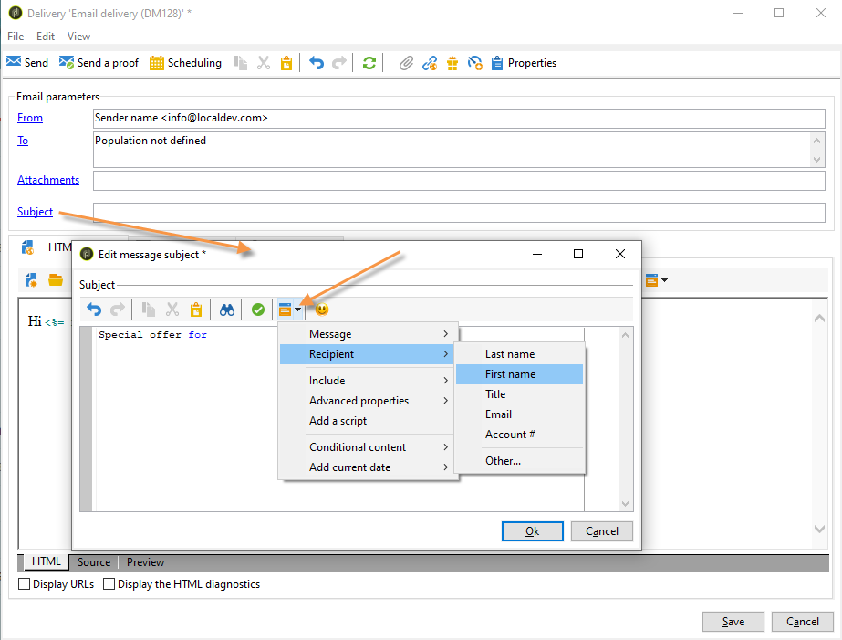
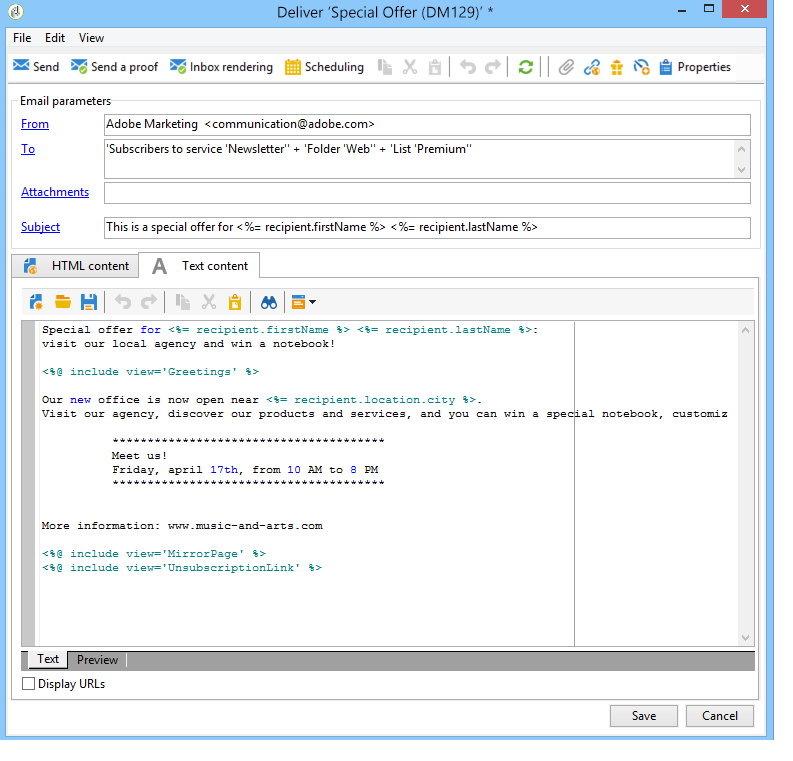

# 定义电子邮件内容{#defining-the-email-content}

## 发件人{#sender}

要定义将显示在所发送邮件标头中的发件人姓名和地址，请单击&#x200B;**[!UICONTROL From]**&#x200B;链接。

在此窗口中，您可以输入创建电子邮件标头所需的所有信息。 此信息可以个性化。为此，请使用输入字段右侧的按钮插入个性化字段。

要了解如何插入和使用个性化字段，请参阅[关于个性化](../../delivery/using/about-personalization.md)部分。

>[!NOTE]
>
>* 默认情况下，发件人地址将用于回复。
>* 标题参数不得为空。 默认情况下，它们包含配置部署向导时输入的值。 有关详细信息，请参阅[安装指南](../../installation/using/deploying-an-instance.md)。
>* 发送者的地址是允许发送电子邮件的必填地址（RFC标准）。
>* Adobe Campaign检查输入的电子邮件地址的语法。

>[!IMPORTANT]
>
>在Internet访问提供商(ISP)为打击未经请求的电子邮件（垃圾邮件）而实施的检查环境中，Adobe建议创建与为投放和回复指定的地址对应的电子邮件帐户。 请咨询邮件系统管理员。

## 邮件主题{#message-subject}

消息主题在相应字段中配置。 您可以直接在字段中输入脚本，或单击&#x200B;**[!UICONTROL Subject]**&#x200B;链接以输入脚本。 个性化链接允许您在主题中插入数据库字段。

>[!IMPORTANT]
>
>邮件主题是必填的。

发送消息时，字段内容将替换为收件人用户档案中的值。

例如，在以上消息中，每个收件人的消息主题都是个性化的，其中包含来自用户档案的数据。

>[!NOTE]
>
>[关于个性化](../../delivery/using/about-personalization.md)中介绍了个性化字段的使用。

还可以在&#x200B;**[!UICONTROL Insert emoticon]**&#x200B;弹出窗口中将表情图标插入主题行。

## 消息内容{#message-content}

>[!IMPORTANT]
>
>出于隐私考虑，我们建议对所有外部资源使用HTTPS。

消息内容在投放配置窗口的下半部分中定义。

默认情况下，消息以HTML或文本格式发送，这取决于收件人首选项。 我们建议创建两种格式的内容，以确保消息能够在任何邮件系统中正确显示。 有关详细信息，请参阅[选择消息格式](#selecting-message-formats)。

* 要导入HTML内容，请使用&#x200B;**[!UICONTROL Open]**&#x200B;按钮。 您还可以直接将源代码粘贴到&#x200B;**[!UICONTROL Source]**&#x200B;子选项卡中。

   如果您使用[数字内容编辑器](../../web/using/about-campaign-html-editor.md)(数字内容编辑器)，请参阅[选择内容模板](../../web/using/use-case--creating-an-email-delivery.md#step-3---selecting-a-content)。

   >[!IMPORTANT]
   >
   >必须事先创建HTML内容，然后将其导入Adobe Campaign。 HTML编辑器不是为创建内容而设计的。

   通过&#x200B;**[!UICONTROL Preview]**&#x200B;子选项卡，您可以视图每个内容的呈现，以便收件人。 个性化字段和内容的条件元素被替换为所选用户档案的相应信息。

   工具栏按钮提供对HTML页面的标准操作和格式参数的访问。

   

   您可以在消息中插入来自本地文件或图像库的Adobe Campaign图像。 为此，请单击&#x200B;**[!UICONTROL Image]**&#x200B;图标并选择相应的选项。

   

   库图像可通过文件夹树中的&#x200B;**[!UICONTROL Resources>Online>Public resources]**&#x200B;文件夹进行访问。 另请参阅[添加图像](#adding-images)。

   工具栏中的最后一个按钮允许您插入个性化字段。

   >[!NOTE]
   >
   >[关于个性化](../../delivery/using/about-personalization.md)中介绍了个性化字段的使用。

   页面底部的选项卡允许您显示所创建页面的HTML代码，并将消息的呈现与其个性化视图。 要启动此显示屏，请单击&#x200B;**[!UICONTROL Preview]**，然后使用工具栏中的&#x200B;**[!UICONTROL Test personalization]**&#x200B;按钮选择收件人。 您可以从定义的收件人中选择一个目标或选择其他收件人。

   

   您可以验证HTML消息。 您还可以视图电子邮件标题的内容。

   

* 要导入文本内容，请使用&#x200B;**[!UICONTROL Open]**&#x200B;按钮或&#x200B;**[!UICONTROL Text Content]**&#x200B;选项卡输入以文本格式显示的消息内容。 使用工具栏按钮访问内容上的操作。 最后一个按钮允许您插入个性化字段。

   

   对于HTML格式，请单击页面底部的&#x200B;**[!UICONTROL Preview]**&#x200B;选项卡，将消息呈现与其个性化视图。

   

### 在电子邮件{#inserting-emoticons}中插入表情图标

您可以在电子邮件内容中插入表情图标。

1. 单击&#x200B;**[!UICONTROL Insert emoticon]**&#x200B;图标。
1. 从弹出窗口中选择一个表情图标。

   

1. 完成后，单击&#x200B;**[!UICONTROL Close]**&#x200B;按钮。

要自定义表情图标列表，请参阅此[页面](../../delivery/using/customizing-emoticon-list.md)。

## 选择消息格式{#selecting-message-formats}

您可以更改发送电子邮件的格式。 为此，请编辑投放属性，然后单击&#x200B;**[!UICONTROL Delivery]**&#x200B;选项卡。

在窗口的下半部分选择电子邮件的格式：

* **[!UICONTROL Use recipient preferences]** （默认模式）

   消息格式是根据收件人用户档案中存储的数据定义的，默认情况下存储在&#x200B;**[!UICONTROL email format]**&#x200B;字段(@emailFormat)中。 如果收件人希望以特定格式接收消息，则会将该格式用于发送的邮件。如果未填写字段，则会发送复合-可选消息（请参阅下文）。

* **[!UICONTROL Let recipient mail client choose the most appropriate format]**

   消息包含两种格式：文本和HTML。 接收时显示的格式取决于收件人邮件软件(复合-可选)的配置。

   >[!IMPORTANT]
   >
   >此选项包括两个版本的文档。 因此，它会影响投放率，因为消息大小更大。

* **[!UICONTROL Send all messages in text format]**

   消息以文本格式发送。 不会发送HTML格式，但仅当镜像页面单击消息时，才会将其用于收件人。

## 定义互动内容 {#amp-for-email-format}

Adobe Campaign允许您尝试新的交互式[ AMP for Email](https://amp.dev/about/email/)格式，它允许在某些条件下发送动态电子邮件。

有关更多信息，请参阅[此章节](../../delivery/using/defining-interactive-content.md)。

## 使用内容管理{#using-content-management}

您可以直接在投放中使用内容管理表单定义投放向导的内容。 为此，您必须在发布模板属性的&#x200B;**[!UICONTROL Advanced]**&#x200B;选项卡中引用要使用的内容管理的投放。

您还可以使用其他选项卡输入内容，这些内容将根据内容管理规则自动进行集成和格式化。

>[!NOTE]
>
>有关Adobe Campaign内容管理的详细信息，请参阅[本节](../../delivery/using/about-content-management.md)。

## 添加图像{#adding-images}

HTML格式的电子邮件投放可以包含图像。 在该投放向导中，可以导入包含图像的HTML页面，或通过&#x200B;**[!UICONTROL Image]**&#x200B;图标直接使用HTML编辑器插入图像。

图像可以：

* 本地映像或从服务器调用的映像
* 存储在Adobe Campaign公共资源库中的图像

   公共资源可通过Adobe Campaign层次结构的&#x200B;**[!UICONTROL Resources > Online]**&#x200B;节点访问。 它们被分组在库中，并可以包含在电子邮件中，但也可用于活动或任务或内容管理。

* 与Adobe Experience Cloud共享的资产。 请参阅[此章节](../../integrations/using/sharing-assets-with-adobe-experience-cloud.md) 。

>[!IMPORTANT]
>
>要使用投放向导将图像包含在电子邮件中，必须配置Adobe Campaign实例以启用公共资源管理。 此过程可从部署向导中执行。 有关配置的详细信息，请参阅[本节](../../installation/using/deploying-an-instance.md)。

该投放向导允许您向消息内容中添加本地图像或库中存储的图像。 为此，请单击HTML内容工具栏中的&#x200B;**[!UICONTROL Image]**&#x200B;按钮。

>[!IMPORTANT]
>
>为了使收件人能够视图他们收到的消息中包含的图像，这些消息必须在可从外部访问的服务器上可用。

要通过投放向导管理图像，请执行以下操作：

1. 单击工具栏中的&#x200B;**[!UICONTROL Tracking & Images]**图标。
   

1. 在&#x200B;**[!UICONTROL Images]**&#x200B;选项卡中选择&#x200B;**[!UICONTROL Upload images]**。
1. 然后，您可以选择是否要在电子邮件中包含图像。
   

* 您可以手动上传图像，无需等待投放分析阶段。 为此，请单击&#x200B;**[!UICONTROL Upload the images straightaway...]**&#x200B;链接。
* 您可以指定另一个路径以访问跟踪服务器上的图像。 为此，请在&#x200B;**[!UICONTROL Images URL]**&#x200B;字段中输入它。 此值将覆盖在安装向导的参数中定义的值。

在投放向导中打开包含图像的HTML内容时，系统会显示一条消息，提示您根据投放参数立即上传图像。

>[!IMPORTANT]
>
>在手动上传或发送消息时，会修改图像访问路径。

### 发送包含图像{#sending-a-message-with-images}的消息

>[!NOTE]
>
>为避免性能问题，如果您将动态下载的图像作为[attachment](../../delivery/using/attaching-files.md)从个性化URL下载，默认情况下，每个图像大小不应超过100,000字节。 此建议的阈值可以从[Campaign Classic选项的列表](../../installation/using/configuring-campaign-options.md#delivery)进行配置。

以下是包含四个图像的投放的示例：

这些图像来自本地目录或网站，如您可以通过&#x200B;**[!UICONTROL Source]**&#x200B;选项卡进行验证。

单击&#x200B;**[!UICONTROL Tracking & Images]**&#x200B;图标，然后单击&#x200B;**[!UICONTROL Images]**&#x200B;选项卡以开始检测消息中的图像。

对于检测到的每个图像，您可以视图其状态：

* 如果图像存储在本地或位于另一台服务器上，即使此服务器从外部（例如，在Internet站点上）可见，也会被检测为&#x200B;**[!UICONTROL Not yet online]**。
* 如果图像是在创建其他投放时较早上传的，则检测为&#x200B;**[!UICONTROL Already online]**。
* 在部署向导中，您可以定义未启用图像检测的URL:上传这些图像将为&#x200B;**[!UICONTROL Skipped]**。

>[!NOTE]
>
>图像由其内容而非访问路径来标识。 这意味着以前以不同名称或不同目录上载的图像将检测为&#x200B;**[!UICONTROL Already online]**。

在分析阶段，图像会自动上传到服务器，以便从外部访问它们，但本地图像必须预先上传。

您可以继续工作并上传图像，以便其他Adobe Campaign操作员查看它们。 如果您能相互协作，您会发现这一点很有用。 为此，请单击&#x200B;**[!UICONTROL Upload the images straightaway...]**&#x200B;将图像上传到服务器。

>[!NOTE]
>
>然后，将修改电子邮件中图像的URL，特别是其名称。

图像联机后，您可以从消息的&#x200B;**[!UICONTROL Source]**&#x200B;选项卡视图对其名称和路径所做的更改。

如果选择&#x200B;**[!UICONTROL Include the images in the email]**，则可以选择要包含在相应列中的图像。

>[!NOTE]
>
>如果消息中包含本地图像，则必须确认对消息源代码所做的更改。

## 在电子邮件中插入条形码{#inserting-a-barcode-in-an-email}

条形码生成模块允许您创建符合许多常见标准的几种条形码，包括2D条形码。

可以使用使用客户条件定义的值动态生成条形码作为位图。 个性化条码可包含在电子邮件活动中。 收件人可以打印消息并将其显示给发布公司进行扫描（例如，在签出时）。

要在电子邮件中插入条形码，请将光标放在要显示它的内容中，然后单击个性化按钮。 选择 **[!UICONTROL Include > Barcode...]**。

然后，配置以下元素以满足您的需求：

1. 选择条形码类型。

   * 对于1D格式，Adobe Campaign中提供以下类型：Codabar，代码128, GS1-128（以前称为EAN-128）, UPC-A, UPC-E, ISBN, EAN-8，代码39，隔行2，共5个，邮递网和皇家邮政(RM4SCC)。

      1D条形码示例：

      

   * DataMatrix和PDF417类型涉及2D格式。

      2D条形码示例：

      

   * 要插入QR码，请选择此类型并输入要应用的错误校正率。 此比率定义重复信息的数量和退化的容限。

      

      QR码示例：

      

1. 输入要插入到电子邮件中的条形码的大小：通过配置比例，您可以增加或减少条形码的大小，从x1到x10。
1. **[!UICONTROL Value]**&#x200B;字段允许您定义条形码的值。 值可以与特殊优惠匹配，也可以是标准的函数，也可以是链接到客户的数据库字段的值。

   此示例显示EAN-8类型条形码，其中添加了收件人的帐号。 要添加此帐号，请单击&#x200B;**[!UICONTROL Value]**&#x200B;字段右侧的个性化按钮，然后选择&#x200B;**[!UICONTROL Recipient > Account number]**。

   

1. 通过&#x200B;**[!UICONTROL Height]**&#x200B;字段，您可以配置条形码的高度，而不更改其宽度，方法是改变每条条之间的空间量。

   根据条形码的类型，没有限制条目控件。 如果条形码值不正确，它将仅在&#x200B;**预览**&#x200B;模式下可见，在该模式下，条形码将以红色划出。

   >[!NOTE]
   >
   >分配给条形码的值取决于其类型。 例如，EAN-8类型应具有恰好8个数字。
   >
   >通过&#x200B;**[!UICONTROL Value]**&#x200B;字段右侧的个性化按钮，除了值本身之外，还可以添加数据。 这丰富了条形码，前提是条形码标准接受它。
   >
   >例如，如果您使用GS1-128类型条形码并且希望输入收件人的帐号以及值，请单击个性化按钮并选择&#x200B;**[!UICONTROL Recipient > Account number]**。 如果正确输入了选定收件人的帐号，条形码会将其考虑在内。

配置这些元素后，您可以完成电子邮件并发送。 为避免出现错误，请通过单击&#x200B;**[!UICONTROL Preview]**&#x200B;选项卡，确保在执行投放之前正确显示您的内容。

>[!NOTE]
>
>如果条形码的值不正确，其位图将用红色划出。

## 在日本手机上发送电子邮件{#sending-emails-on-japanese-mobiles}

### 日本手机的电子邮件格式{#email-formats-for-japanese-mobiles}

Adobe Campaign管理手机上电子邮件的三种特定日文格式：**Deco-mail**（DoCoMo移动设备）、**Decore Mail**（Softbank移动设备）和&#x200B;**Decoration Mail**（KDDI AU移动设备）。 这些格式会施加特定的编码、结构和大小限制。 进一步了解[本节](#limitations-and-recommendations)中的限制和建议。

为了让收件人正确接收这些格式中的某种消息，我们建议在相应的用户档案中选择&#x200B;**[!UICONTROL Deco-mail (DoCoMo)]**、**[!UICONTROL Decore Mail (Softbank)]**&#x200B;或&#x200B;**[!UICONTROL Decoration Mail (KDDI AU)]**:

但是，如果将&#x200B;**[!UICONTROL Email format]**&#x200B;选项保留为&#x200B;**[!UICONTROL Unknown]**、**[!UICONTROL HTML]**&#x200B;或&#x200B;**[!UICONTROL Text]**,Adobe Campaign将自动检测（发送电子邮件时）要使用的日文格式，以便正确显示消息。

此自动检测系统基于&#x200B;**[!UICONTROL Management of Email Formats]**&#x200B;邮件规则集中定义的预定义域的列表。 有关管理电子邮件格式的详细信息，请参阅[此页](../../installation/using/email-deliverability.md#managing-email-formats)。

### 限制和建议{#limitations-and-recommendations}

发送将在日本提供商(Softbank、DoCoMo、KDDI AU)所运营的移动设备上读取的电子邮件时，会遇到一些限制。

因此，您必须：

* 仅使用JPEG或GIF格式的图像
* 创建文本和HTML部分严格低于10 000字节的投放（对于KDDI AU和DoCoMo）
* 使用大小（编码前）小于100 KB的图像
* 每封邮件使用的图像不超过20张
* 使用缩小的HTML格式（每个操作员可以使用有限数量的标记）

>[!NOTE]
>
>创建邮件时，应考虑每个操作员的特定限制。 请参阅:
>
>* 对于DoCoMo，请参阅[此页](https://www.nttdocomo.co.jp/service/developer/make/content/deco_mail/index.html)
>* 对于KDDI AU，请参阅[此页](https://www.au.com/ezfactory/tec/spec/decorations/template.html)
>* 有关软件库，请参阅[此页](https://www.support.softbankmobile.co.jp/partner/home_tech3/index.cfm)

### 测试电子邮件内容{#testing-the-email-content}

#### 预览消息{#previewing-the-message}

Adobe Campaign允许您检查消息格式是否适用于发送到日文手机。

定义内容并输入电子邮件主题后，可以检查消息创建时的显示和格式。

在内容编辑窗口的&#x200B;**[!UICONTROL Preview]**&#x200B;选项卡中，单击&#x200B;**[!UICONTROL More... > Deco-mail diagnostic]**&#x200B;可以：

* 检查HTML内容标记是否符合日文格式限制
* 检查邮件中的图像数量是否不超过格式规定的限制（20张图像）
* 检查邮件总大小（小于100kB）

   

#### 运行类型规则{#running-typology-rule}

除了预览诊断之外，在发送验证或投放时还执行第二检查：在分析期间启动特定类型规则&#x200B;**[!UICONTROL Deco-mail check]**。

>[!IMPORTANT]
>
>仅当将至少一个类型规则配置为以&#x200B;**[!UICONTROL Deco-mail (DoCoMo)]**、**[!UICONTROL Decore Mail (Softbank)]**&#x200B;或&#x200B;**[!UICONTROL Decoration Mail (KDDI AU)]**&#x200B;格式接收电子邮件时，才执行此收件人。

此类型规则允许您确保投放符符合日语运算符定义的[格式约束](#limitations-and-recommendations)，特别是与电子邮件总大小、HTML和文本部分的大小、消息中的图像数以及HTML内容中的标记有关。

#### 发送校样{#sending-proofs}

您可以发送验证来测试投放。 当您发送验证时，如果您使用的是替代地址，请输入与所使用用户档案的电子邮件格式对应的地址。

例如，如果此用户档案的电子邮件格式是在&#x200B;**[!UICONTROL Decore Mail (Softbank)]**&#x200B;上预先定义的，则可以用test@softbank.ne.jp替换该用户档案的地址。

### 发送消息 {#sending-messages}

要向具有活动的日本电子邮件格式发送电子邮件至收件人，可以使用以下两种方式：

* 创建两个投放:一个仅适用于日语收件人，另一个适用于其他收件人-请参阅[本节](#designing-a-specific-delivery-for-japanese-formats)。
* 创建单个投放,Adobe Campaign将自动检测要使用的格式——请参阅[本节](#designing-a-delivery-for-all-formats)。

#### 为日文格式{#designing-a-specific-delivery-for-japanese-formats}设计特定投放

您可以创建包含两个投放的工作流：一个在日本手机上阅读，另一个在标准电子邮件格式收件人上阅读。

为此，请在工作流中使用&#x200B;**[!UICONTROL Split]**&#x200B;活动，并将日文电子邮件格式（Deco邮件、装饰邮件和Decore邮件）定义为过滤条件。

#### 设计所有格式{#designing-a-delivery-for-all-formats}的投放

当Adobe Campaign根据域(电子邮件格式定义为&#x200B;**[!UICONTROL Unknown]**、**[!UICONTROL HTML]**&#x200B;或&#x200B;**[!UICONTROL Text]**&#x200B;的用户档案)动态管理格式时，您可以向所有收件人发送相同的投放。

与标准收件人一样，消息联系人将正确显示给日本手机上的用户。

>[!IMPORTANT]
>
>确保尊重与每个日文电子邮件格式（Deco邮件、装饰邮件和Decore邮件）相关的特殊功能。 有关限制的详细信息，请参阅[本节](#limitations-and-recommendations)。
