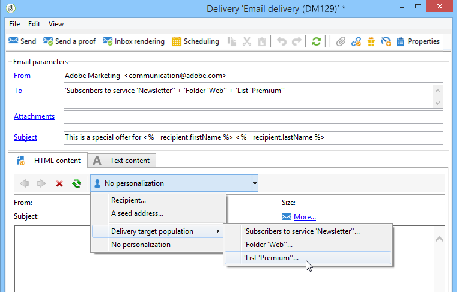
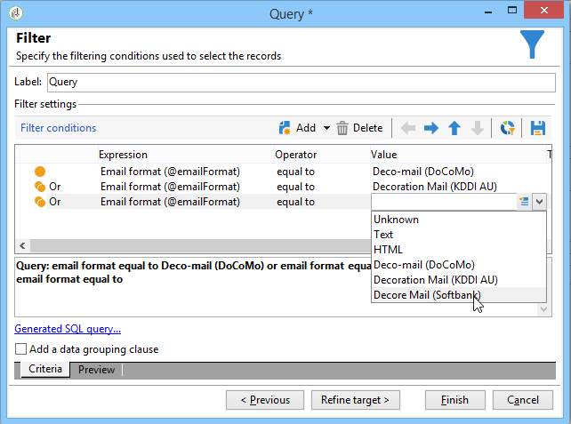

# 定义电子邮件内容 {#defining-the-email-content}

## 发件人{#sender}

要定义将显示在所发送邮件标头中的发件人名称和地址，请单击&#x200B;**[!UICONTROL From]**&#x200B;链接。

在此窗口中，您可以输入创建电子邮件标头所需的所有信息。 此信息可以个性化。为此，请使用输入字段右侧的按钮插入个性化字段。

要了解如何插入和使用个性化字段，请参阅[关于个性化](../../delivery/using/about-personalization.md)部分。

>[!NOTE]
>
>* 默认情况下，发件人地址将用于回复。
>* 标题参数不得为空。 默认情况下，它们包含配置部署向导时输入的值。 有关详细信息，请参阅[《安装指南》](../../installation/using/deploying-an-instance.md)。
>* 发送者的地址是允许发送电子邮件的必填地址（RFC标准）。
>* Adobe Campaign检查输入的电子邮件地址的语法。

>[!IMPORTANT]
>
>在因特网访问提供商(ISP)为打击未经请求的电子邮件（垃圾邮件）而实施的检查的上下文中，Adobe建议创建与为投放和回复指定的地址对应的电子邮件帐户。 请咨询消息系统管理员。

## 邮件主题{#message-subject}

消息的主题在相应字段中配置。 您可以直接在字段中输入脚本，或单击&#x200B;**[!UICONTROL Subject]**&#x200B;链接以输入脚本。 个性化链接允许您在主题中插入数据库字段。

>[!IMPORTANT]
>
>邮件主题是必填项。

在发送消息时，字段内容将替换为收件人用户档案中的值。

例如，在上述消息中，每个收件人的消息主题都会通过来自其用户档案的数据进行个性化。

>[!NOTE]
>
>[关于个性化](../../delivery/using/about-personalization.md)中介绍了个性化字段的使用。

您还可以在&#x200B;**[!UICONTROL Insert emoticon]**&#x200B;弹出窗口中将表情图标插入主题行。

## 消息内容{#message-content}

>[!IMPORTANT]
>
>出于隐私考虑，我们建议对所有外部资源使用HTTPS。

消息的内容在投放配置窗口的下半部分中定义。

默认情况下，根据收件人首选项，消息以HTML或文本格式发送。 我们建议以两种格式创建内容，以确保消息可以正确显示在任何邮件系统中。 有关详细信息，请参阅[选择消息格式](#selecting-message-formats)。

* 要导入HTML内容，请使用&#x200B;**[!UICONTROL Open]**&#x200B;按钮。 您还可以将源代码直接粘贴到&#x200B;**[!UICONTROL Source]**&#x200B;子选项卡中。

   如果您使用[数字内容编辑器](../../web/using/about-campaign-html-editor.md)(数字内容编辑器)，请参阅[选择内容模板](../../web/using/use-case--creating-an-email-delivery.md#step-3---selecting-a-content)。

   >[!IMPORTANT]
   >
   >必须事先创建HTML内容，然后将其导入Adobe Campaign。 HTML编辑器不是为创建内容而设计的。

   使用&#x200B;**[!UICONTROL Preview]**&#x200B;子选项卡可以视图每个内容的呈现以用于收件人。 个性化字段和内容的条件元素被替换为所选用户档案的相应信息。

   工具栏按钮提供对HTML页的标准操作和格式参数的访问。

   

   您可以在消息中插入来自本地文件或图像库的图像，以Adobe Campaign。 要执行此操作，请单击&#x200B;**[!UICONTROL Image]**&#x200B;图标，然后选择相应的选项。

   

   库图像可通过文件夹树中的&#x200B;**[!UICONTROL Resources>Online>Public resources]**&#x200B;文件夹进行访问。 另请参阅[添加图像](#adding-images)。

   工具栏中的最后一个按钮允许您插入个性化字段。

   >[!NOTE]
   >
   >[关于个性化](../../delivery/using/about-personalization.md)中介绍了个性化字段的使用。

   通过页面底部的选项卡可显示所创建页面的HTML代码，并将消息的呈现与其个性化视图。 要启动此显示屏，请单击&#x200B;**[!UICONTROL Preview]**&#x200B;并使用工具栏中的&#x200B;**[!UICONTROL Test personalization]**&#x200B;按钮选择收件人。 您可以从定义的收件人中选择目标或选择其他收件人。

   

   您可以验证HTML消息。 您还可以视图电子邮件标题的内容。

   

* 要导入文本内容，请使用&#x200B;**[!UICONTROL Open]**&#x200B;按钮或&#x200B;**[!UICONTROL Text Content]**&#x200B;选项卡输入以文本格式显示的消息内容。 使用工具栏按钮访问内容上的操作。 最后一个按钮允许您插入个性化字段。

   

   至于HTML格式，请单击页面底部的&#x200B;**[!UICONTROL Preview]**&#x200B;选项卡，将消息的呈现与其个性化视图。

   

<!--## Selecting message formats {#selecting-message-formats}

You can change the format of email messages sent. To do this, edit the delivery properties and click the **[!UICONTROL Delivery]** tab.

Select the format of the email in the lower section of the window:

* **[!UICONTROL Use recipient preferences]** (default mode)

  The message format is defined according to the data stored in the recipient profile and stored by default in the **[!UICONTROL email format]** field (@emailFormat). If a recipient wishes to receive messages in a certain format, this is the format sent. If the field is not filled in, a multipart-alternative message is sent (see below).

* **[!UICONTROL Let recipient mail client choose the most appropriate format]**

  The message contains both formats: text and HTML. The format displayed on reception depends on the configuration of the recipient's mail software (multipart-alternative).

  >[!IMPORTANT]
  >
  >This option includes both versions of the document. It therefore impacts the delivery rate, because the message size is greater.

* **[!UICONTROL Send all messages in text format]**

  The message is sent in text format. HTML format will not be sent, but used for the mirror page only when the recipient clicks on the message.-->

## 定义互动内容 {#amp-for-email-format}

Adobe Campaign允许您尝试新的交互式[AMP for Email](https://amp.dev/about/email/)格式，该格式允许在某些条件下发送动态电子邮件。

有关更多信息，请参阅[此章节](../../delivery/using/defining-interactive-content.md)。

## 使用内容管理{#using-content-management}

您可以直接在投放中使用内容管理表单定义投放向导内容。 要执行此操作，您必须引用要使用的内容管理的发布模板，在投放属性的&#x200B;**[!UICONTROL Advanced]**&#x200B;选项卡中。

您还可以使用其他选项卡输入内容，这些内容将根据内容管理规则自动集成和设置格式。

>[!NOTE]
>
>有关Adobe Campaign中内容管理的详细信息，请参阅[本节](../../delivery/using/about-content-management.md)。

## 插入表情图标{#inserting-emoticons}

您可以将表情图标插入电子邮件内容。

1. 单击&#x200B;**[!UICONTROL Insert emoticon]**&#x200B;图标。
1. 从弹出窗口中选择一个表情图标。

   

1. 完成后，单击&#x200B;**[!UICONTROL Close]**&#x200B;按钮。

要自定义表情列表，请参阅此[页面](../../delivery/using/customizing-emoticon-list.md)。

## 添加图像{#adding-images}

HTML格式的电子邮件投放可以包含图像。 在该投放向导中，可以通过&#x200B;**[!UICONTROL Image]**&#x200B;图标直接使用HTML编辑器导入包含图像的HTML页面或插入图像。

图像可以：

* 本地图像或从服务器调用的图像
* 存储在Adobe Campaign公共资源库中的图像

   公共资源可通过Adobe Campaign层次的&#x200B;**[!UICONTROL Resources > Online]**&#x200B;节点访问。 它们被分组在库中，并可以包含在电子邮件中，但也可以用于活动或任务或内容管理。

* 与Adobe Experience Cloud共享的资源。 请参阅[此章节](../../integrations/using/sharing-assets-with-adobe-experience-cloud.md) 。

>[!IMPORTANT]
>
>要使用投放向导在电子邮件中包含图像，必须配置Adobe Campaign实例以启用公共资源管理。 可以从部署向导中执行此过程。 有关配置的详细信息，请参阅[本节](../../installation/using/deploying-an-instance.md)。

该投放向导允许您向消息内容中添加本地图像或存储在库中的图像。 要执行此操作，请单击HTML内容工具栏中的&#x200B;**[!UICONTROL Image]**&#x200B;按钮。

>[!IMPORTANT]
>
>为了使收件人能够视图他们收到的消息中包含的图像，这些消息必须在可从外部访问的服务器上可用。

要通过投放向导管理图像，请执行以下操作：

1. 单击工具栏中的&#x200B;**[!UICONTROL Tracking & Images]**图标。
   

1. 在&#x200B;**[!UICONTROL Images]**&#x200B;选项卡中选择&#x200B;**[!UICONTROL Upload images]**。
1. 然后，您可以选择是否要在电子邮件中包含图像。
   

* 您可以手动上传图像，无需等待投放分析阶段。 为此，请单击&#x200B;**[!UICONTROL Upload the images straightaway...]**&#x200B;链接。
* 您可以指定另一个路径以访问跟踪服务器上的图像。 为此，请在&#x200B;**[!UICONTROL Images URL]**&#x200B;字段中输入。 此值将覆盖在安装向导参数中定义的值。

当您打开投放向导中包含图像的HTML内容时，系统会显示一条消息，提示您可以根据投放参数立即上传图像。

>[!IMPORTANT]
>
>在手动上传或发送消息期间修改图像访问路径。

### 发送包含图像{#sending-a-message-with-images}的消息

>[!NOTE]
>
>为避免性能问题，如果您将动态下载的图像作为[attachment](../../delivery/using/attaching-files.md)包含在个性化URL中，默认情况下，每个图像大小不应超过100,000字节。 可以从[Campaign Classic选项的列表](../../installation/using/configuring-campaign-options.md#delivery)配置此推荐阈值。

以下是包含四张图像的投放示例：

这些图像来自本地目录或网站，您可以通过&#x200B;**[!UICONTROL Source]**&#x200B;选项卡进行验证。

单击&#x200B;**[!UICONTROL Tracking & Images]**&#x200B;图标，然后单击&#x200B;**[!UICONTROL Images]**&#x200B;选项卡以开始检测邮件中的图像。

对于检测到的每个图像，您可以视图其状态：

* 如果图像存储在本地或位于另一台服务器上，即使此服务器从外部（例如，在Internet站点上）可见，也会检测到它为&#x200B;**[!UICONTROL Not yet online]**。
* 如果图像是在创建其他投放时较早上传的，则检测为&#x200B;**[!UICONTROL Already online]**。
* 在部署向导中，您可以定义未启用图像检测的URL:上传这些图像将为&#x200B;**[!UICONTROL Skipped]**。

>[!NOTE]
>
>图像由其内容而非访问路径来标识。 这意味着先前以不同名称或不同目录上载的图像将检测为&#x200B;**[!UICONTROL Already online]**。

在分析阶段，图像会自动上传到服务器，以便从外部访问它们，但本地图像必须预先上传。

您可以继续处理并上传图像，以便其他Adobe Campaign操作员可以查看它们。 如果您相互协作，您可能会发现此功能非常有用。 为此，请单击&#x200B;**[!UICONTROL Upload the images straightaway...]**&#x200B;将图像上传到服务器。

>[!NOTE]
>
>随后将修改电子邮件中图像的URL，尤其是其名称。

图像联机后，您可以从消息的&#x200B;**[!UICONTROL Source]**&#x200B;选项卡中视图对其名称和路径的更改。

如果选择&#x200B;**[!UICONTROL Include the images in the email]**，则可以选择要包含在相应列中的图像。

>[!NOTE]
>
>如果消息中包含本地图像，则必须确认对消息源代码的更改。

## 在电子邮件中插入条形码{#inserting-a-barcode-in-an-email}

条形码生成模块允许您创建符合许多常见标准（包括2D条码）的几种条形码。

可以使用使用客户标准定义的值动态地将条形码生成为位图。 个性化的条码可以包含在电子邮件活动中。 收件人可以打印消息并将其显示给发布公司以进行扫描（例如，当签出时）。

要在电子邮件中插入条形码，请将光标置于要显示它的内容中，然后单击个性化按钮。 选择 **[!UICONTROL Include > Barcode...]**。

然后，配置以下元素以满足您的需求：

1. 选择条形码类型。

   * 对于1D格式，以下类型在Adobe Campaign中可用：Codabar， Code 128, GS1-128（以前称为EAN-128）， UPC-A， UPC-E， ISBN， EAN-8, Code39, Interleved 2 of 5, POSTNET和Royal Mail(RM4SCC)。

      1D条形码示例：

      

   * DataMatrix和PDF417类型涉及2D格式。

      2D条形码示例：

      

   * 要插入QR码，请选择此类型并输入要应用的纠错率。 此比率定义重复信息的数量和对恶化的容差。

      

      QR码示例：

      

1. 输入要插入电子邮件的条形码的大小：通过配置缩放，您可以增加或减小条形码的大小，从x1到x10。
1. **[!UICONTROL Value]**&#x200B;字段允许您定义条形码的值。 值可以与特定优惠匹配，也可以是标准的函数，也可以是链接到客户的数据库字段的值。

   此示例显示EAN-8类型的条形码，其中添加了收件人的帐号。 要添加此帐号，请单击&#x200B;**[!UICONTROL Value]**&#x200B;字段右侧的个性化按钮并选择&#x200B;**[!UICONTROL Recipient > Account number]**。

   

1. 通过&#x200B;**[!UICONTROL Height]**&#x200B;字段，您可以通过更改每个条形之间的空间量，配置条形码的高度，而不更改其宽度。

   没有根据条形码类型进行的限制性输入控件。 如果条形码值不正确，则只能在&#x200B;**预览**&#x200B;模式下显示该条形码，在该模式下，条形码将以红色划出。

   >[!NOTE]
   >
   >分配给条形码的值取决于其类型。 例如，EAN-8类型应具有正8个数字。
   >
   >通过&#x200B;**[!UICONTROL Value]**&#x200B;字段右侧的个性化按钮，除了值本身之外，还可以添加数据。 这会丰富条形码，前提是条形码标准接受它。
   >
   >例如，如果您使用GS1-128类型条形码，并且要输入收件人的帐号以及值，请单击个性化按钮并选择&#x200B;**[!UICONTROL Recipient > Account number]**。 如果正确输入所选收件人的帐号，条形码会将其考虑在内。

配置这些元素后，您可以完成电子邮件并发送。 为避免出现错误，请务必在执行投放之前单击&#x200B;**[!UICONTROL Preview]**&#x200B;选项卡，确保正确显示您的内容。

>[!NOTE]
>
>如果条形码的值不正确，其位图将用红色划出。

<!--## Sending emails on Japanese mobiles {#sending-emails-on-japanese-mobiles}

### Email formats for Japanese mobiles {#email-formats-for-japanese-mobiles}

Adobe Campaign manages three specific Japanese formats for email on mobiles: **Deco-mail** (DoCoMo mobiles), **Decore Mail** (Softbank mobiles) and **Decoration Mail** (KDDI AU mobiles). These formats impose particular coding, structure, and size constraints. Learn more about limitations and recommendations in [this section](#limitations-and-recommendations).

In order for the recipient to correctly receive messages in one of these formats, we recommend selecting **[!UICONTROL Deco-mail (DoCoMo)]**, **[!UICONTROL Decore Mail (Softbank)]** or **[!UICONTROL Decoration Mail (KDDI AU)]** in the corresponding profile:

However, if you leave the **[!UICONTROL Email format]** option as **[!UICONTROL Unknown]**, **[!UICONTROL HTML]** or **[!UICONTROL Text]**, Adobe Campaign will automatically detect (when sending the email) the Japanese format to use so that the message is correctly displayed.

This automatic detection system is based on the list of predefined domains defined in the **[!UICONTROL Management of Email Formats]** mail rule set. For more on managing email formats, refer to [this page](../../installation/using/email-deliverability.md#managing-email-formats).

### Limitations and recommendations {#limitations-and-recommendations}

A certain number of constraints apply for sending emails that will be read on a mobile operated by a Japanese provider (Softbank, DoCoMo, KDDI AU).

Therefore, you must:

* Only use images in JPEG or GIF format
* Create a delivery with text and HTML sections that are strictly lower than 10 000 bytes (for KDDI AU and DoCoMo)
* Use images with a total size (before encoding) that is lower than 100 KB
* Do not use more than 20 images per message
* Use a reduced size HTML format (a limited number of tags are available for each operator)

>[!NOTE]
>
>Limitations specific to each operator are to be taken into account when creating your message. Refer to:  
>
>* For DoCoMo, refer to [this page](https://www.nttdocomo.co.jp/service/developer/make/content/deco_mail/index.html)
>* For KDDI AU, refer to [this page](https://www.au.com/ezfactory/tec/spec/decorations/template.html)
>* For Softbank, refer to [this page](https://www.support.softbankmobile.co.jp/partner/home_tech3/index.cfm)

### Testing the email content {#testing-the-email-content}

#### Previewing the message {#previewing-the-message}

Adobe Campaign allows you to check that your message format is adapted to be sent to a Japanese mobile.

Once you have defined your content and entered the email subject, you can check the display and formatting when the message is created.

In the **[!UICONTROL Preview]** tab of the content editing window, clicking **[!UICONTROL More... > Deco-mail diagnostic]** allows you to:

* Check that the HTML content tags conform to the Japanese format restrictions
* Check that the number of images in the message does not exceed the limit imposed by the format (20 images)
* Check the total message size (less than 100kB)

  

#### Running typology rule {#running-typology-rule}

In addition to the previewing diagnosis, a second check is carried out when sending a proof or a delivery: a specific typology rule, **[!UICONTROL Deco-mail check]**, is started during the analysis.

>[!IMPORTANT]
>
>This typology rule is only executed if at least one of the recipients is configured to receive emails in **[!UICONTROL Deco-mail (DoCoMo)]**, **[!UICONTROL Decore Mail (Softbank)]** or **[!UICONTROL Decoration Mail (KDDI AU)]** format.

This typology rule allows you to make sure that the delivery respects the [format constraints](#limitations-and-recommendations) defined by the Japanese operators, particularly in relation to the total size of the email, the size of the HTML and text sections, the number of images in the messages, and the tags in the HTML content.

#### Sending proofs {#sending-proofs}

You can send proofs to test your delivery. When you send the proof, if you are using substitution addresses, please enter addresses that correspond to the email format of the profile used.

For example, you can replace a profile's address by test@softbank.ne.jp if the email format for this profile was defined beforehand on **[!UICONTROL Decore Mail (Softbank)]**.

### Sending messages {#sending-messages}

To send an email to recipients with Japanese email formats with Campaign, two options are possible:

* Create two deliveries: one only for Japanese recipients and another for other recipients - refer to [this section](#designing-a-specific-delivery-for-japanese-formats).
* Create a single delivery and Adobe Campaign will automatically detect the format to use - refer to [this section](#designing-a-delivery-for-all-formats).

#### Designing a specific delivery for Japanese formats {#designing-a-specific-delivery-for-japanese-formats}

You can create a workflow that contains two deliveries: one to be read on a Japanese mobile and another for recipients with a standard email format.

To do this, use the **[!UICONTROL Split]** activity in your workflow and define the Japanese email formats (Deco-mail, Decoration Mail and Decore Mail) as filtering conditions.

#### Designing a delivery for all formats {#designing-a-delivery-for-all-formats}

When Adobe Campaign dynamically manages the formats according to the domain (profiles with email formats defined as **[!UICONTROL Unknown]**, **[!UICONTROL HTML]** or **[!UICONTROL Text]** ), you can send the same delivery to all of your recipients.

The message contact will display correctly for the users on Japanese mobiles, just as for the standard recipients.

>[!IMPORTANT]
>
>Make sure to respect the special features associated with each Japanese email format (Deco-mail, Decoration Mail, and Decore Mail). For more information on limitations, refer to [this section](#limitations-and-recommendations).-->
