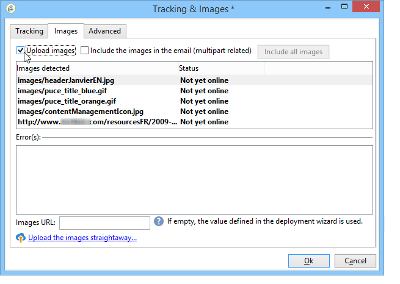

# 定义电子邮件内容{#defining-the-email-content}

## 发件人 {#sender}

要定义将显示在发送消息标头中的发送方的名称和地址，请单击链 **[!UICONTROL From]** 接。

在此窗口中，您可以输入创建电子邮件标题所需的所有信息。 此信息可以个性化。 为此，请使用输入字段右侧的按钮插入个性化字段。

要了解如何插入和使用个性化字段，请参阅关于个 [性化部分](../../delivery/using/about-personalization.md) 。

>[!NOTE]
>
>* 默认情况下，发件人地址将用于回复。
>* 标题参数不得为空。 默认情况下，它们包含配置部署向导时输入的值。 有关详细信息，请参阅《安 [装指南》](../../installation/using/deploying-an-instance.md)。
>* 发送方地址是允许发送电子邮件的必填地址（RFC标准）。
>* Adobe Campaign检查输入的电子邮件地址的语法。

>[!CAUTION]
>
>在Internet访问提供商(ISP)实施的检查中，Adobe建议创建与为发送和回复指定的地址相对应的电子邮件帐户，以防止未经请求的电子邮件（垃圾邮件）。 请咨询消息传递系统管理员。

## 邮件主题 {#message-subject}

消息的主题在相应的字段中配置。 您可以直接在字段中输入它，或单击 **[!UICONTROL Subject]** 链接以输入脚本。 个性化链接允许您在主题中插入数据库字段。

>[!CAUTION]
>
>邮件主题为必填项。

发送消息时，字段内容将替换为收件人配置文件中的值。

例如，在上述消息中，每个收件人的邮件主题都是个性化的，并带有其个人资料中的数据。

>[!NOTE]
>
>“关于个性化”中介绍了个性化字段 [的使用](../../delivery/using/about-personalization.md)。

## 消息内容 {#message-content}

>[!CAUTION]
>
>出于隐私原因，我们建议对所有外部资源使用HTTPS。

消息内容在分发配置窗口的下半部分中定义。

默认情况下，根据收件人首选项，消息以HTML或文本格式发送。 我们建议创建两种格式的内容，以确保消息能够正确地显示在任何邮件系统中。 有关详细信息，请参阅选 [择消息格式](#selecting-message-formats)。

* 要导入HTML内容，请使用按 **[!UICONTROL Open]** 钮。 您还可以将源代码直接粘贴到子 **[!UICONTROL Source]** 选项卡中。

   如果您使用的是数 [字内容编辑器](../../web/using/about-campaign-html-editor.md) (DCE)，请参阅 [选择内容模板](../../web/using/use-case--creating-an-email-delivery.md#step-3---selecting-a-content)。

   >[!CAUTION]
   >
   >必须事先创建HTML内容，然后将其导入Adobe Campaign。 HTML编辑器不设计用于创建内容。

   子选 **[!UICONTROL Preview]** 项卡允许您查看每个收件人内容的呈现。 个性化字段和内容的条件元素被替换为所选配置文件的相应信息。

   工具栏按钮提供对HTML页面的标准操作和格式参数的访问。

   

   您可以在Adobe Campaign中从本地文件或图像库向消息中插入图像。 为此，请单击图 **[!UICONTROL Image]** 标并选择相应的选项。

   

   库图像可通过文件夹树 **[!UICONTROL Resources>Online>Public resources]** 中的文件夹访问。 另请参阅添 [加图像](#adding-images)。

   工具栏中的最后一个按钮允许您插入个性化字段。

   >[!NOTE]
   >
   >“关于个性化”中介绍了个性化字段 [的使用](../../delivery/using/about-personalization.md)。

   页面底部的选项卡允许您显示所创建页面的HTML代码，并查看消息的呈现及其个性化。 要启动此显示屏，请单 **[!UICONTROL Preview]** 击并使用工具栏中的按钮 **[!UICONTROL Test personalization]** 选择收件人。 您可以从定义的目标中选择收件人或选择其他收件人。

   

   您可以验证HTML消息。 您还可以查看电子邮件标题的内容。

   

* 要导入文本内容，请在以文 **[!UICONTROL Open]** 本格式显示 **[!UICONTROL Text Content]** 时，使用按钮或选项卡输入消息的内容。 使用工具栏按钮可访问内容上的操作。 最后一个按钮允许您插入个性化字段。

   

   对于HTML格式，请单击页 **[!UICONTROL Preview]** 面底部的选项卡，查看消息的呈现及其个性化。

   

## 选择消息格式 {#selecting-message-formats}

您可以更改发送电子邮件的格式。 为此，请编辑传送属性，然后单击选 **[!UICONTROL Delivery]** 项卡。

在窗口的下半部分选择电子邮件的格式：

* **[!UICONTROL Use recipient preferences]** （默认模式）

   消息格式根据存储在收件人配置文件中的数据定义，默认情况下存储在字 **[!UICONTROL email format]** 段(@emailFormat)中。 如果收件人希望以某种格式接收消息，则此格式为发送的格式。 如果未填写字段，则会发送多部分替代消息（请参阅下文）。

* **[!UICONTROL Let recipient mail client choose the most appropriate format]**

   该消息包含两种格式：文本和HTML。 接收时显示的格式取决于收件人的邮件软件（多部分替代）的配置。

   >[!CAUTION]
   >
   >此选项包括文档的两个版本。 因此，它会影响传送速率，因为消息大小较大。

* **[!UICONTROL Send all messages in text format]**

   消息以文本格式发送。 不会发送HTML格式，但仅当收件人单击消息时，才用于镜像页面。

## 定义交互式内容 {#amp-for-email-format}

Adobe Campaign允许您尝试新的交互式 [AMP for Email](https://amp.dev/about/email/) ，该格式允许在特定条件下发送动态电子邮件。

For more on this, see [this section](../../delivery/using/defining-interactive-content.md).

## 使用内容管理 {#using-content-management}

您可以直接在分发向导中使用内容管理表单定义分发的内容。 为此，您必须引用要使用的内容管理的发布模板(在交付属性的选 **[!UICONTROL Advanced]** 项卡中)。

您还可以使用其他选项卡输入内容，这些内容将根据内容管理规则自动集成和格式化。

>[!NOTE]
>
>有关Adobe Campaign中内容管理的更多信息，请参阅 [此部分](../../delivery/using/about-content-management.md)。

## 添加图像 {#adding-images}

HTML格式的电子邮件发送可以包含图像。 从传送向导中，您可以导入包含图像的HTML页面，或通过图标直接使用HTML编辑器插入 **[!UICONTROL Image]** 图像。

图像可以是：

* 本地映像或从服务器调用的映像
* Adobe Campaign公共资源库中存储的图像

   公共资源可通过Adobe Campaign层 **[!UICONTROL Resources > Online]** 次结构的节点访问。 它们分组在库中，并可以包含在电子邮件中，但也可用于营销活动或任务或内容管理。

* 与Adobe Experience cloud共享的资产。 Refer to [this section](../../integrations/using/sharing-assets-with-adobe-experience-cloud.md).

>[!CAUTION]
>
>要使用传送向导将图像包含在电子邮件中，必须配置Adobe Campaign实例以启用公共资源管理。 可以从部署向导中执行此过程。 有关配置的 [更多信息](../../installation/using/deploying-an-instance.md) ，请参阅本节。

传送向导允许您向消息内容中添加本地图像或库中存储的图像。 To do this, click the **[!UICONTROL Image]** button in the HTML content toolbar.

要使收件人能够查看他们收到的消息中包含的图像，这些消息必须在可从外部访问的服务器上可用。

要通过传送向导管理图像，必须单击工 **[!UICONTROL Tracking & Images]** 具栏中的图标。

在选 **[!UICONTROL Upload images]** 项卡中 **[!UICONTROL Images]** 选择。 然后，您可以选择是否希望在电子邮件中包含图像。

* 您可以手动上传图像，无需等待传送分析阶段。 要执行此操作，请单击链 **[!UICONTROL Upload images now]** 接。
* 您可以指定另一个路径以访问跟踪服务器上的图像。 为此，请在字段中输入该 **[!UICONTROL Image URL]** 字段。 此值将覆盖在安装向导参数中定义的值。

在传送向导中打开包含图像的HTML内容时，系统会显示一条消息，提示您根据传送参数立即上传图像。

>[!CAUTION]
>
>在手动上传或发送消息期间，将修改图像访问路径。

**示例：用图像发送消息{#example--sending-a-message-with-images}**

以下是包含四个图像的分发示例：

这些图像来自本地目录或网站，您可以通过选项卡进行验 **[!UICONTROL Source]** 证。

单击图 **[!UICONTROL Tracking & Images]** 标，然后单击选 **[!UICONTROL Images]** 项卡以开始检测消息中的图像。

对于检测到的每幅图像，您可以查看其状态：

* 如果图像存储在本地或位于另一台服务器上，即使该服务器从外部（例如，在Internet站点上）可见，也会检测为 **[!UICONTROL Not yet online]**。
* 检测到图像，就像在创 **[!UICONTROL Already online]** 建其他分发时之前上传的图像一样。
* 在部署向导中，您可以定义未启用图像检测的URL:上传这些图像将 **[!UICONTROL Skipped]**&#x200B;是。

>[!NOTE]
>
>图像由其内容而非访问路径来标识。 这意味着之前以其他名称或其他目录中上载的图像将检测为 **[!UICONTROL Already online]**。

在分析阶段，图像会自动上传到服务器，以便从外部访问它们，但本地图像必须预先上传。

您可以继续工作并上传图像，以便其他Adobe Campaign运营商查看它们。 如果您能够协同工作，您会发现这一点很有用。 为此，请单击 **[!UICONTROL Upload the images straightaway...]** 将图像上传到服务器。

>[!NOTE]
>
>随后将修改电子邮件中图像的URL，特别是其名称。

图像联机后，您可以从消息的选项卡中查看对其名称和 **[!UICONTROL Source]** 路径的更改。

如果选择 **[!UICONTROL Include the images in the email]**&#x200B;了此选项，则可以选择要包含在相应列中的图像。

>[!NOTE]
>
>如果消息中包含本地图像，则必须确认对消息源代码所做的更改。

## 在电子邮件中插入条形码{#inserting-a-barcode-in-an-email}

条形码生成模块允许您创建符合许多常见标准（包括2D条形码）的几种条形码。

可以使用使用客户标准定义的值动态地生成条形码作为位图。 个性化的条码可包含在电子邮件营销活动中。 收件人可以打印邮件并将其显示给发布公司进行扫描（例如，在注销时）。

要将条形码插入电子邮件，请将光标放在要显示它的内容中，然后单击个性化按钮。 Select **[!UICONTROL Include > Barcode...]**.

然后，配置以下元素以满足您的需求：

1. 选择条形码类型。

   * 对于1D格式，Adobe Campaign中提供以下类型：Codabar，代码128, GS1-128（以前称为EAN-128）, UPC-A, UPC-E, ISBN, EAN-8, Code39, Interleand 2 of 5, POSTNET和Royal Mail(RM4SCC)。

      1D条形码示例：

      

   * DataMatrix和PDF417类型涉及2D格式。

      2D条形码示例：

      

   * 要插入QR码，请选择此类型并输入要应用的错误校正率。 该速率定义重复信息的数量和对恶化的容忍度。

      

      QR码示例：

      

1. 输入要插入电子邮件的条形码的大小：通过配置比例，您可以从x1增大或减小条形码的大小，从x1增大到x10。
1. 该 **[!UICONTROL Value]** 字段允许您定义条形码的值。 值可以与特价优惠匹配，也可以是标准的函数，也可以是链接到客户的数据库字段的值。

   此示例显示EAN-8类型条形码，该条形码已添加到收件人的帐号。 要添加此帐号，请单击字段右侧的个性化按钮并 **[!UICONTROL Value]** 选择 **[!UICONTROL Recipient > Account number]**。

   

1. 通过 **[!UICONTROL Height]** 该字段，您可以通过更改每个条形之间的间距量，在不更改条形码宽度的情况下配置条形码的高度。

   根据条形码的类型，没有限制性的输入控件。 如果条形码值不正确，它将仅在“预览 **** ”模式下可见，在该模式下，条形码将以红色划出。

   >[!NOTE]
   >
   >分配给条形码的值取决于其类型。 例如，EAN-8类型应具有正好8个数字。
   >
   >通过字段右侧的个性化按 **[!UICONTROL Value]** 钮，除了值本身之外，您还可以添加数据。 这丰富了条形码，前提是条形码标准接受它。
   >
   >例如，如果您使用GS1-128类型的条形码，并且除了输入值之外还要输入收件人的帐号，请单击个性化按钮并选择 **[!UICONTROL Recipient > Account number]**。 如果正确输入了选定收件人的帐号，条形码会将其考虑在内。

配置这些元素后，您可以完成电子邮件并发送。 为避免出错，请务必在执行分发之前通过单击选项卡确保内容正确显 **[!UICONTROL Preview]** 示。

>[!NOTE]
>
>如果条形码的值不正确，其位图将以红色划出。

## 在日本手机上发送电子邮件 {#sending-emails-on-japanese-mobiles}

### 日文手机的电子邮件格式 {#email-formats-for-japanese-mobiles}

Adobe Campaign管理三种特定的日文格式，用于移动设备上的电子邮件： **Deco-mail** (DoCoMo mobile)、 **Decore Mail** (Softbank mobile)和 **Decoration Mail** (KDDI AU mobile)。 这些格式具有特定的编码、结构和大小限制。 了解本节中有关限制和建议的 [更多信息](#limitations-and-recommendations)。

为了让收件人正确接收以下格式之一的消息，我们建议选择或在相 **[!UICONTROL Deco-mail (DoCoMo)]**&#x200B;应的 **[!UICONTROL Decore Mail (Softbank)]** 配置 **[!UICONTROL Decoration Mail (KDDI AU)]** 文件中：

但是，如果您将选 **[!UICONTROL Email format]** 项保留为 **[!UICONTROL Unknown]**, **[!UICONTROL HTML]****[!UICONTROL Text]**&#x200B;或者，Adobe Campaign将自动检测（发送电子邮件时）要使用的日文格式，以便正确显示消息。

该自动检测系统基于在邮件规则集中定义的预定域 **[!UICONTROL Management of Email Formats]** 的列表。 有关管理电子邮件格式的详细信息，请参 [阅此页](../../installation/using/email-deliverability.md#managing-email-formats)。

### 限制和建议 {#limitations-and-recommendations}

某些限制适用于发送将在日本提供商(Softbank、DoCoMo、KDDI AU)运营的移动设备上读取的电子邮件。

因此，您必须：

* 仅使用JPEG或GIF格式的图像
* 创建文本部分和HTML部分严格低于10 000字节（对于KDDI AU和DoCoMo）的交付
* 使用总大小（编码前）低于100 KB的图像
* 每条消息不使用20张以上的图像
* 使用缩小的HTML格式（每个操作员可以使用有限数量的标记）

>[!NOTE]
>
>创建消息时，应考虑每个操作符的特定限制。 请参阅：
>
>* 有关DoCoMo，请参 [阅本页](https://www.nttdocomo.co.jp/service/developer/make/content/deco_mail/index.html)
>* 有关KDDI AU，请参 [阅本页](https://www.au.com/ezfactory/tec/spec/decorations/template.html)
>* 有关软件库，请参 [阅本页](https://www.support.softbankmobile.co.jp/partner/home_tech3/index.cfm)

### 测试电子邮件内容 {#testing-the-email-content}

#### 预览消息 {#previewing-the-message}

Adobe Campaign允许您检查消息格式是否已调整为发送到日文移动设备。

在定义内容并输入电子邮件主题后，您可以检查消息创建时的显示和格式。

在内容 **[!UICONTROL Preview]** 编辑窗口的选项卡中，单击 **[!UICONTROL More... > Deco-mail diagnostic]** 可以：

* 检查HTML内容标记是否符合日文格式限制
* 检查邮件中的图像数量是否超出格式设置的限制（20张图像）
* 检查消息总大小（小于100kB）

   

#### 运行排版规则 {#running-typology-rule}

除了预览诊断之外，在发送证明或递送时还执行第二次检查：在分析过程中 **[!UICONTROL Deco-mail check]**&#x200B;会启动特定的排版规则。

>[!CAUTION]
>
>此排版规则仅在至少一个收件人被配置为接收以或格式发送的电子 **[!UICONTROL Deco-mail (DoCoMo)]**&#x200B;邮件 **[!UICONTROL Decore Mail (Softbank)]** 时执 **[!UICONTROL Decoration Mail (KDDI AU)]** 行。

此排版规则允许您确保交付符合日语运算符定义的格式限制  ，特别是与电子邮件的总大小、HTML和文本部分的大小、消息中的图像数以及HTML内容中的标记有关的限制。

#### 发送校样 {#sending-proofs}

您可以发送校样以测试您的交付。 发送证明时，如果您使用的是替代地址，请输入与所用配置文件的电子邮件格式相对应的地址。

例如，如果此配置文件的电子邮件格式是在上预先定义的，则可以用test@softbank.ne.jp替换配置文件的地址 **[!UICONTROL Decore Mail (Softbank)]**。

### 发送消息 {#sending-messages}

要使用Campaign向采用日文电子邮件格式的收件人发送电子邮件，可以使用以下两种选项：

* 创建两个提交：一个仅适用于日文收件人，另一个适用于其他收件人——请参 [阅本节](#designing-a-specific-delivery-for-japanese-formats)。
* 创建单个分发，Adobe Campaign将自动检测要使用的格式——请参阅 [此部分](#designing-a-delivery-for-all-formats)。

#### 为日文格式设计特定交付 {#designing-a-specific-delivery-for-japanese-formats}

您可以创建包含两个提交的工作流：一个在日文手机上阅读，另一个在标准电子邮件格式的收件人上阅读。

为此，请使用工作流 **[!UICONTROL Split]** 中的活动，并将日文电子邮件格式（Deco邮件、装饰邮件和Decore邮件）定义为筛选条件。

#### 设计所有格式的交付 {#designing-a-delivery-for-all-formats}

当Adobe Campaign根据域（电子邮件格式定义为或或）动态管理格式时， **[!UICONTROL Unknown]**&#x200B;您可以向所有收件人发送相同的分发 **[!UICONTROL HTML]****[!UICONTROL Text]** 。

与标准收件人一样，邮件联系人将正确显示给日文手机上的用户。

>[!CAUTION]
>
>确保遵守与每种日文电子邮件格式（Deco邮件、装饰邮件和Decore邮件）相关的特殊功能。 For more information on limitations, refer to [this section](#limitations-and-recommendations).
