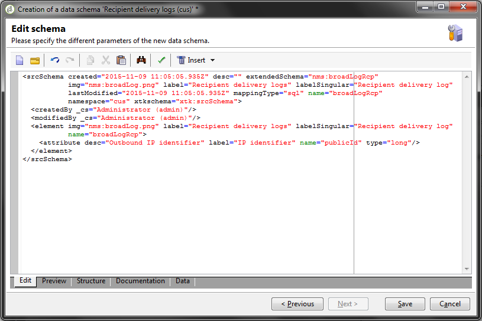
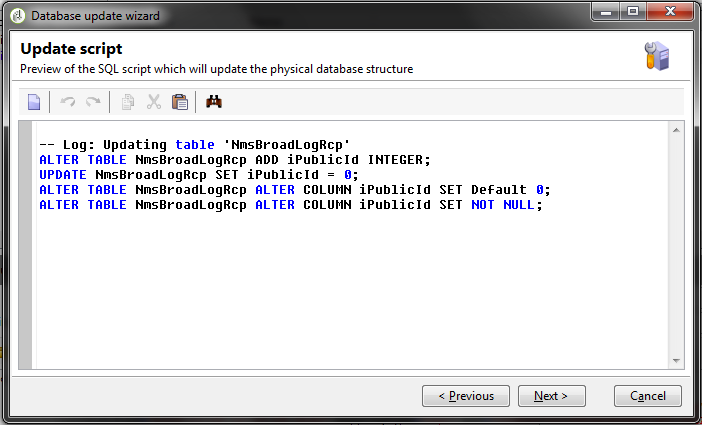

# 投放仪表板 {#delivery-dashboard}


此 **投放仪表板** 是监测投放以及发送消息期间遇到的最终问题的关键。

利用该功能，可检索投放信息并在必要时对其进行编辑。 请注意，一旦发送投放，选项卡内容可能无法再更改。

您可以使用功能板中的几个选项卡监控以下信息：

* [投放摘要](#delivery-summary)
* [投放报告](#delivery-reports)
* [投放日志、镜像页面、排除项](#delivery-logs-and-history)
* [投放跟踪日志和历史记录](#tracking-logs)
* [投放呈现](#delivery-rendering)
* [投放审核](#delivery-audit-)


**相关主题：**

* [了解投放失败](understanding-delivery-failures.md)
* [了解隔离管理](understanding-quarantine-management.md)
* [投放最佳实践](delivery-best-practices.md)
* [管理可投放性](about-deliverability.md)

## 投放摘要 {#delivery-summary}

此 **[!UICONTROL Summary]** 选项卡包含投放的特征：投放状态、使用的渠道、有关发件人的信息、主题、有关执行的信息。

## 投放报告 {#delivery-reports}

此 **[!UICONTROL Reports]** 链接，可从访问 **[!UICONTROL Summary]** 选项卡，用于查看与投放操作相关的一组报告：常规投放报告、详细报告、投放报告、失败消息的分布、打开率、点击数和交易数等。

可以根据您的要求配置此选项卡的内容。 有关投放报告的更多信息，请参阅 [本节](../../reporting/using/delivery-reports.md).


## 投放日志、历史记录和排除项 {#delivery-logs-and-history}

此 **[!UICONTROL Delivery]** 选项卡提供了此投放中发生的历史记录。 它包含投放日志，即已发送消息的列表及其状态和相关消息。

对于投放，您可以仅显示（例如）投放失败或地址被隔离的收件人。 要执行此操作，请单击 **[!UICONTROL Filters]** 按钮并选择 **[!UICONTROL By state]**. 然后在下拉列表中选择状态。 中列出了各种状态 [此页面](delivery-statuses.md).

>[!NOTE]
>
>可自定义显示投放日志的列表，如同Campaign Classic中的任何列表。 例如，您可以添加一列来了解在投放中发送了每封电子邮件的IP地址。 有关更多信息，请参阅中详述的用例。 [本节](#use-case).


此 **[!UICONTROL Display the mirror page for this message...]** 链接允许您在新窗口中查看从列表中选择的投放内容的镜像页面。

镜像页面仅适用于已为其定义HTML内容的投放。 有关详细信息，请参见 [生成镜像页面](sending-messages.md#generating-the-mirror-page).


## 投放跟踪日志和历史记录 {#tracking-logs}

此 **[!UICONTROL Tracking]** 选项卡列出了此投放的跟踪历史记录。 此选项卡显示已发送消息的跟踪数据，即所有受Adobe Campaign跟踪的URL。 跟踪数据每小时更新一次。

>[!NOTE]
>
>如果未为投放启用跟踪，则不会显示此选项卡。

跟踪配置在投放向导的相应阶段执行。 请参阅 [如何配置跟踪的链接](how-to-configure-tracked-links.md).

**[!UICONTROL Tracking]** 数据会在投放报告中得到说明。 请参阅[此小节](../../reporting/using/delivery-reports.md)。


## 收件箱呈现 {#delivery-rendering}

此 **[!UICONTROL Inbox rendering]** 选项卡允许您在可能接收消息的不同上下文中预览消息，并检查主要桌面和应用程序中的兼容性。

这样，您就可以确保以最佳方式在各种Web客户端、Web邮件和设备上向收件人显示您的消息。

有关收件箱呈现的更多信息，请参阅 [此页面](inbox-rendering.md)


## 投放审核 {#delivery-audit-}

此 **[!UICONTROL Audit]** 选项卡包含投放日志以及与验证相关的所有消息。

此 **[!UICONTROL Refresh]** 按钮可让您更新数据。 使用 **[!UICONTROL Filters]** 按钮来定义数据的过滤器。

使用特殊图标可以识别错误或警告。 请参阅 [分析投放](steps-validating-the-delivery.md#analyzing-the-delivery).

此 **[!UICONTROL Proofs]** 子选项卡允许您查看已发送的校样列表。


您可以修改此窗口中显示的信息(以及 **[!UICONTROL Delivery]** 和 **[!UICONTROL Tracking]** 选项卡)来选择要显示的列。 要执行此操作，请单击 **[!UICONTROL Configure list]** 图标图标。 有关配置列表显示的详细信息，请参阅 [本节](../../platform/using/adobe-campaign-workspace.md#configuring-lists).

## 投放仪表板同步 {#delivery-dashboard-synchronization}

在投放仪表板中，检查已处理的消息和投放日志，确保投放已成功发送。

某些指标或状态可能不正确或不是最新的，此问题可通过以下解决方案解决：

* 如果您的投放状态不正确，请检查是否已为此投放完成所有必要的批准，或者 **[!UICONTROL operationMgt]** 和 **[!UICONTROL deliveryMgt]** 工作流正在运行，且未出现错误。 这也可能是因为使用未在发送实例上配置的关联进行投放。

* 如果您的投放指标仍然为零，并且您使用的是中间源配置，请查看 **[!UICONTROL Mid-sourcing (delivery counters)]** 技术工作流。 如果状态不是，则启动它 **[!UICONTROL Started]**. 然后，您可以尝试重新计算指示器，方法是在Adobe Campaign资源管理器中右键单击相关投放并选择 **[!UICONTROL Actions]** > **[!UICONTROL Recompute delivery and tracking indicators]**. 有关跟踪指标的更多信息，请参阅此 [部分](../../reporting/using/delivery-reports.md#tracking-indicators).

* 如果投放计数器与您的投放不匹配，请尝试重新计算指示器，方法是在Adobe Campaign资源管理器中右键单击相关的投放，然后选择 **[!UICONTROL Actions]** > **[!UICONTROL Recompute delivery and tracking indicators]** 以重新同步。 有关跟踪指标的更多信息，请参阅此 [部分](../../reporting/using/delivery-reports.md#tracking-indicators).

* 如果您的投放计数器不是最新中间源部署，请检查 **[!UICONTROL Mid-Sourcing (Delivery counters)]** 技术工作流正在运行。 有关详细信息，请参见此 [ 页面](../../installation/using/mid-sourcing-deployment.md)。

您还可以通过投放仪表板使用不同的报告跟踪您的投放。 有关更多信息，请参阅此](../../reporting/using/delivery-reports.md)章节[。

## 用例：将发件人的IP地址添加到日志 {#use-case}

在此部分中，您将了解如何向投放日志添加有关在投放中发送每封电子邮件的IP地址的信息。

>[!NOTE]
>
>如果您使用的是单个实例或中间源实例，则此修改会有所不同。 在执行修改之前，请确保已连接到电子邮件发送实例。

### 第1步：扩展模式

添加 **publicID** 在投放日志中，您需要先扩展架构。 您可以按照以下步骤继续操作。

1. 创建架构扩展，在 **[!UICONTROL Administration]** > **[!UICONTROL Configuration]** > **[!UICONTROL Data Schemas]** > **[!UICONTROL New]**.

   有关架构扩展的详细信息，请参阅 [此页面](../../configuration/using/extending-a-schema.md).

1. 选择 **[!UICONTROL broadLogRcp]** 扩展收件人投放日志(nms)并定义自定义命名空间。 在本例中，它将为“cus”：

   

   >[!NOTE]
   >
   >如果您的实例位于中间源中，则需要使用broadLogMid架构。

1. 在扩展中添加新字段。 在此示例中，您需要替换：

   ```
   <element img="nms:broadLog.png" label="Recipient delivery logs" labelSingular="Recipient delivery log" name="broadLogRcp"/>
   ```

   通过：

   ```
   <element img="nms:broadLog.png" label="Recipient delivery logs" labelSingular="Recipient delivery log" name="broadLogRcp">
   <attribute desc="Outbound IP identifier" label="IP identifier"
   name="publicId" type="long"/>
   </element>
   ```

   

### 步骤2：更新数据库结构

完成修改后，您需要更新数据库结构，以便使其与其逻辑描述保持一致。

为此请执行以下操作步骤：

1. 单击 **[!UICONTROL Tools]** > **[!UICONTROL Advanced]** > **[!UICONTROL Update database structure...]** 菜单。

   

1. 在 **[!UICONTROL Edit tables]** 窗口， **[!UICONTROL NmsBroadLogRcp]** 表格已选中(或 **[!UICONTROL broadLogMid]** 表（如果您的使用的是中间源环境），如下所示：

   

   >[!IMPORTANT]
   >
   >始终确保没有其他修改，但 **[!UICONTROL NmsBroadLoGRcp]** 表格(或 **[!UICONTROL broadLogMid]** 表（如果您的在中间源环境中）。 如果是，则取消选中其他表。

1. 单击 **[!UICONTROL Next]** 进行验证。 将显示以下屏幕：

   

1. 单击 **[!UICONTROL Next]**，则 **[!UICONTROL Start]** 以开始更新数据库结构。 正在开始索引生成。 此步骤可能很长，具体取决于 **[!UICONTROL NmsBroadLogRcp]** 表格。

   

>[!NOTE]
>
>成功更新数据库的物理结构后，需要断开并重新连接，以便考虑所做的修改。

### 步骤3：验证修改

要确认所有组件正常工作，您需要更新投放日志屏幕。

为此，请访问投放日志并添加“IP标识符”列。


>[!NOTE]
>
>要了解如何在Campaign Classic界面中配置列表，请参阅 [此页面](../../platform/using/adobe-campaign-workspace.md).

以下是您应在 **[!UICONTROL Delivery]** 选项卡进行修改后：


