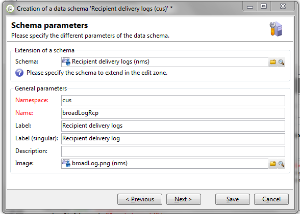

# 投放仪表板 {#delivery-dashboard}

**投放仪表板**&#x200B;是监控投放以及在发送消息过程中遇到的最终问题的关键。

利用该功能，可检索有关投放的信息，并在必要时对其进行编辑。 请注意，发送投放后，选项卡内容可能不再发生更改。

以下是您可以使用功能板中提供的多个选项卡监控的信息：

* [投放摘要](#delivery-summary)
* [投放报告](#delivery-reports)
* [投放日志、镜像页面、排除项](#delivery-logs-and-history)
* [投放跟踪日志和历史记录](#tracking-logs)
* [投放渲染](#delivery-rendering)
* [投放审核](#delivery-audit-)


**相关主题：**

* [了解投放失败](../../delivery/using/understanding-delivery-failures.md)
* [了解隔离管理](../../delivery/using/understanding-quarantine-management.md)
* [投放最佳实践](../../delivery/using/delivery-best-practices.md)
* [管理投放能力](../../delivery/using/about-deliverability.md)

## 投放摘要 {#delivery-summary}

**[!UICONTROL Summary]**&#x200B;选项卡包含投放的特性：投放状态、使用的渠道、有关发送者的信息、主题、有关执行的信息。

## 投放报告 {#delivery-reports}

可从&#x200B;**[!UICONTROL Summary]**&#x200B;选项卡访问&#x200B;**[!UICONTROL Reports]**&#x200B;链接，以查看与投放操作相关的一组报告：一般投放报告、详细报告、投放报告、失败消息分发、开场率、点击量和交易等。

此选项卡的内容可以根据您的要求进行配置。 有关投放报告的更多信息，请参阅[此部分](../../reporting/using/delivery-reports.md)。


## 投放日志、历史记录和排除项{#delivery-logs-and-history}

**[!UICONTROL Delivery]**&#x200B;选项卡提供此投放中发生次数的历史记录。 它包含投放日志，即已发送消息的列表及其状态和关联的消息。

对于投放，您只能在隔离中显示（例如）投放失败或地址为收件人的收件人。 为此，请单击&#x200B;**[!UICONTROL Filters]**&#x200B;按钮并选择&#x200B;**[!UICONTROL By state]**。 然后，在下拉列表中选择状态。 [此页面](../../delivery/using/delivery-statuses.md)中列出了各种状态。

>[!NOTE]
>
>与Campaign Classic中的任何列表一样，可以自定义显示投放日志的列表。 例如，您可以添加一列，以了解投放中每封电子邮件的发送IP地址。 有关更多信息，请参阅[此部分](#use-case)中详细描述的用例。


**[!UICONTROL Display the mirror page for this message...]**&#x200B;链接允许您在新窗口中查看从列表中选择的投放内容的镜像页面。

镜像页面仅适用于已定义HTML内容的投放。 有关更多信息，请参阅[生成镜像页面](../../delivery/using/sending-messages.md#generating-the-mirror-page)。


## 投放跟踪日志和历史记录{#tracking-logs}

**[!UICONTROL Tracking]**&#x200B;选项卡列出了此投放的跟踪历史记录。 此选项卡显示已发送消息的跟踪数据，即所有受Adobe Campaign跟踪的URL。 跟踪数据每小时更新一次。

>[!NOTE]
>
>如果未为投放启用跟踪，则不会显示此选项卡。

跟踪配置在投放向导的相应阶段执行。 请参阅[如何配置跟踪的链接](../../delivery/using/how-to-configure-tracked-links.md)。

**[!UICONTROL Tracking]** 数据会在投放报告中进行解释。请参阅[此小节](../../reporting/using/delivery-reports.md)。


## 收件箱呈现 {#delivery-rendering}

**[!UICONTROL Inbox rendering]**&#x200B;选项卡允许您在收到消息的不同上下文中预览消息，并检查主要桌面和应用程序的兼容性。

这样，您就可以确保以最佳方式在各种Web客户端、Web邮件和设备上向收件人显示您的消息。

有关收件箱呈现的更多信息，请参阅[此页面](../../delivery/using/inbox-rendering.md)


## 投放审核{#delivery-audit-}

**[!UICONTROL Audit]**&#x200B;选项卡包含投放日志以及与校样有关的所有消息。

使用&#x200B;**[!UICONTROL Refresh]**&#x200B;按钮可更新数据。 使用&#x200B;**[!UICONTROL Filters]**&#x200B;按钮定义数据过滤器。

通过特殊图标，可识别错误或警告。 请参阅[分析投放](../../delivery/using/steps-validating-the-delivery.md#analyzing-the-delivery)。

使用&#x200B;**[!UICONTROL Proofs]**&#x200B;子选项卡可以查看已发送的校样列表。


通过选择要显示的列，可以修改此窗口中显示的信息（以及&#x200B;**[!UICONTROL Delivery]**&#x200B;和&#x200B;**[!UICONTROL Tracking]**&#x200B;选项卡的信息）。 为此，请单击右下角的&#x200B;**[!UICONTROL Configure list]**&#x200B;图标。 有关配置列表显示的更多信息，请参阅[此部分](../../platform/using/adobe-campaign-workspace.md#configuring-lists)。

## 投放仪表板同步{#delivery-dashboard-synchronization}

在投放仪表板中，您需要检查已处理的消息和投放日志，以确保已成功发送投放。

某些指标或状态可能不正确或不是最新的，可通过以下解决方案来解决此问题：

* 如果您的投放状态不正确，请检查是否已对该投放完成所有必要的批准，或者&#x200B;**[!UICONTROL operationMgt]**&#x200B;和&#x200B;**[!UICONTROL deliveryMgt]**&#x200B;工作流是否正在运行且未出现错误。 这也可能是因为投放时使用了未在发送实例上配置的亲和度。

* 如果您的投放指示器仍为零，并且您处于中间源配置中，请检查&#x200B;**[!UICONTROL Mid-sourcing (delivery counters)]**&#x200B;技术工作流。 如果其状态不是&#x200B;**[!UICONTROL Started]**，则启动它。 然后，您可以尝试重新计算指标，方法是在Adobe Campaign资源管理器中右键单击相关投放，然后选择&#x200B;**[!UICONTROL Actions]** > **[!UICONTROL Recompute delivery and tracking indicators]**。 有关跟踪指标的更多信息，请参阅此[部分](../../reporting/using/delivery-reports.md#tracking-indicators)。

* 如果投放计数器与投放不匹配，请尝试重新计算指示器，方法是在Adobe Campaign资源管理器中右键单击相关投放，然后选择&#x200B;**[!UICONTROL Actions]** > **[!UICONTROL Recompute delivery and tracking indicators]**&#x200B;以重新同步。 有关跟踪指标的更多信息，请参阅此[部分](../../reporting/using/delivery-reports.md#tracking-indicators)。

* 如果您的投放计数器不是中间源部署的最新状态，请检查&#x200B;**[!UICONTROL Mid-Sourcing (Delivery counters)]**&#x200B;技术工作流是否正在运行。 有关详细信息，请参见此 [ 页面](../../installation/using/mid-sourcing-deployment.md)。

您还可以通过投放仪表板通过不同的报表跟踪投放。 有关更多信息，请参阅此](../../reporting/using/delivery-reports.md)章节[。

## 用例：将发件人的IP地址添加到日志{#use-case}

在此部分中，您将了解如何向投放日志添加有关投放中发送每封电子邮件的IP地址的信息。

>[!NOTE]
>
>如果您使用单个实例或中间源实例，则此修改会有所不同。 在进行修改之前，请确保您已连接到电子邮件发送实例。

### 步骤1:扩展架构

要在投放日志中添加&#x200B;**publicID**，您需要先扩展架构。 您可以按照以下步骤继续操作。

1. 在&#x200B;**[!UICONTROL Administration]** > **[!UICONTROL Configuration]** > **[!UICONTROL Data Schemas]** > **[!UICONTROL New]**&#x200B;下创建架构扩展。

   有关模式扩展的更多信息，请参阅[此页面](../../configuration/using/extending-a-schema.md)。

1. 选择&#x200B;**[!UICONTROL broadLogRcp]**&#x200B;以扩展收件人投放日志(nms)并定义自定义命名空间。 在这种情况下，它将为“cus”：

   

   >[!NOTE]
   >
   >如果您的实例处于中间源中，则需要使用broadLogMid架构。

1. 在扩展中添加新字段。 在此示例中，您需要替换：

   ```
   <element img="nms:broadLog.png" label="Recipient delivery logs" labelSingular="Recipient delivery log" name="broadLogRcp"/>
   ```

   按：

   ```
   <element img="nms:broadLog.png" label="Recipient delivery logs" labelSingular="Recipient delivery log" name="broadLogRcp">
   <attribute desc="Outbound IP identifier" label="IP identifier"
   name="publicId" type="long"/>
   </element>
   ```

   

### 步骤2:更新数据库结构

修改完成后，您需要更新数据库结构，使其与其逻辑描述保持一致。

为此请执行以下操作步骤：

1. 单击&#x200B;**[!UICONTROL Tools]** > **[!UICONTROL Advanced]** > **[!UICONTROL Update database structure...]**&#x200B;菜单。

   

1. 在&#x200B;**[!UICONTROL Edit tables]**&#x200B;窗口中，将检查&#x200B;**[!UICONTROL NmsBroadLogRcp]**&#x200B;表（如果您在中间源环境中，则检查&#x200B;**[!UICONTROL broadLogMid]**&#x200B;表），如下所示：

   

   >[!IMPORTANT]
   >
   >始终确保除&#x200B;**[!UICONTROL NmsBroadLoGRcp]**&#x200B;表(或&#x200B;**[!UICONTROL broadLogMid]**&#x200B;表（如果您位于中间源环境中）之外，没有其他修改。 如果是，请取消选中其他表。

1. 单击&#x200B;**[!UICONTROL Next]**&#x200B;以验证。 将显示以下屏幕：

   

1. 单击&#x200B;**[!UICONTROL Next]**，然后单击&#x200B;**[!UICONTROL Start]**&#x200B;以开始更新数据库结构。 索引构建正在启动。 此步骤可能会很长，具体取决于&#x200B;**[!UICONTROL NmsBroadLogRcp]**&#x200B;表中的行数。

   

>[!NOTE]
>
>数据库物理结构的更新成功完成后，您需要断开连接并重新连接，以便考虑您所做的修改。

### 步骤3:验证修改

要确认所有内容均正常工作，您需要更新投放日志屏幕。

为此，请访问投放日志并添加“IP标识符”列。


>[!NOTE]
>
>要了解如何在Campaign Classic界面中配置列表，请参阅[此页面](../../platform/using/adobe-campaign-workspace.md)。

以下是修改后应在&#x200B;**[!UICONTROL Delivery]**&#x200B;选项卡中看到的内容：


