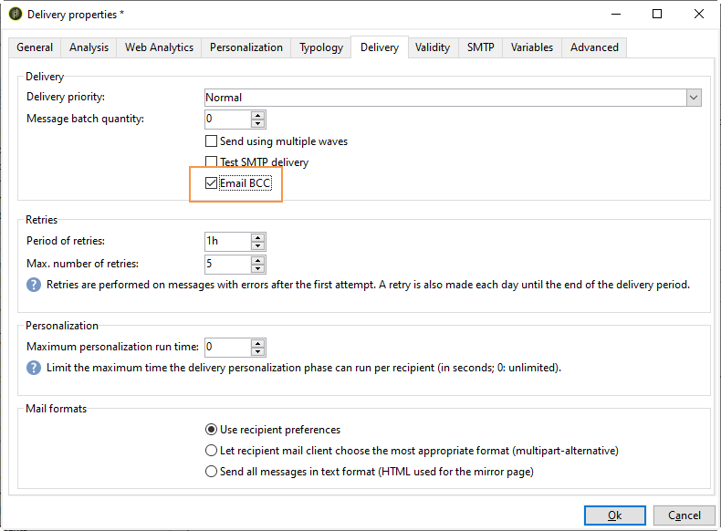
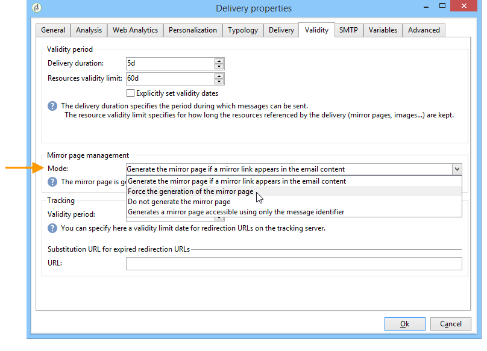

# 电子邮件参数 {#email-parameters}

本节介绍特定于电子邮件投放的选项和参数。

## 电子邮件密送 {#email-bcc}

Adobe Campaign允许您通过密件抄送方式在外部系统上存储电子邮件，方法是只需向消息目标添加密件抄送电子邮件地址。

激活选项后，将为此投放保留所有已发送消息的确切副本。

有关电子邮件密送配置和最佳实践的更多信息，请参阅[此部分](../../installation/using/email-archiving.md)。

>[!NOTE]
>
>电子邮件密件抄送是一项可选功能。 请核实您的许可协议并联系您的帐户管理员以将其激活。

创建新投放或投放模板时，默认情况下不启用电子邮件密送。 您需要在电子邮件投放或投放模板级别手动启用它。

要为电子邮件投放模板启用电子邮件密送，请执行以下步骤：

1. 转到&#x200B;**[!UICONTROL Campaign Management]** > **[!UICONTROL Deliveries]**&#x200B;或&#x200B;**[!UICONTROL Resources]** > **[!UICONTROL Templates]** > **[!UICONTROL Delivery templates]**。
1. 选择您选择的投放或复制现成的&#x200B;**电子邮件投放**&#x200B;模板，然后选择复制的模板。
1. 单击&#x200B;**Properties**&#x200B;按钮。
1. 选择 **[!UICONTROL Delivery]** 选项卡。
1. 选中&#x200B;**电子邮件密送**&#x200B;选项。 基于此模板的每个投放的所有已发送消息副本都将发送到已配置的电子邮件密送地址。

   

>[!NOTE]
>
>如果打开并点进发送到密件抄送地址的电子邮件，则在发送分析的&#x200B;**[!UICONTROL Total opens]**&#x200B;和&#x200B;**[!UICONTROL Clicks]**&#x200B;中会考虑这一点，这可能会导致某些错误计算。

## 选择消息格式 {#selecting-message-formats}

您可以更改发送的电子邮件的格式。 要实现此目的，请编辑投放属性，然后单击&#x200B;**[!UICONTROL Delivery]**&#x200B;选项卡。

在窗口的下部选择电子邮件的格式：

* **[!UICONTROL Use recipient preferences]** （默认模式）

   根据收件人用户档案中存储的数据定义消息格式，默认情况下，该数据会存储在&#x200B;**[!UICONTROL email format]**&#x200B;字段(@emailFormat)中。 如果收件人希望以特定格式接收消息，则会将该格式用于发送的邮件。如果未填写字段，则会发送multipart-alternative消息（请参阅下文）。

* **[!UICONTROL Let recipient mail client choose the most appropriate format]**

   消息包含两种格式：文本和HTML。 接收时显示的格式取决于收件人邮件软件的配置(multipart-alternative)。

   >[!IMPORTANT]
   >
   >此选项包括文档的两个版本。 因此，它会影响投放率，因为消息大小更大。

* **[!UICONTROL Send all messages in text format]**

   消息以文本格式发送。 不会发送HTML格式，但仅当收件人单击消息时，才会将其用于镜像页面。

>[!NOTE]
>
>有关定义电子邮件内容的更多信息，请参阅[此部分](defining-the-email-content.md)。

## 生成镜像页面 {#generating-mirror-page}

镜像页面是可通过Web浏览器在线访问的HTML页面。 其内容与电子邮件相同。

默认情况下，如果将链接插入到邮件内容中，则会生成镜像页面。 有关个性化块插入的更多信息，请参阅[个性化块](personalization-blocks.md)。

在投放属性中，使用&#x200B;**[!UICONTROL Validity]**&#x200B;选项卡的&#x200B;**[!UICONTROL Mode]**&#x200B;字段可修改此页面的生成模式。

>[!IMPORTANT]
>
>必须为要创建镜像页面的交付定义HTML内容。

除了默认模式之外，还提供以下选项：

* **[!UICONTROL Force the generation of the mirror page]**:即使投放中未插入指向镜像页面的链接，也会创建镜像页面。
* **[!UICONTROL Do not generate the mirror page]**:即使投放中存在链接，也不会生成镜像页面。
* **[!UICONTROL Generates a mirror page accessible using only the message identifier]**:此选项允许您在投放日志窗口中访问包含个性化信息的镜像页面的内容。为此，在投放结束后，单击&#x200B;**[!UICONTROL Delivery]**&#x200B;选项卡，并选择要查看其镜像页面的收件人行。 单击&#x200B;**[!UICONTROL Display the mirror page for this message...]**&#x200B;链接。

   

## 字符编码 {#character-encoding}

在投放参数的&#x200B;**[!UICONTROL SMTP]**&#x200B;选项卡中，使用&#x200B;**[!UICONTROL Character encoding]**&#x200B;部分可设置特定编码。

默认编码为UTF-8。 如果某些收件人的电子邮件提供程序不支持UTF-8标准编码，您可能需要设置特定编码以向电子邮件收件人正确显示特殊字符。

例如，您要发送包含日语字符的电子邮件。 为确保所有字符都能以日语正确显示给收件人，您可能希望使用支持日语字符的编码，而不是标准的UTF-8。

要实现此目的，请选择&#x200B;**[!UICONTROL Character encoding]**&#x200B;部分中的&#x200B;**[!UICONTROL Force the encoding used for messages]**&#x200B;选项，然后从显示的下拉列表中选择编码。

## 管理退回电子邮件 {#managing-bounce-emails}

利用投放参数的&#x200B;**[!UICONTROL SMTP]**&#x200B;选项卡，可配置对退回邮件的管理。

默认情况下，平台的默认错误框中会收到退回的电子邮件，但您可以为投放定义特定的错误地址。

您还可以从此屏幕中定义特定地址，以调查退回邮件在应用程序无法自动鉴别这些邮件的原因。 对于每个字段，使用&#x200B;**添加个性化字段**&#x200B;图标可添加个性化参数。

有关退回邮件管理的更多信息，请参阅[此部分](understanding-delivery-failures.md#bounce-mail-management)。

## 添加SMTP标头 {#adding-smtp-headers}

可以向投放添加SMTP标头。 为此，请使用投放中&#x200B;**[!UICONTROL SMTP]**&#x200B;选项卡的相关部分。

在此窗口中输入的脚本必须引用以下格式的每行一个标题：**name:value**。

如有必要，将自动对值进行编码。

>[!IMPORTANT]
>
>高级用户可随时添加脚本以插入其他 SMTP 标头。
>
>此脚本的语法必须符合此内容类型的要求：没有未使用的空格，没有空行等。
