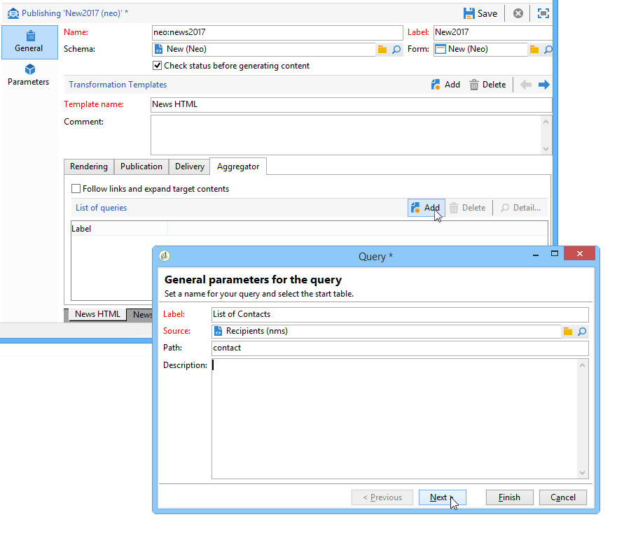

# 丰富内容{#enriching-content}


聚合器允许您使用外部数据扩充内容。 此数据来自通用查询或链接的表。

## 一般查询 {#generic-queries}

查询通过 **[!UICONTROL Aggregator]** 选项卡。

检索到的数据将通过其主元素扩充XML输出文档。

从关于收件人架构的查询返回的示例(**nms:recipient**):

```
<book name="Content Management">
  ...
  <collection-recipient>
    <recipient lastName="Doe" firstName="John" email="john.doe@aolf.com">
    ...
  </collection-recipient>
</book>
```

的 **`<collection-recipient>`** 元素表示由查询生成的文档的输入元素。 检索到的数据将在此元素下返回；在本例中，为收件人列表。

### 添加查询 {#adding-a-query}

可使用向导编辑查询参数。

1. 在第一页中，指定标签和包含要检索数据的架构。

   

   >[!NOTE]
   >
   >编辑字段 **路径** 用于重命名查询输出元素。

1. 下一页允许您选择要检索的数据。

   

1. 下一页定义过滤条件。

   

1. 最后一页将启动查询返回的数据预览。

   

## 链接的表 {#linked-tables}

利用链接，可检索链接到内容的外部数据。

链接数据有两种类型：

* 内容链接：这是本机内容管理模式。 链接的内容会自动集成到XML输出文档中。
* 指向外部表的链接允许访问数据库中的所有其他表，但约束是使用聚合器检索所选链接的数据。

### 链接到内容架构 {#link-to-a-content-schema}

在数据架构中声明内容链接，如下所示：

```
<element expandSchemaTarget="cus:chapter" label="Main chapter" name="mainChapter" type="string"/>
```

链接的定义会填充在 **字符串**-type **`<element>`**&#x200B;和 **expandSchemaTarget** 属性引用目标架构（我们示例中的“cus:chapter”）。 引用的架构必须是内容架构。

目标元素的内容丰富了链接元素，即 **`<chapter>`** 元素：

```
<mainChapter computeString="Introduction" id="7011" title="Introduction" xtkschema="cus:chapter">    
  <page>Introduction to input <STRONG>forms</STRONG>.</page>
</mainChapter>
```

>[!NOTE]
>
>的 **计算字符串** 的 **computeString** 属性。

在输入表单中，链接的编辑控件声明如下：

```
<input type="articleEdit" xpath="mainChapter"/>
```


的 **[!UICONTROL Magnifier]** 图标，可打开链接元素的编辑表单。

#### 链接集合 {#link-collection}

要填充链接集合，请将 **unbound=&quot;true&quot;** 属于数据架构中链接元素的定义：

```
<element expandSchemaTarget="cus:chapter" label="List of chapters" name="chapter"  ordered="true" unbound="true"/>
```

目标元素的内容丰富了每个收集元素：

```
<chapter computeString="Introduction" id="7011" title="Introduction" xtkschema="cus:chapter">    
  <page>Introduction to input <STRONG>forms</STRONG>.</page>
</chapter>
```

在输入表单中，列表控件声明如下：

```
<input editable="false" nolabel="true" toolbarCaption="List of chapters" type="articleList" xpath="chapter" zoom="true"/>
```


为了查看 **计算字符串** 目标元素的列表。

### 指向外部表的链接 {#links-to-external-tables}

在数据架构中声明指向外部表的链接，如下所示：

```
<element label="Main contact" name="mainContact" target="nms:recipient" type="link"/>
```

链接的定义会填充在 **链接**-type **`<element>`**&#x200B;和 **目标** 属性引用目标模式（在我们的示例中为“nms:recipient”）。

按照惯例，必须从数据架构的主要元素中声明链接。

的 **计算字符串** 而目标元素的关键，丰富了 **`<name>-id`** 和 **`<name>-cs`** 属性。

在我们的示例中，链接以“cus:book”模式填充，链接数据的内容包含在“mainContact-id”和“mainContact-cs”属性中：

```
<book computeString="Content management" date="2006/06/08" id="6106" language="en" mainContact-cs="John Doe (john.doe@adobe.com)" mainContact-id="3012" name="Content management" xtkschema="cus:book">
```

链接编辑控件声明如下：

```
<input xpath="mainContact"/>
```


您可以通过添加 **`<sysfilter>`** 元素（通过输入表单中的链接定义）：

```
<input xpath="mainContact">
  <!-- Filter the selection of the link on the Adobe domain -->
  <sysFilter>
    <condition expr="@domain =  'adobe.com '"/>
  </sysFilter>
</input>
```

>[!NOTE]
>
>此限制也适用于内容链接。

#### 链接集合 {#link-collection-1}

集合的定义与集合元素上列表的定义相同：

```
<element label="List of contacts" name="contact" unbound="true">
  <element label="Recipient" name="recipient" target="nms:recipient" type="link"/>
</element>
```

在输入表单中，列表控件声明如下：

```
<input nolabel="true" toolbarCaption="List of contacts" type="list" xpath="contact">
  <input xpath="recipient"/>
</input>
```


>[!NOTE]
>
>该列表是可编辑的，允许您从上面显示的“链接”类型控件中选择链接。

目标元素的内容丰富了输出文档中的每个收集元素：

```
<contact id="11504978621" recipient-cs="Doe John (john.doe@adobe.com)" recipient-id="3012"/>
<contact id="11504982510" recipient-cs="Martinez Peter (peter.martinez@adobe.com)" recipient-id="3013"/>
```

#### 链接聚合 {#link-aggregation}

引用的每个链接的内容仅限于内部键和 **计算字符串** 目标元素的URL。

JavaScript脚本用于通过SOAP查询扩充链接的内容。

**示例**:将收件人名称添加到“mainContact”链接和“contact”集合链接：

```
// Update <mainContact> link
var mainContactId = content.@['mainContact-id']
var query = xtk.queryDef.create(
    <queryDef schema="nms:recipient" operation="get">
      <select>
        <node expr="@lastName"/>
      </select>
      <where>
        <condition expr={"@id="+mainContactId}/>
      </where>
    </queryDef>)

var recipient = query.ExecuteQuery()
content.mainContact.@lastName = recipient.@lastName

// Update <contact> link collection
for each(var contact in content.contact)
{
  var contactId = contact.@['recipient-id']
  var query = xtk.queryDef.create(
    <queryDef schema="nms:recipient" operation="get">
      <select>
        <node expr="@lastName"/>
      </select>
      <where>
        <condition expr={"@id="+contactId}/>
      </where>
    </queryDef>
  )
  
  var recipient = query.ExecuteQuery()
  contact.@lastName = recipient.@lastName
}
```

执行脚本后获得的结果：

```
<mainContact lastName="Doe"/>

<contact id="11504978621" lastName="Doe" recipient-cs="Doe John (john.doe@adobe.com)" recipient-id="3012"/>  
<contact id="11504982510" lastName="Martinez" recipient-cs="Martinez Peter (peter.martinez@adobe.com)" recipient-id="3013"/> 
```

JavaScript代码的内容通过 **[!UICONTROL Administration > Configuration > Content management > JavaScript Codes]** 文件夹，且必须在每个转换的发布模板中填充。


