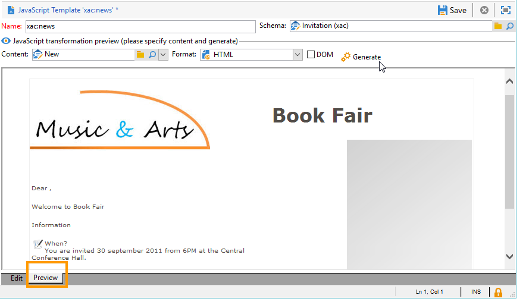

# 格式化{#formatting}

## JavaScript 模板 {#javascript-templates}

JavaScript模板是包含JavaScript代码的HTML或文本文档。 其构建方式与投放操作中的电子邮件内容相同。

### JavaScript模板的标识 {#identification-of-a-javascript-template}

JavaScript模板由其名称和命名空间进行标识，就像架构和表单一样。 但是，建议将&#x200B;**.js**&#x200B;选项添加到模板名称。

### JavaScript模板的结构 {#structure-of-a-javascript-template}

基于“cus：book”架构的JavaScriptHTML格式模板示例：

```
<html>
  <body>
    <!-- Title of book -->
    <h1><%= content.@name %></h1>
    <ul>
      <% for each(var chapter in content.chapter) { %>
        <li><%= chapter.@name %></li>
      <% }%>
    </ul>
  </body>
</html>
```

各种JavaScript指令均以下列形式显示：

* 合并字段：使用&#x200B;**`<%= <source> %>`**&#x200B;语法显示数据的内容，其中`<source>`是要显示的数据的源字段。
* 说明块：执行&lt;%和%>标记之间包含的一系列JavaScript说明。

**content**&#x200B;对象表示输入XML文档的主元素。

在我们的示例中，以下行显示名称簿名称的内容：

```
<h1><%= content.@name %></h1>
```

以下代码对`<chapter>`收藏集元素进行了迭代：

```
<% for each(var chapter in content.chapter) { %>
  <li><%= chapter.@name %></li>
<% }%>
```

内容的属性和元素表示为JavaScript对象，并遵循源文档的结构。

**示例**：

* **内容。@name**：检索主元素的“name”属性的值
* **内容。@`['name']`**：与&#x200B;**内容相同。@name**&#x200B;语法
* **content.chapter.length**：返回`<chapter`收藏集元素上的元素数
* **content.chapter`[0]`。@name**：检索第一个`<chapter>`元素的名称
* **chapter.name()**：返回`<chapter>`元素的名称
* **chapter.parent()。name()**：返回`<chapter>`的父元素的名称

>[!CAUTION]
>
>由于“ — ”字符是在JavaScript语言中保留的，因此必须通过`['<field>']`语法恢复包含此字符的任何特性或元素的值。
>
>例如： `content.@['offer-id']`。

编程语言的所有功能（变量、循环、条件测试、函数等） )可用于构造输出文档。 可以访问SOAP API以扩充输出文档。

示例：

* 条件测试：

  ```
  <% if (content.@number == 1 || content.@language == 'en') { %>
  <!-- Content to be displayed if test is true--> 
  <% } %>
  ```

* 函数调用：

  ```
  <!-- Displays a horizontal bar -->
  ;<% function DisplayHorizontalBar() { %>
    <hr/>
  <% } %> 
  
  <!-- The same function in a block  -->
  <% 
  function DisplayHorizontalBar2()
  {
    document.write('<hr/>');
  }
  %> 
  
  <!-- Returns the value in uppercase -->
  <% 
  function formatName(value)
  { 
    return value.toUpperCase(); 
  }
  %>
  
  <!-- Call functions -->
  <%= DisplayHorizontalBar1() %>
  <%= DisplayHorizontalBar2() %>
  <%= formatName(content.@name) %>
  ```

* 声明和变量调用：

  ```
  <%  var counter = 0; %>
  
  <%= counter += 10 %>
  ```

* 使用静态方法检索和显示收件人名称：

  ```
  <% var recipient = nms.recipient.get(1246); %>
  <%= recipient.lastName %>
  ```

* 使用非静态方法恢复和显示收件人名称：

  ```
  <% var query = xtk.queryDef.create(
    <queryDef schema="nms:recipient" operation="get">
      <select>
        <node expr="@lastName"/>
      </select>
      <where>
        <condition expr="@id=1246"/>
      </where>
    </queryDef>);
  
    var recipient = query.ExecuteQuery();
  %>
  
  <%= recipient.@lastName %>
  ```

### 包含JavaScript模板 {#including-a-javascript-template}

您可以构建一个函数或变量库以供将来使用。 为此，请使用&#x200B;**eval**&#x200B;函数导入JavaScript模板。 这使您可以使用在其他JavaScript模板中声明的其他函数扩充上下文。

**示例**：导入&#x200B;**common.jsp**&#x200B;模板。

```
<% eval(xtk.javascript.get("cus:common.js").data);  %>
```

### 编辑JavaScript模板 {#editing-a-javascript-template}

通过编辑区域，可填充JavaScript模板的内容：


>[!NOTE]
>
>必须填充关联的数据模型架构，才能初始化JavaScript对象。

要随时生成输出文档的预览，请选择内容和输出格式(HTML、文本、XML)，然后单击&#x200B;**[!UICONTROL Generate]**：



>[!NOTE]
>
>无需保存更改即可预览输出文档。

### 如何创建和使用JavaScript模板的示例 {#example-of-how-to-create-and-use-a-javascript-template}

在下面，您会找到使用JavaScript模板实施以下内容管理所需的配置：


此示例涉及以下步骤：

1. 创建以下架构（在此例中： **neo：news**）：

   ```
   <srcSchema _cs="Invitation (neo)"   entitySchema="xtk:srcSchema" img="xtk:schema.png" label="Invitation" mappingType="sql" name="news" namespace="neo" xtkschema="xtk:srcSchema">
   
     <enumeration basetype="string" default="en" name="language">
       <value label="Français" name="fr" value="fr"/>
       <value label="English" name="gb" value="gb"/>
     </enumeration>
   
     <enumeration basetype="string" name="css">
       <value label="Blue" name="bl" value="blue"/>
       <value label="Orange" name="or" value="orange"/>
     </enumeration>
   
     <element label="Intervenants" name="attendee">
       <key internal="true" name="id">
         <keyfield xpath="@id"/>
       </key>
       <attribute label="Name" name="name" type="string"/>
       <element label="Image" name="image" target="xtk:fileRes" type="link"/>
       <attribute label="Description" name="description" type="string"/>
       <attribute default="Gid()" label="Id" name="id" type="long"/>
     </element>
   
     <element label="Invitation" name="news" template="ncm:content" xmlChildren="true">
   
       <compute-string expr="@name"/>
       <attribute enum="language" label="Language" name="language" type="string"/>
       <attribute enum="css" label="Stylesheet" name="css" type="string"/>
       <attribute label="Title" name="title" type="string"/>
       <element label="Presentation" name="presentation" type="html"/>
       <attribute label="Date" name="date" type="date"/>
       <element label="Attendees list" name="attendeesList" ordered="true" ref="attendee" unbound="true"/>
   
     </element>
   </srcSchema>
   ```

1. 创建链接的&#x200B;**[!UICONTROL Content management]**&#x200B;类型表单(**neo：news**)

   ```
   <form _cs="News (neo)" entitySchema="xtk:form"  img="xtk:form.png" label="News"  name="news" namespace="neo" type="contentForm" xtkschema="xtk:form">
   
     <container type="iconbox">
       <container label="Invitation">
         <input xpath="@langue"/>
         <input xpath="@css"/>
         <input xpath="@title"/>
         <input xpath="@date"/>
         <input xpath="presentation"/>
       </container>
   
       <container label="Intervenants">
         <container toolbarCaption="Liste des intervenants" type="notebooklist" xpath="attendeesList" xpath-label="@nom">
           <container>
             <input xpath="@nom"/>
             <input img="nl:sryimage.png" newEntityFormChoice="true" xpath="image">
               <sysFilter>
                 <condition expr="@isImage = true"/>
               </sysFilter>
             </input>
             <input xpath="@description"/>
           </container>
         </container>
       </container>
     </container>
   
   </form>
   ```

1. 创建JavaScript模板，其中包含HTML和文本格式的消息内容。

   * 在我们的示例中，对于HTML：

     ```
     <html>     
       <head>         
         <title>Newsletter</title>
          <style type="text/css">
           .body {font-family:Verdana, Arial, Helvetica, sans-serif; font-size:10px; color:#514c48; margin-left: auto; margin-right: auto;}
           .body table {width:748; border: solid 1px; cellpadding:0; cellspacing:0"}
          </style>
       </head>     
       <body>
         <p><center><%= mirrorPage %></center></p>
         <center>
           <table>      
            <tr>
             <td>                                                         
                                                  
             </td>
             <td>
               <h1><%= content.@title %></h1>
             </td>
            </tr>
            <tr>
     
            <td>
             <div >                                    
               <h0><%= hello,</h0>                              
               <p><%= content.presentation %></p>                                          
     
               <h0>Useful information</h0>                              
               <p>                                  
                 When? <br/><%= formatDate(content.@date, "%2D %Bl %4Y") %> From 10 AM in your bookshop.</p><br/>                                       
               <p>                                  
                 Who? <br>Meet our favorite authors and illustrators and get a signed copy of their book.</p><br/>                                                         
               <p>                                  
                 Attendance is free but there is a limited number of seats: sign up now!</p>
           </div>
           </td>
     
             <td>                                                    
              <div style="text-align:left; width:210; height:400px; background:url([IMAGE DE FOND])">
     
                 <h0><%= participant %></h0>
                 <%
                 var i
                 var iLength = content.attendeesList.length()
                 for (i=0; i<iLength; i++)
                 { %>
                 <p>
                   <%= generateImgTag(content.attendeesList[i].@["image-id"]) %>  <%= content.attendeesList[i].@description %>
                 </p>  
                 <% }  
                 %>                              
              </div2>
             </td>
         </tr>
       </table>
     </center>
     </body>    
     </html>
     ```

   * 对于文本：

     ```
     <%= content.@title %>
     <%= content.presentation %>
     
     *** When? On <%= formatDate(content.@date, "%2D %Bl %4Y") %> From 10 AM in your bookshop.
     
     *** Who? Come and meet our favorite authors and illustrators and get a signed copy of their books. 
     
     *** Attendance is free but there is a limited number of seats: sign up now!
     
     Guests:
     ******************
     <%
     var i
     var iLength = content.attendeesList.length()
     //for (i=(iLength-1); i>-1; i--)
     for( i=0 ; i<iLength ; i++ )
       { %>
       Description <%= i %> : <%= content.attendeesList[i].@description %>
       <% }  
     %>
     ```

1. 现在，创建用于两种格式的发布模板：

   * 对于HTML：

     

   * 对于文本：

     

1. 然后，您可以在投放中使用此内容模板。

   有关详细信息，请参阅[使用内容模板](using-a-content-template.md)。

## XSL样式表 {#xsl-stylesheets}

XSLT语言允许将XML文档更改为输出文档。 根据样式表的输出方法，生成的文档可以以HTML、纯文本或其他XML树生成。

此转换在称为样式表的文档中的XML中又进行了详细说明。

### 标识样式表 {#identifying-a-stylesheet}

样式表由其名称和命名空间标识，就像架构和表单一样。 但是，建议将&#x200B;**.xsl**&#x200B;扩展添加到样式表的名称中。

样式表的标识键是由命名空间和用冒号分隔的名称组成的字符串；例如： **cus：book.xsl**。

### 样式表的结构 {#structure-of-a-stylesheet}

基于示例架构“cus：book”的HTML格式化样式表的示例：

```
<?xml version="1.0" encoding="ISO-8859-1" ?>
<xsl:stylesheet xmlns:xsl="http://www.w3.org/1999/XSL/Transform" version="1.0">
  <xsl:output encoding="ISO-8859-1" method="html"/>
  <!-- Point of entry of the stylesheet -->
  <xsl:template match="/book">
    <html>
      <body>
        <!-- Book title -->
        <h1><xsl:value-of select="@name"/></h1>
        <lu>
          <!-- List of chapters -->
          <xsl:for-each select="child::chapter">
            <li><xsl:value-of select="@name"/></li>
          </xsl:for-each>
       </lu>
      </body>
    </html>
   </xsl:template>
</xsl:stylesheet>
```

样式表是遵循以下规则的XML文档：

* 属性的值在引号之间，
* 元素必须具有开始标记和结束标记，
* 将“&lt;”或“&amp;”字符替换为&#x200B;**“&lt;”**&#x200B;或&#x200B;**“&amp;”**&#x200B;实体，
* 每个XSL元素都必须使用&#x200B;**xsl**&#x200B;命名空间。

样式表必须以XSL根元素标记&#x200B;**`<xsl:stylesheet>`**&#x200B;开头，以&#x200B;**`</xsl:stylesheet>`**&#x200B;标记结尾。 必须在开始标记中定义XSL命名空间，如下所示：

```
<xsl:stylesheet xmlns:xsl="http://www.w3.org/1999/XSL/Transform" version="1.0">
```

**`<xsl:output>`**&#x200B;元素指定生成的文档的格式。 指定所需的字符集和输出格式。

```
<xsl:output encoding="ISO-8859-1" method="html"/>
```

以下说明描述了用于格式化输出文档的样式表的配置。

```
<xsl:template match="/book">
  <html>
    <body>
      <!-- Book title -->
      <h1><xsl:value-of select="@name"/></h1>
      <lu>
        <!-- List of chapters -->
        <xsl:for-each select="child::chapter">
          <li><xsl:value-of select="@name"/></li>
        </xsl:for-each>
      </lu>
    </body>
  </html>
</xsl:template>
```

默认情况下，XSLT处理器会搜索应用于输入XML文档的根或主节点的&#x200B;**模板**。 输出文档的构造以此&#x200B;**模板**&#x200B;开始。

在我们的示例中，通过显示书名和章节列表，从“cus：book”架构生成了HTML页。

>[!NOTE]
>
>有关XSLT语言的更多信息，请参阅XSLT参考文档。

### 显示HTML/XML {#displaying-html-xml}

要显示&#x200B;**html**&#x200B;字段，请使用&#x200B;**`<xsl:value-of>`**&#x200B;指令中的&#x200B;**disable-output-escaping=&quot;yes&quot;**&#x200B;选项。 这样可避免将字符替换为XML实体（例如，将&lt;替换为&lt;）。

带有&#x200B;**disable-output-escaping=&quot;yes&quot;**&#x200B;选项的&#x200B;**`<xsl:text>`**&#x200B;指令允许您为个性化字段或条件测试插入JavaScript标记。

示例：

* 显示“html”类型字段的内容：

  ```
  <xsl:value-of select="summary" disable-output-escaping="yes"/>
  ```

* 插入个性化字段&#x200B;**&lt;%= recipient.email %>**：

  ```
  <xsl:text disable-output-escaping="yes"><%= recipient.email %></xsl:text>
  ```

* 正在添加条件测试&#x200B;**&lt;%，如果(recipient.language == &#39;en&#39;) `{` %>**：

  ```
  <xsl:text disable-output-escaping="yes"><% if (recipient.language == 'en') { %></xsl:text>
  ```

### 包括样式表 {#including-stylesheets}

可以构建模板或变量的库以在多个样式表之间共享。 上面显示的“longMonth”模板&#x200B;**模板**&#x200B;是一个典型示例，说明在样式表中远程查找模板以便以后可以重复使用。

**`<xsl:include>`**&#x200B;指令指示要包含在文档中的样式表的名称。

**示例**：包含“common.xsl”样式表。

```
<? xml version="1.0" encoding="ISO-8859-1" ?>
<xsl:stylesheet xmlns:xsl="http://www.w3.org/1999/XSL/Transform" version="1.0">
  <xsl:include href="common.xsl"/> 
  <xsl:output encoding="ISO-8859-1" method="jsp" indent="yes"/>
  ...
</xsl:stylesheet>
```

>[!NOTE]
>
>不得在要包含的样式表的引用中输入命名空间的名称。 作为标准，此样式表是使用用户命名空间创建的。

### 编辑样式表 {#editing-a-stylesheet}

编辑区域允许您填充样式表的内容：


要随时生成输出文档的预览，请选择内容实例和格式(HTML、文本、XML)，然后单击&#x200B;**[!UICONTROL Generate]**：


>[!NOTE]
>
>无需在样式表中保存更改即可查看输出文档预览。

## 映像管理 {#image-management}

### 图像引用 {#image-referencing}

在HTML输出文档中输入的图像可以使用绝对或相对参照进行参照。

相对引用允许您输入包含&#x200B;**NcmResourcesDir**&#x200B;和&#x200B;**NcmResourcesDirPreview**&#x200B;选项中图像的服务器的URL。 这些选项包含要在Adobe Campaign客户端控制台中发布和预览的图像的位置。

这两个选项可通过&#x200B;**[!UICONTROL Administration > Platform > Options]**&#x200B;文件夹中的选项管理屏幕访问。

**示例**：

* NcmResourcesDir = &quot;https://server/images/&quot;
* NcmResourcesDirPreview = &quot;x：/images/&quot;

在样式表处理期间，输入XML文档的主元素上的&#x200B;**_resPath**&#x200B;属性会自动填充一个或多个选项，具体取决于上下文（预览或发布）。

有关如何将图像放置选项及其用于图像的示例：

```
/newsletter/image.png"/>
```

>[!NOTE]
>
>我们建议声明一个包含存储图像的服务器引用的变量（在我们的示例中为“resPath”）。

### 使用公共资源 {#using-public-resources}

您还可以使用&#x200B;**[!UICONTROL Public resources]**&#x200B;来声明映像，并根据在部署向导中输入的实例设置将其上载到服务器。

然后，您可以在内容中调用这些图像。 为此，请在内容管理架构中使用以下语法：

```
<element label="Image" name="image" target="xtk:fileRes" type="link"/>
```

在表单中，用于选择图像的字段将通过以下语法添加：

```
<input img="nl:sryimage.png" newEntityFormChoice="true" xpath="image">
    <sysFilter>
      <condition expr="@isImage = true"/>
    </sysFilter>
  </input>
```

>[!NOTE]
>
>有关&#x200B;**[!UICONTROL Public resources]**&#x200B;以及如何配置和使用它们的详细信息，请参阅[本节](../../installation/using/deploying-an-instance.md#managing-public-resources)。

## 日期显示 {#date-display}

在XML输入文档中，日期以内部XML格式存储： **`YYYY/MM/DD HH:MM:SS`**（示例`2018/10/01 12:23:30`）。

Adobe Campaign为JavaScript模板和XSL样式表提供日期格式功能，如下所述。

### JavaScript日期格式 {#javascript-date-formatting}

若要以所需格式显示日期，Adobe Campaign提供了&#x200B;**formatDate**&#x200B;函数，该函数将日期的内容作为输入，并提供一个指定输出格式的字符串，其语法为： **%4Y/%2M/%2D %2H%2N%2S**

示例：

* 以&#x200B;**31/10/2018**&#x200B;格式显示日期：

  ```
   <%= formatDate(content.@date, "%2D/%2M/%4Y") %>
  ```

* 以&#x200B;**2018年7月**&#x200B;格式显示日期：

  ```
  <%
   function displayDate(date)
    {
      var aMonth = 
      [ 'January', 'February', 'March', 'April', 'May', 'June', 'July', 'August', 'September', 'October', 'November', 'December' ];
  
      var month = formatDate(content.@date, "%2M")
      var year = formatDate(content.@date, "%4Y")
  
      return aMonth[month-1]+" "+year;
    }
  %>
  
  <%= displayDate(content.@date) %>
  ```

### XSL日期格式 {#xsl-date-formatting}

在XSLT语法中没有标准日期管理函数。 为了以所需格式显示日期，Adobe Campaign提供了外部函数&#x200B;**date-format**。 此函数将日期的内容和指定输出格式的字符串作为输入，其语法为： **%4Y/%2M/%2D %2H%2N%2S**

示例：

* 要以&#x200B;**01/10/2018**&#x200B;格式显示日期：

  ```
  <xsl:value-of select="external:date-format(@date, '%2D/%2M/%4Y')"/>
  ```

* 要以&#x200B;**2018年7月**&#x200B;格式显示日期：

  ```
  <!-- Returns the month in the form of a string with the month number as input -->
  <xsl:template name="longMonth">
    <xsl:param name="monthNumber"/>
  
    <xsl:choose>
      <xsl:when test="$monthNumber = 1">January</xsl:when>
      <xsl:when test="$monthNumber = 2">February</xsl:when>
      <xsl:when test="$monthNumber = 3">March</xsl:when>
      <xsl:when test="$monthNumber = 4">April</xsl:when>
      <xsl:when test="$monthNumber = 5">May</xsl:when>
      <xsl:when test="$monthNumber = 6">June</xsl:when>
      <xsl:when test="$monthNumber = 7">July</xsl:when>
      <xsl:when test="$monthNumber = 8">August</xsl:when>
      <xsl:when test="$monthNumber = 9">September</xsl:when>
      <xsl:when test="$monthNumber = 10">October</xsl:when>
      <xsl:when test="$monthNumber = 11">November</xsl:when>
      <xsl:when test="$monthNumber = 12">December</xsl:when>
    </xsl:choose>
  </xsl:template> 
  
  <!-- Display date -->
  <xsl:call-template name="longMonth">
    <xsl:with-param name="monthNumber">
      <xsl:value-of select="external:date-format(@date, '%2M')"/>
    </xsl:with-param>
  </xsl:call-template>
   <xsl:value-of select="external:date-format(@date, '%4y')"/>
  ```
