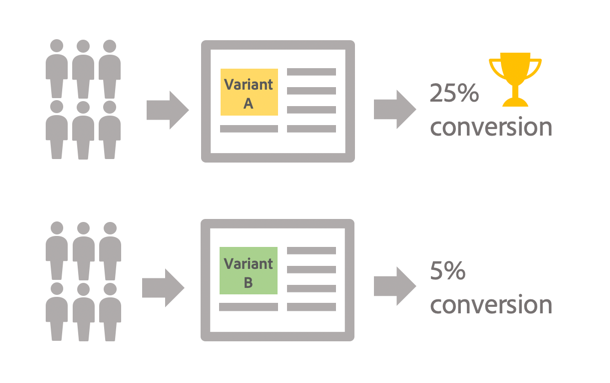

# A/B 测试入门 {#get-started-a-b-testing}

A/B测试允许您比较投放的多个版本，以确定哪个版本对目标群体产生最大的影响。

要实现此目的，您首先需要定义投放的多个变体。 然后，会将每个变体发送到群体样本，以确定哪个变体根据您选择的标准（打开、垃圾邮件投诉、单击特定链接……）表现更好。

在下面的示例中，投放目标已分为两组，每组代表目标人口的50%。 每个组会收到两个版本的投放以及两个不同的促销选件。 发送投放后，根据促销优惠的点击次数，可以推断变体A的效果更好。

使用Campaign Classic，A/B测试通过工作流实现，您可以在工作流中指定要定向的群体以及接收每个变体的组（请参阅[配置A/B测试](configuring-a-b-testing.md)）。

主要步骤为：

1. **目标**&#x200B;所需群体。
1. **将群体**&#x200B;拆分为子集，您将在该子集上测试投放的变体。

   例如，您可以将投放的一个版本发送给一小部分目标群体，将另一个版本发送给其余群体。 这样，您就可以测试新版本的投放，而不是测试通常发送给客户的投放。 您还可以将目标群体分为3组，以便向其发送投放的三个不同版本。

1. **创建与每个子集对应的投放的多个版本**。 要测试的变体可以是主题、消息内容、发件人名称等。
1. 启动工作流，然后使用&#x200B;**投放日志**&#x200B;分析每个变体的子集行为。

>[!NOTE]
>
>借助工作流，您还可以自动识别表现更好的投放变体，然后将其发送至剩余群体，从而自动执行流程。 有关详细信息，请参阅此专用的[用例](a-b-testing-use-case.md)。
