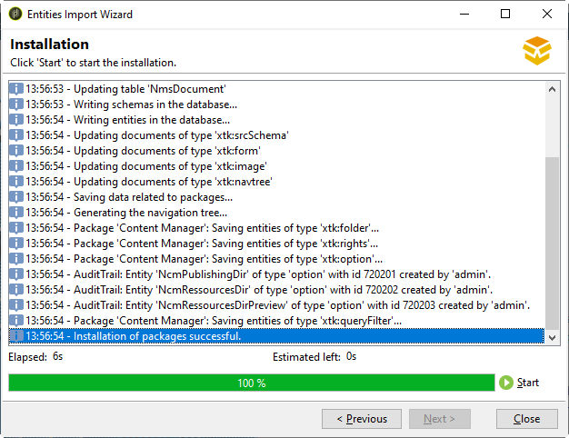

# 应用程序配置入门

在此部分中，您可以找到基于销售在线假日套餐的公司的配置示例。 其移动应用程序(Neotrips)有两个版本可供客户使用：Neotrips for Android和Neotrips for iOS。

要在Adobe Campaign中发送推送通知，您需要：

* 创建 **[!UICONTROL Mobile application]** 键入Neotrips移动应用程序的信息服务。 请参阅 [本节介绍iOS](configuring-the-mobile-application.md#configuring-ios-service). 和 [此部分适用于Android](configuring-the-mobile-application-android.md#configuring-android-service).
* 将应用程序的iOS和Android版本添加到此服务。
* 创建投放 [iOS](create-notifications-ios.md) 和 [Android](create-notifications-android.md).

>[!NOTE]
>
>转到 **[!UICONTROL Subscriptions]** 选项卡，以查看服务的订阅者列表，即在其移动设备上安装了应用程序并同意接收通知的所有用户。

## 安装包 {#installing-package-ios}

 [了解如何在视频中安装移动应用程序包](https://experienceleague.adobe.com/docs/campaign-classic-learn/tutorials/sending-messages/push-channel/installing-the-mobile-app-channel.html?lang=en#sending-messages)

作为混合/托管客户，请联系 [Adobe客户关怀](https://helpx.adobe.com/cn/enterprise/admin-guide.html/enterprise/using/support-for-experience-cloud.ug.html) 团队来访问Campaign中的推送通知渠道。

作为内部部署客户，您需要安装内置包。

>[!CAUTION]
>
>进一步了解Campaign内置资源包、最佳实践和 [本页](../../installation/using/installing-campaign-standard-packages.md).

安装步骤包括：

1. 从访问资源包导入向导 **[!UICONTROL Tools > Advanced > Import package]** 在Adobe Campaign客户端控制台中。

   

1. 选择 **[!UICONTROL Install a standard package]**。

1. 在显示的列表中，勾选 **[!UICONTROL Mobile App Channel]**.

   

1. 单击 **[!UICONTROL Next]**，则 **[!UICONTROL Start]** 以启动包安装。

   安装包后，进度栏会显示 **100%** 并且您可以在安装日志中看到以下消息： **[!UICONTROL Installation of packages successful]**.

   

1. **[!UICONTROL Close]** 安装窗口。

完成此步骤后，您可以配置Android和iOS应用程序。
请参阅以下章节：

* [iOS 配置步骤](configuring-the-mobile-application.md)

* [Android 配置步骤](configuring-the-mobile-application-android.md)
