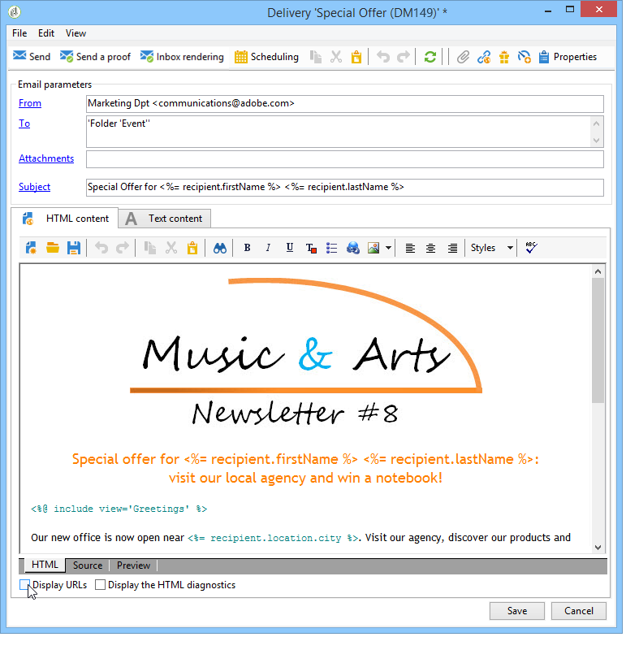

# 如何配置跟踪的链接{#how-to-configure-tracked-links}

对于每次投放，您可以跟踪邮件是否收到，以及邮件内容中插入的链接是否被点击。这样即可在目标投放行动实施后，跟踪收件人的行为。

跟踪适用于消息，但Web跟踪允许您监视收件人浏览网站（访问的页面、购买）的方式。 Web跟踪的配置显示在[本节](../../configuration/using/about-web-tracking.md)中。

>[!NOTE]
>
>电子邮件内容中包含个性化的链接需要跟踪特定的语法。 有关如何在可个性化的电子邮件中添加链接和支持跟踪的更多信息，请参阅[本节](../../delivery/using/tracking-personalized-links.md)。

默认情况下，消息跟踪处于启用状态。 要对URL的跟踪方式进行个性化设置，请执行以下步骤：

1. 在投放向导下半部分的消息内容下选择&#x200B;**[!UICONTROL Display URLs]**&#x200B;选项。

   

   当您从跟踪的URL列表中选择URL时，该URL将在投放内容中高亮显示 — 镜像页面中的链接和默认提供的退订链接除外。

   

1. 对于邮件的每个URL，选择是否激活跟踪。

   >[!IMPORTANT]
   >
   >当链接的URL用作标签时，建议取消激活跟踪以避免因网络钓鱼而被拒绝的风险。
   >
   >例如，如果将www.adobe.com URL插入消息中，并在消息上激活了跟踪，则超文本链接的内容将修改为https://nlt.adobe.net/r/?id=xxxxxx。 这意味着，收件人消息客户可将其视为欺诈。

1. 如果需要，更改跟踪标签，按住多次单击标签并输入新标签。

   >[!NOTE]
   >
   >可以修改跟踪的URL的标签和标签，以简化跟踪投放时的信息读取。 在计算点击计数时，两个或两个具有相同名称的URL将一起添加。

1. 如果需要，请更改跟踪模式，在&#x200B;**[!UICONTROL Tracking]**&#x200B;列中选择与目标链接匹配的新模式，如下所示：

   

   对于每个URL，可以将跟踪模式设置为以下值之一：

   * **[!UICONTROL Enabled]** :在此URL上激活跟踪。
   * **[!UICONTROL Not tracked]** :禁用此URL上的跟踪。
   * **[!UICONTROL Always enabled]** :始终激活此URL的跟踪。此信息将保存，以便下次，如果URL再次出现在将来的消息内容中，其跟踪将自动激活。
   * **[!UICONTROL Never tracked]** :绝不激活此URL的跟踪。此信息将保存，以便下次，如果URL再次出现在将来的消息中，其跟踪将自动停用。
   * **[!UICONTROL Opt-out]** :将此URL视为退出或退订URL。
   * **[!UICONTROL Mirror page]** :认为此URL是镜像页面URL。

1. 此外，您还可以在&#x200B;**[!UICONTROL Category]**&#x200B;列的下拉列表中为每个跟踪的URL选择类别。 这些类别可以显示报表，如&#x200B;**[!UICONTROL URLs and click streams]**（请参阅[此部分](../../reporting/using/reports-on-deliveries.md#urls-and-click-streams)）。 类别在特定明细列表中定义：**[!UICONTROL urlCategory]**(请参阅[管理明细列表](../../platform/using/managing-enumerations.md))。
