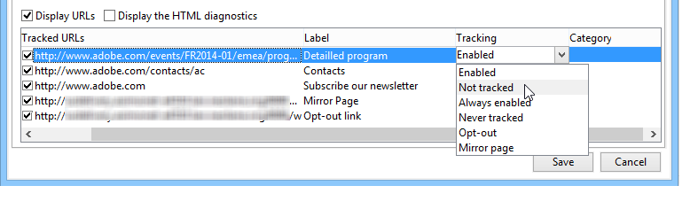

# 如何配置跟踪的链接{#how-to-configure-tracked-links}

对于每次投放，您可以跟踪邮件是否收到，以及邮件内容中插入的链接是否被点击。这样即可在目标投放行动实施后，跟踪收件人的行为。

跟踪适用于消息，但Web跟踪允许您监视收件人浏览网站的方式（访问的页面、购买）。 [此部分](../../configuration/using/about-web-tracking.md)介绍了如何配置 Web 跟踪。

>[!NOTE]
>
>电子邮件内容中包含个性化的链接需要跟踪特定语法。 有关如何在电子邮件中添加可个性化并支持跟踪的链接的详细信息，请参阅[此部分](tracking-personalized-links.md)。

我们强烈建议您在应用跟踪公式之前，将URL用分隔符包含在&#x200B;**[!UICONTROL Text content]**&#x200B;选项卡中。 Adobe Campaign会使用您在此选项卡中输入的URL分隔符来标识字符串中的URL。 您可以使用以下分隔符对：
* 圆括号( )
* 括号[ ]
* 大括号{ }

在此示例中，URL https://www.adobe.com后跟一个分号。 收件人电子邮件客户端可能会将分号解释为URL的一部分。 因此，链接可能会断开。 要避免出现此问题，您可以通过以下方式之一以分隔符括住URL：
* (https://www.adobe.com)；
* [https://www.adobe.com]；
* {https://www.adobe.com}；

默认启用消息跟踪。 要个性化URL的跟踪方式，请执行以下步骤：

1. 选择投放助理下部消息内容下的&#x200B;**[!UICONTROL Display URLs]**&#x200B;选项。

   

   从跟踪的URL列表中选择URL时，交付内容中将高亮显示该URL — 镜像页面中的链接和默认提供的退订链接除外。

   

1. 对于消息的每个URL，选择是否激活跟踪。

   >[!IMPORTANT]
   >
   >当链接的URL用作标签时，建议停用跟踪以避免因网络钓鱼而被拒绝的风险。
   >
   >例如，如果将www.adobe.com URL插入到消息中并在其上激活跟踪，则超文本链接的内容将被修改为https://nlt.adobe.net/r/?id=xxxxxx。 这意味着收件人消息客户端可能会将其视为欺诈行为。

1. 如果需要，请更改跟踪标签，双击该标签并输入一个新标签。

   >[!NOTE]
   >
   >可修改跟踪的URL和标签的标签以简化跟踪投放时信息的读取。 计算点击计数时，会将两个具有相同名称的URL或两个标签添加到一起。

1. 如果需要，请更改跟踪模式，在&#x200B;**[!UICONTROL Tracking]**&#x200B;列中选择与目标链接匹配的新模式，如下所示：

   

   对于每个单独的URL，您可以将跟踪模式设置为以下值之一：

   * **[!UICONTROL Enabled]** ：在此URL上激活跟踪。
   * **[!UICONTROL Not tracked]** ：停用此URL上的跟踪。
   * **[!UICONTROL Always enabled]** ：始终激活此URL的跟踪。 保存此信息，以便下次如果URL再次出现在将来的消息内容中，则会自动激活其跟踪。
   * **[!UICONTROL Never tracked]** ：从不激活此URL的跟踪。 保存此信息，以便下次如果URL再次出现在将来的消息中，则会自动停用其跟踪。
   * **[!UICONTROL Opt-out]** ：将此URL视为选择退出或退订URL。
   * **[!UICONTROL Mirror page]** ：认为此URL是镜像页面URL。

1. 此外，您还可以在&#x200B;**[!UICONTROL Category]**&#x200B;列的下拉列表中选择每个跟踪URL的类别。 这些类别可以显示报表，例如在&#x200B;**[!UICONTROL URLs and click streams]**&#x200B;中（请参阅[此部分](../../reporting/using/reports-on-deliveries.md#urls-and-click-streams)）。 类别在特定枚举中定义。 在&#x200B;**Adobe Campaign v8 （控制台）文档**&#x200B;中了解如何[使用枚举](https://experienceleague.adobe.com/en/docs/campaign/campaign-v8/config/settings/enumerations){target=_blank}。
