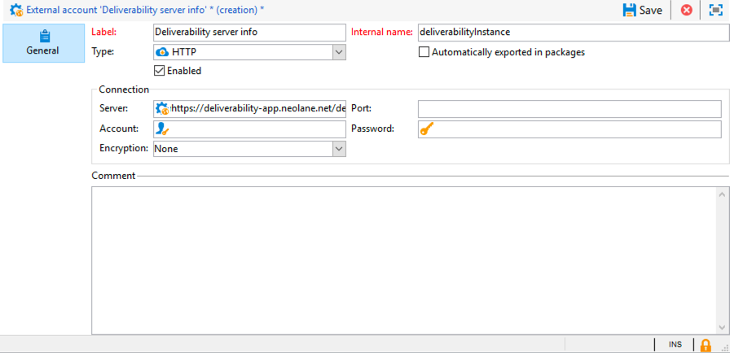

# 收件箱呈现{#inbox-rendering}


## 关于收件箱呈现 {#about-inbox-rendering}

在点击 **发送** 按钮，确保以最佳方式在各种Web客户端、Web邮件和设备上向收件人显示您的消息。

要实现此目的，Adobe Campaign将利用 [利特穆斯](https://litmus.com/email-testing) 基于web的电子邮件测试解决方案，用于捕获渲染并在专用报告中提供。 这样，您就可以预览不同上下文中可能收到的已发送消息，并检查主要桌面和应用程序的兼容性。

Litmus是一种功能丰富的电子邮件验证和预览应用程序。 它允许电子邮件内容创建者在70多个电子邮件渲染器(如Gmail收件箱或Apple Mail客户端)中预览其消息内容。

可用的移动设备、消息传送和Web邮件客户端 **收件箱呈现** 在Adobe Campaign中， [利特姆斯网站](https://litmus.com/email-testing) (单击 **查看所有电子邮件客户端**)。

>[!NOTE]
>
>在投放中测试个性化无需进行收件箱呈现。 可以使用Adobe Campaign工具(例如 **[!UICONTROL Preview]** 和 [校样](steps-validating-the-delivery.md#sending-a-proof).

## 激活收件箱呈现 {#activating-inbox-rendering}

对于托管和混合客户端，Adobe技术支持和顾问会在您的实例上配置收件箱呈现。 有关更多信息，请联系您的Adobe客户经理。

对于内部部署安装，请按照以下步骤配置收件箱呈现。

1. 安装 **[!UICONTROL Inbox rendering (IR)]** 包 **[!UICONTROL Tools]** > **[!UICONTROL Advanced]** > **[!UICONTROL Import package]** 菜单。 有关此内容的更多信息，请参阅 [安装Campaign Classic标准包](../../installation/using/installing-campaign-standard-packages.md).
1. 通过配置HTTP类型的外部帐户 **[!UICONTROL Administration]** > **[!UICONTROL Platform]** > **[!UICONTROL External Accounts]** 节点。 有关此内容的更多信息，请参阅 [创建外部帐户](../../installation/using/external-accounts.md#creating-an-external-account).
1. 按如下方式设置外部帐户参数：
   * **[!UICONTROL Label]**:可投放性服务器信息
   * **[!UICONTROL Internal name]**:deliverabilityInstance
   * **[!UICONTROL Type]**: HTTP
   * **[!UICONTROL Server]**:https://deliverability-app.neolane.net/deliverability
   * **[!UICONTROL Encryption]**: 无
   * 勾选 **[!UICONTROL Enabled]** 选项。

   

1. 转到 **[!UICONTROL Administration]** > **[!UICONTROL Platform]** > **[!UICONTROL Options]** 节点。 搜索 **[!UICONTROL DmRendering_cuid]** 选项并联系支持人员，以获取需要复制到的投放报告标识符 **[!UICONTROL Value (text)]** 字段。
1. 编辑 **serverConf.xml** 文件，以允许调用Litmus服务器。 将以下行添加到 `<urlPermission>` 部分：

   ```
   <url dnsSuffix="deliverability-app.neolane.net" urlRegEx="https://.*"/>
   ```

1. 使用以下命令重新加载配置：

   ```
   nlserver config -reload
   ```

>[!NOTE]
>
>您可能需要从控制台注销并重新登录才能使用收件箱呈现功能。

## 关于Litmus令牌 {#about-litmus-tokens}

由于利特摩是第三方服务，因此它采用的是按使用计费的模式。 每次用户调用Litmus功能时，都会扣除点数。

在Adobe Campaign中，点数对应于可用渲染（称为令牌）的数量。

>[!NOTE]
>
>可用的Litmus令牌数量取决于您购买的Campaign许可证。 检查您的许可协议。

每次您使用 **[!UICONTROL Inbox rendering]** ，则生成的每个渲染都会将您的可用令牌数量减少1。

>[!IMPORTANT]
>
>令牌用于每个人的渲染，而不用于整个收件箱渲染报表，这意味着：
>
>* 每次生成收件箱呈现报告时，都会为每个消息传送客户端扣除一个令牌：一个用于Outlook 2000渲染的令牌，一个用于Outlook 2010渲染的令牌，一个用于Apple Mail 9渲染，等等。
>* 对于同一投放，如果您再次生成收件箱呈现，则可用令牌的数量会再次减少所生成渲染的数量。
>


可用令牌的剩余数量显示在 **[!UICONTROL General summary]** 的 [收件箱呈现报告](#inbox-rendering-report).


通常，收件箱呈现功能用于测试新设计电子邮件的HTML框架。 每个渲染最多需要70个令牌（具体取决于通常测试的环境数量）。 但是，在某些情况下，您可能需要多个收件箱呈现报告才能完全测试您的投放。 因此，可能需要更多令牌才能完成多项检查。

## 访问收件箱呈现报告 {#accessing-the-inbox-rendering-report}

创建电子邮件投放并定义其内容及定向群体后，请执行以下步骤。

有关创建、设计和定位投放的更多信息，请参阅 [此部分](about-email-channel.md).

1. 在投放的顶部栏中，单击 **[!UICONTROL Inbox rendering]** 按钮。
1. 选择 **[!UICONTROL Analyze]** 以启动捕获进程。

   

   发送校样。 在发送电子邮件后几分钟，可以在校样中访问渲染缩略图。 有关发送校样的更多信息，请参阅 [此部分](steps-validating-the-delivery.md#sending-a-proof).

1. 发送校样后，该校样会显示在投放列表中。 双击它。

   

1. 转到 **收件箱呈现** 选项卡。

   

   将显示收件箱呈现报告。

## 收件箱呈现报告 {#inbox-rendering-report}

此报表显示收件人看到的收件箱呈现。 呈现方式可能因收件人打开电子邮件投放的方式而异：浏览器、移动设备或电子邮件应用程序中。

的 **[!UICONTROL General summary]** 以列表和图形颜色编码表示方式显示已接收、无用（垃圾邮件）、未接收或待接收的消息数。


将鼠标悬停在图表上可显示每种颜色的详细信息。

报告正文分为三部分： **[!UICONTROL Mobile]**, **[!UICONTROL Messaging clients]**&#x200B;和 **[!UICONTROL Webmails]**. 向下滚动报告，可显示分组到这三个类别中的所有渲染。


要获取各个报告的详细信息，请单击相应的卡。将针对所选的接收方式显示对应的渲染。


