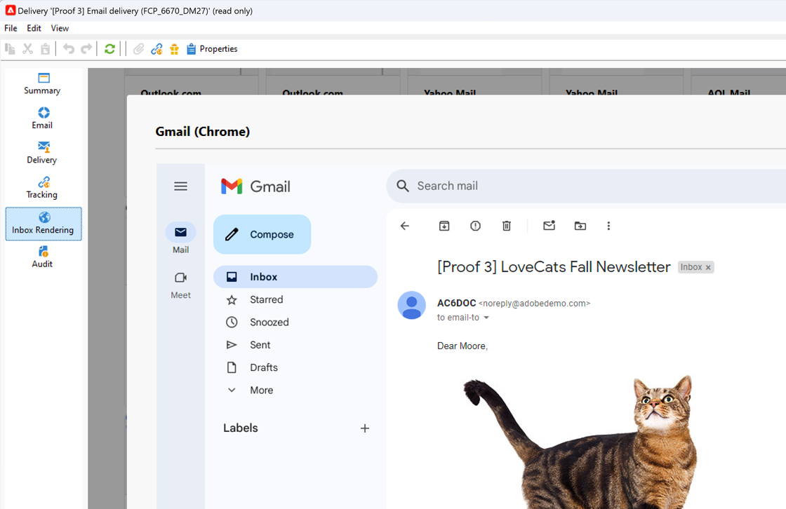

# 收件箱呈现{#inbox-rendering}

## 关于收件箱呈现 {#about-inbox-rendering}

在点击“ **发送** ”按钮之前，请确保您的消息将以最佳方式显示给收件人，在各种Web客户端、Web邮件和设备上。

为此，Adobe Campaign利用基于 [Litmus](https://litmus.com/email-testing) web的电子邮件测试解决方案捕获渲染并在专用报告中提供它们。 这样，您就可以在收到消息的不同上下文中预览发送的消息，并检查主要桌面和应用程序的兼容性。

Litmus是一个功能丰富的电子邮件验证和预览应用程序。 它允许电子邮件内容创建者在70多个电子邮件渲染器（如Gmail收件箱或Apple mail客户端）中预览其邮件内容。

Litmus网站上列出了可用于Adobe Campaign中 **Inbox渲染的移动设备、消息传递和Web邮件客户端** (单击“查看所 [有电子邮件客户端](https://litmus.com/email-testing)****”)。

>[!NOTE]
>
>在分发中测试个性化不需要收件箱呈现。 可以使用Adobe Campaign工具（如“校样”）检查个 **[!UICONTROL Preview]** 性 [化](../../delivery/using/steps-validating-the-delivery.md#sending-a-proof)。

## 激活收件箱渲染{#activating-inbox-rendering}

对于托管和混合客户端，Adobe技术支持和顾问会在您的实例上配置收件箱呈现功能。 有关详细信息，请与您的Adobe客户经理联系。

对于内部部署安装，请按照以下步骤配置收件箱渲染。

1. 通过 **[!UICONTROL Inbox rendering (IR)]** > **[!UICONTROL Tools]** > **[!UICONTROL Advanced]** >菜单安装 **[!UICONTROL Import package]** 包。 有关此方面的详细信息，请参 [阅安装Campaign Classic标准包](../../installation/using/installing-campaign-standard-packages.md)。
1. 通过> **[!UICONTROL Administration]** >节点配置HTTP类型的外部 **[!UICONTROL Platform]****[!UICONTROL External Accounts]** 帐户。 有关此方面的详细信息，请 [参阅创建外部帐户](../../platform/using/external-accounts.md#creating-an-external-account)。
1. 按如下方式设置外部帐户参数：
   * **[!UICONTROL Label]**:可交付性服务器信息
   * **[!UICONTROL Internal name]**:deliverabilityInstance
   * **[!UICONTROL Type]**:HTTP
   * **[!UICONTROL Server]**:https://deliverability-app.neolane.net/deliverability
   * **[!UICONTROL Encryption]**:无
   * 选中该 **[!UICONTROL Enabled]** 选项。
   

1. 转到 **[!UICONTROL Administration]** > **[!UICONTROL Platform]** >节 **[!UICONTROL Options]** 点。 搜索选项 **[!UICONTROL DmRendering_cuid]** 和联系支持以获取需要复制到字段的交付报告标识 **[!UICONTROL Value (text)]** 符。
1. 编辑 **serverConf.xml文件** ，以允许调用Litmus服务器。 在部分中添加以下 `<urlPermission>` 行：

   ```
   <url dnsSuffix="deliverability-app.neolane.net" urlRegEx="https://.*"/>
   ```

1. 使用以下命令重新加载配置：

   ```
   nlserver config -reload
   ```

>[!NOTE]
>
>您可能需要从控制台中注销并重新登录才能使用收件箱渲染。

## 关于Litmus令牌 {#about-litmus-tokens}

由于利特穆斯是第三方服务，因此它的运行模式是按使用计费。 每次用户调用Litmus功能时，都会扣除信用。

在Adobe Campaign中，信用与可用呈现次数（称为令牌）相对应。

>[!NOTE]
>
>可用的Litmus令牌数量取决于您购买的Campaign许可证。 检查您的许可协议。

每次在交付中使 **[!UICONTROL Inbox rendering]** 用该功能时，生成的每个呈现都会将可用令牌减少一个。

>[!IMPORTANT]
>
>令牌帐户用于每个单独的呈现，而非整个收件箱呈现报告，这意味着：
>
>* 每次生成收件箱呈现报告时，都会扣除每个消息客户端的一个令牌：一个用于Outlook 2000渲染的令牌，一个用于Outlook 2010渲染，一个用于Apple Mail 9渲染，等等。
>* 对于相同的分发，如果您再次生成收件箱渲染，则可用令牌的数量会再次减少为生成的渲染数量。
>


剩余的可用令牌数显示在收件箱 **[!UICONTROL General summary]** 呈现报 [告中](#inbox-rendering-report)。


通常，收件箱渲染功能用于测试新设计的电子邮件的HTML框架。 每个渲染最多需要70个令牌（具体取决于通常测试的环境数量）。 但是，在某些情况下，您可能需要多个收件箱来呈现报告以完全测试您的分发。 因此，可能需要更多令牌才能完成多项检查。

>[!NOTE]
>
>如果您是Litmus客户，则可以使用您自己的Litmus帐户来配置和使用Adobe Campaign中的收件箱渲染。 有关此方面的更多信息，请与您的Adobe客户经理联系。
>
>请注意，更改Litmus凭据可能会导致Adobe Campaign中的身份验证问题。

## 访问收件箱呈现报告 {#accessing-the-inbox-rendering-report}

创建电子邮件分发并定义其内容以及目标用户群后，请按照以下步骤操作。

有关创建、设计和定位分发的详细信息，请参阅 [此部分](../../delivery/using/about-email-channel.md)。

1. 在传送的顶栏上，单击按 **[!UICONTROL Inbox rendering]** 钮。
1. 选择 **[!UICONTROL Analyze]** 以启动捕捉过程。

   

   发送证据。 在发送电子邮件后几分钟内，可以在该证明中访问渲染缩略图。 For more on sending proofs, refer to [this section](../../delivery/using/steps-validating-the-delivery.md#sending-a-proof).

1. 发送后，证明显示在递送列表中。 双击它。

   

1. 转到证明 **的“收件箱** ”“渲染”选项卡。

   

   此时将显示收件箱呈现报告。

## 收件箱呈现报告 {#inbox-rendering-report}

此报告在收件人看到收件箱时显示其呈现内容。 呈现方式可能因收件人打开电子邮件分发的方式而异：或通过电子邮件应用程序。

以 **[!UICONTROL General summary]** 列表形式和通过图形颜色编码表示来显示接收的、不想要的（垃圾邮件）、未接收的或待处理的接收的消息数。


将鼠标悬停在图表上可显示每种颜色的详细信息。

报告正文分为三部分： **[!UICONTROL Mobile]**、 **[!UICONTROL Messaging clients]**&#x200B;和 **[!UICONTROL Webmails]**。 向下滚动报告可显示分组到这三个类别的所有渲染。


要获取每个报告的详细信息，请单击相应的卡片。 为所选的接收方法显示渲染。


