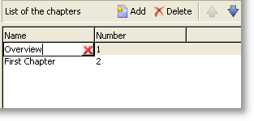
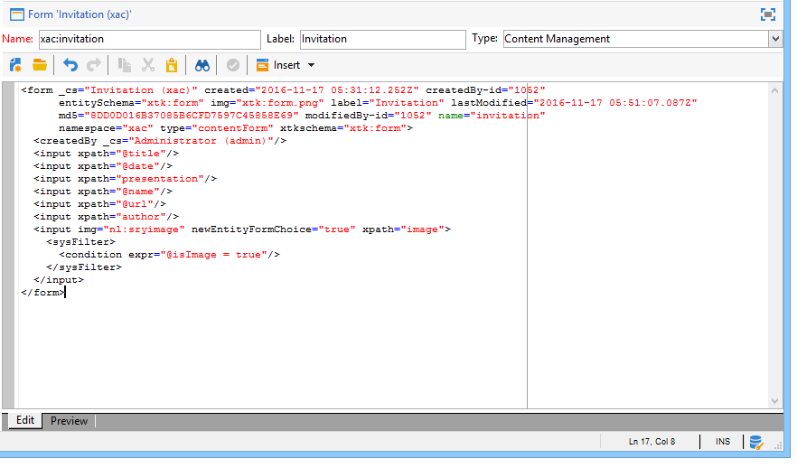
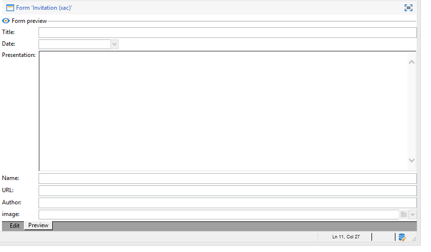

# 输入表单{#input-forms}


以下是关于在Adobe Campaign使用输入表的一些一般原则。

Forms详见 [此部分](../../configuration/using/identifying-a-form.md).

## 窗体结构 {#form-structure}

输入表单的XML文档必须包含 **`<form>`** 根元素，其中 **name** 和 **命名空间** 属性来分别填充表单名称及其命名空间。

```
<form name="form_name" namespace="name_space">
...
</form>
```

默认情况下，表单与具有相同名称和命名空间的数据架构相关联。 要将表单与其他名称关联，请在 **实体模式** 属性 **`<form>`** 元素。

为了说明输入表单的结构，我们基于示例模式“cus:book”描述了一个界面：


这是相应的输入表单：

```
<form name="book" namespace="cus" type="contentForm">
  <input xpath="@name"/>
  <input xpath="@date"/>
  <input xpath="@language"/>
</form>
```

编辑元素的描述以 **`<form>`** 根元素。

在 **`<input>`** 元素 **xpath** 属性，其中包含其架构中字段的路径。

**有关XPath语法的提醒：**

Adobe Campaign中使用XPath语言来引用属于数据模式的元素或属性。

XPath是一种语法，用于在XML文档的树中查找节点。

元素由其名称指定，属性由名称前面的字符“@”指定。

示例:

* **@date**:选择名称为“date”的属性
* **章节/@title**:选择 `<chapter>` 元素
* **../@date**:从当前元素的父元素中选择日期

编辑控件会自动适应相应的数据类型，并使用架构中定义的标签。

默认情况下，每个字段都显示在一行中，并占用所有可用空间，具体取决于数据类型。

>[!CAUTION]
>
>输入窗体必须引用 **type=&quot;contentForm&quot;** 属性 **`<form>`** 元素，以自动添加输入内容所需的框架。

## 格式化 {#formatting}

控件相对彼此的布置类似于HTML表中使用的布置，其可能将控件分成若干列、交错元件或指定可用空间的占用。 但是，请记住，格式仅允许分配比例；不能为对象指定固定维度。

如需详细信息，请参阅[此部分](../../configuration/using/form-structure.md#formatting)。

## 列表类型控件 {#list-type-controls}

要编辑收藏集元素，必须使用列表类型控件。

### 列列表 {#column-list}

此控件显示可编辑的列列表，其中的工具栏包含“添加”和“删除”按钮。


```
<input xpath="chapter" type="list">
  <input xpath="@name"/>
  <input xpath="@number"/>
</input>
```

必须使用 **type=&quot;list&quot;** 属性，且列表路径必须引用收集元素。

列由子项声明 **`<input>`** 列表的元素。

>[!NOTE]
>
>在 **ordered=&quot;true&quot;** 已为数据架构中的收集元素完成属性。

默认情况下，工具栏按钮垂直对齐。 也可以水平对齐：



```
<input nolabel="true" toolbarCaption="List of chapters" type="list" xpath="chapter">
  <input xpath="@name"/>
  <input xpath="@number"/>
</input>
```

的 **toolbarCaption** 属性强制工具栏的水平对齐方式并填充列表上方的标题。

>[!NOTE]
>
>对于不要在控件左侧显示的收藏集元素标签，请添加 **nolabel=&quot;true&quot;** 属性。

#### 放大列表 {#zoom-in-a-list}

列表数据的插入和编辑可以以单独的编辑表单执行。

在以下情况下，会使用列表中的编辑表单：

* 为便于信息输入，
* 存在多线控，
* 列表中的列仅包含主字段，并且表单显示收藏集元素的所有字段。


```
<input nolabel="true" toolbarCaption="List of chapters" type="list" xpath="chapter" zoom="true" zoomOnAdd="true">
  <input xpath="@name"/>
  <input xpath="@number"/>

  <form colcount="2" label="Editing a chapter">
    <input xpath="@name"/>
    <input xpath="@number"/>
    <input colspan="2" xpath="page"/>
  </form>
</input>
```

编辑表单的定义通过 **`<form>`** 元素。 其结构与输入形式的结构相同。

A **[!UICONTROL Detail]** 按钮 **zoom=&quot;true&quot;** 属性在列表定义中输入。 这样，您就可以在选定行上打开编辑表单。

>[!NOTE]
>
>添加 **zoomOnAdd=&quot;true&quot;** 属性强制在插入列表元素时调用编辑表单。

### 选项卡列表 {#tab-list}

此列表以选项卡的形式显示对收藏集元素的编辑。


```
<container toolbarCaption="List of chapters" type="notebooklist" xpath="chapter" xpath-label="@name">
  <container colcount="2">
    <input xpath="@name"/>
    <input xpath="@number"/>
    <input colspan="2" xpath="page"/>
  </container>
</container>
```

必须使用 **type=&quot;notebooklist&quot;** 属性，且列表路径必须引用收集元素。

选项卡的标题包含通过 **xpath-label** 属性。

必须在 **`<container>`** 列表控件的子项元素。

使用工具栏按钮添加或删除列表元素。

>[!NOTE]
>
>在 **ordered=&quot;true&quot;** 属性会填充数据架构中收集元素的。

## 容器 {#containers}

容器允许您对一组控件进行分组。 它们通过 **`<container>`** 元素。 已使用它们设置多列控件的格式以及选项卡列表的控件。

有关容器以及如何在输入表单中使用容器的详细信息，请参阅 [此部分](../../configuration/using/form-structure.md#containers).

## 编辑窗体 {#editing-forms}

编辑区域允许您输入输入表单的XML内容：



的 **[!UICONTROL Preview]** 选项卡可查看输入表单：


