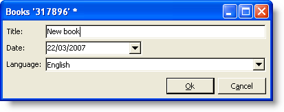

# 输入表单{#input-forms}

以下是关于在Adobe Campaign中使用输入表单的一些一般原则。

本节详细介绍 [了表单](../../configuration/using/identifying-a-form.md)。

## 表单结构 {#form-structure}

输入表单的XML文档必须包含根元素，其 **`<form>`** 中包含 **name** 和namespace **属性** ，以分别填充表单名称及其命名空间。

```
<form name="form_name" namespace="name_space">
...
</form>
```

默认情况下，表单与具有相同名称和命名空间的数据架构相关联。 要将表单与其他名称关联，请在元素的entity-schema **属性中输入架构键****`<form>`** 值。

为了说明输入表单的结构，我们基于示例架构“cus:book”描述了一个界面：



这是相应的输入表单：

```
<form name="book" namespace="cus" type="contentForm">
  <input xpath="@name"/>
  <input xpath="@date"/>
  <input xpath="@language"/>
</form>
```

编辑元素的描述以根元素开 **`<form>`** 头。

在元素中输入编辑控 **`<input>`** 件，该元素的 **** xpath属性包含该字段在其架构中的路径。

**关于XPath语法的提醒：**

Adobe Campaign中使用XPath语言引用属于数据架构的元素或属性。

XPath是一种语法，它允许您在XML文档的树中查找节点。

元素由其名称指定，属性由前面带有字符“@”的名称指定。

示例：

* **@date**:选择名称为“date”的属性
* **第章/@title**:选择元素下的“title”属 `<chapter>` 性
* **../@date**:从当前元素的父元素中选择日期

编辑控件自动适应相应的数据类型并使用架构中定义的标签。

默认情况下，每个字段显示在一行上，并根据数据类型占用所有可用空间。

>[!CAUTION]
>
>输入表单必须引用元 **素上的type=&quot;contentForm&quot;** 属性 **`<form>`** ，以自动添加要输入内容所需的框架。

## 格式化 {#formatting}

控件相对于彼此的排列看起来像在HTML表中使用的排列，可以将控件分成几列、交错元素或指定可用空间的占用。 但是，请记住，格式仅允许比例分配；不能为对象指定固定尺寸。

如需详细信息，请参阅[此部分](../../configuration/using/form-structure.md#formatting)。

## 列表类型控件 {#list-type-controls}

要编辑集合元素，必须使用列表类型控件。

### 列列表 {#column-list}

此控件显示可编辑的列列表，其中包含“添加”和“删除”按钮的工具栏。


```
<input xpath="chapter" type="list">
  <input xpath="@name"/>
  <input xpath="@number"/>
</input>
```

必须使用 **type=&quot;list&quot;属性填充列表控件** ，并且列表的路径必须引用集合元素。

列由列表的子元素 **`<input>`** 声明。

>[!NOTE]
>
>当完成数据架构中的集合元素的 **ordered=&quot;true&quot;属性时** ，将自动添加向上和向下排序箭头。

默认情况下，工具栏按钮垂直对齐。 还可以水平对齐它们：


```
<input nolabel="true" toolbarCaption="List of chapters" type="list" xpath="chapter">
  <input xpath="@name"/>
  <input xpath="@number"/>
</input>
```

工具 **栏Caption** 属性强制工具栏进行水平对齐，并填充列表上方的标题。

>[!NOTE]
>
>对于不要在控件左侧显示的集合元素标签，添加 **nolabel=&quot;true&quot;属性** 。

#### 放大列表 {#zoom-in-a-list}

列表数据的插入和编辑可以在单独的编辑表单中执行。

在以下情况下，可使用列表中的编辑表单：

* 为了便于信息输入，
* 存在多行控件，
* 列表中的列仅包含主字段，并且表单显示集合元素的所有字段。


```
<input nolabel="true" toolbarCaption="List of chapters" type="list" xpath="chapter" zoom="true" zoomOnAdd="true">
  <input xpath="@name"/>
  <input xpath="@number"/>

  <form colcount="2" label="Editing a chapter">
    <input xpath="@name"/>
    <input xpath="@number"/>
    <input colspan="2" xpath="page"/>
  </form>
</input>
```

编辑表单的定义是通过列表元素下 **`<form>`** 的元素指定的。 其结构与输入形式的结构相同。

在 **[!UICONTROL Detail]** 列表定义中输入 **** zoom=&quot;true&quot;属性时，会自动添加一个按钮。 这样，您就可以在选定行上打开编辑表单。

>[!NOTE]
>
>添加 **zoomOnAdd=&quot;true&quot;属性** ，将强制在插入列表元素时调用编辑表单。

### 选项卡列表 {#tab-list}

此列表以选项卡的形式显示集合元素的编辑。


```
<container toolbarCaption="List of chapters" type="notebooklist" xpath="chapter" xpath-label="@name">
  <container colcount="2">
    <input xpath="@name"/>
    <input xpath="@number"/>
    <input colspan="2" xpath="page"/>
  </container>
</container>
```

必须使用 **type=&quot;notebooklist&quot;属性填充列表控件** ，并且列表的路径必须引用集合元素。

选项卡的标题包含通过 **xpath-label属性输入的数据的值** 。

编辑控件必须在作为列表控 **`<container>`** 件子项的元素下声明。

使用工具栏按钮可添加或删除列表元素。

>[!NOTE]
>
>为数据架构中的集合元素填充 **** ordered=&quot;true&quot;属性时，将自动添加左右排序箭头。

## 容器 {#containers}

容器可让您对一组控件进行分组。 它们通过元素存 **`<container>`** 在。 它们已用于设置多列中的控件的格式以及选项卡列表的控件。

有关容器以及如何在输入表单中使用这些容器的详细信息，请参 [阅本节](../../configuration/using/form-structure.md#containers)。

## 编辑表单 {#editing-forms}

通过编辑区域，您可以输入输入表单的XML内容：


在该 **[!UICONTROL Preview]** 选项卡中可以查看输入表单：


