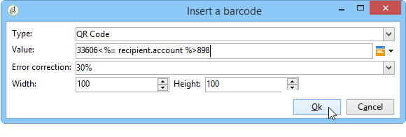

# 在电子邮件中插入条形码{#insert-a-barcode-in-an-email}

条形码生成模块允许您创建符合许多常见标准（包括2D条形码）的几种条形码。

可以使用使用客户标准定义的值动态生成条形码作为位图。 电子邮件促销活动中可包含个性化条形码。 收件人可以打印消息并将其显示给发布公司进行扫描（例如，签出时）。

要将条形码插入电子邮件，请将光标置于要显示该条形码的内容中，然后单击个性化按钮。 选择 **[!UICONTROL Include > Barcode...]**。

然后，根据您的需求配置以下元素：

1. 选择条形码的类型。

   * 对于1D格式，Adobe Campaign中提供了以下类型：Codabar，代码128, GS1-128（以前称为EAN-128）， UPC-A， UPC-E， ISBN， EAN-8，代码39，交织2（共5个）， POSTNET和Royal Mail(RM4SCC)。

      1D条形码示例：

      

   * DataMatrix和PDF417类型涉及2D格式。

      2D条形码示例：

      

   * 要插入二维码，请选择此类型并输入要应用的纠错率。 此比率定义重复信息的数量和退化的容差。

      

      二维码示例：

      

1. 输入要插入到电子邮件中的条形码的大小：通过配置比例，您可以增加或减小条形码的大小，从x1到x10。
1. 的 **[!UICONTROL Value]** 字段，可定义条形码的值。 值可以匹配特殊选件，也可以是标准的函数，也可以是链接到客户的数据库字段的值。

   此示例显示EAN-8类型的条形码，该条形码已添加到收件人的帐户号。 要添加此帐号，请单击 **[!UICONTROL Value]** 字段和选择 **[!UICONTROL Recipient > Account number]**.

   

1. 的 **[!UICONTROL Height]** 字段，您可以通过更改条形码之间的间距量，在不更改其宽度的情况下配置条形码的高度。

   没有基于条形码类型的限制性输入控件。 如果条形码值不正确，则它将仅在 **预览** 用红色划出条形码的模式。

   >[!NOTE]
   >
   >分配给条形码的值取决于其类型。 例如，EAN-8类型的数字应恰好为8。
   >
   >右侧的个性化按钮 **[!UICONTROL Value]** 字段，除了值本身之外，您还可以添加数据。 这丰富了条形码，只要条形码标准接受它。
   >
   >例如，如果您使用GS1-128类型条形码，并且想要输入收件人的帐号以及值，请单击个性化按钮并选择 **[!UICONTROL Recipient > Account number]**. 如果所选收件人的帐号输入正确，则条形码会将其考虑在内。

配置这些元素后，您可以完成电子邮件并发送它。 要避免出现错误，请始终在通过单击 **[!UICONTROL Preview]** 选项卡。

>[!NOTE]
>
>如果条形码的值不正确，则其位图将以红色交叉显示。

