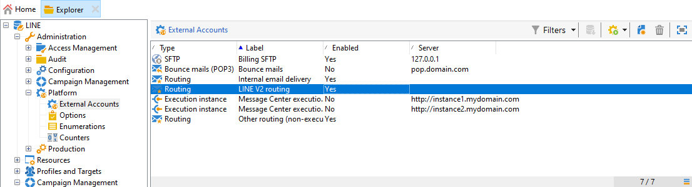

# 创建LINE投放{#line-channel}

LINE是免费即时消息、语音和视频呼叫的应用程序，可在所有智能手机(iPhone、Android、Windows Phone、Blackberry、Nokia)和PC上使用。 Adobe Campaign允许您发送LINE消息。

LINE仅可用于内部部署或托管服务安装。

LINE还可以与事务性消息模块结合，在安装在消费性移动设备上的LINE应用程序上发送实时消息。 有关详细信息，请参见此 [ 页面](../../message-center/using/transactional-messaging-architecture.md#transactional-messaging-and-line)。

以下部分提供特定于LINE渠道的信息。 有关如何创建投放的全局信息，请参阅[本节](../../delivery/using/steps-about-delivery-creation-steps.md)。

使用LINE渠道的步骤有：

1. 创建投放
1. 配置消息内容
1. 选择目标群
1. 发送消息
1. 监视投放（跟踪、隔离、报告等）。

## 设置LINE渠道{#setting-up-line-channel}

### 创建LINE帐户和外部帐户{#creating-a-line-account-and-an-external-account-}

>[!NOTE]
>
>在创建LINE帐户和外部帐户之前，您首先需要在实例上安装LINE包。 有关此问题的详细信息，请参阅《安装指南》中的[LINE](../../installation/using/installing-campaign-standard-packages.md#line-package)部分。

您必须首先创建LINE帐户，以便随后可以将其链接到Adobe Campaign。 然后，您可以向在其移动应用程序中添加LINE帐户的用户发送LINE消息。 外部帐户和LINE帐户只能由平台的功能管理员管理。

要创建和配置LINE帐户，请参阅[https://developers.line.me/](https://developers.line.me/)。

要创建和配置LINE服务，请参阅[管理订阅](../../delivery/using/managing-subscriptions.md)。

最后，要创建关于Adobe Campaign的外部帐户:

1. 在&#x200B;**管理** > **平台**&#x200B;树结构中，单击&#x200B;**外部帐户**&#x200B;选项卡。
1. 然后单击&#x200B;**新建**&#x200B;图标。

   

1. 填写&#x200B;**Label**&#x200B;和&#x200B;**Internal name**&#x200B;字段。
1. 在&#x200B;**[!UICONTROL Type]**&#x200B;字段中，选择“路由”，在&#x200B;**“渠道”**&#x200B;字段中，选择“行”。
1. 单击&#x200B;**[!UICONTROL Save]**&#x200B;以创建LINE外部帐户。
1. 然后，**LINE**&#x200B;个性化字段显示在&#x200B;**常规**&#x200B;图标下，填写以下字段：

   

   * **渠道别名**:是通过您的LINE帐户在>标 **[!UICONTROL Channels]** 签中 **[!UICONTROL Technical configuration]** 提供的。
   * **渠道ID**:是通过“渠道”>“基本信息” **面板中** 的 **LINE帐户** 提供的。
   * **渠道密钥**:是通过“渠道”>“基本信息” **面板中** 的 **LINE帐户** 提供的。
   * **访问令牌**:是通过您的LINE帐户在开发人员门户网站中提供的，或者通过单击 **[!UICONTROL Get access token]** 按钮。
   * **访问令牌到期日**:允许您指定访问令牌的过期日期。
   * **行订阅服务**:允许您指定用户将订阅的服务。

>[!NOTE]
>
>必须验证&#x200B;**[!UICONTROL LINE access token update (updateLineAccessToken)]**&#x200B;和&#x200B;**[!UICONTROL Delete blocked LINE users (deleteBlockedLineUsers)]**&#x200B;工作流是否已启动。 在资源管理器中，单击&#x200B;**[!UICONTROL Administration > Production > Technical workflows > LINE workflows]**&#x200B;以检查工作流的状态。

## 创建投放 {#creating-the-delivery}

要创建&#x200B;**LINE**&#x200B;投放，您必须执行以下步骤：

>[!NOTE]
>
>[本节](../../delivery/using/steps-about-delivery-creation-steps.md)介绍了有关创建投放的全局概念。

1. 从&#x200B;**[!UICONTROL Campaigns]**&#x200B;选项卡中，选择&#x200B;**[!UICONTROL Deliveries]**，然后单击&#x200B;**[!UICONTROL Create]**&#x200B;按钮。
1. 在出现的窗口中，选择&#x200B;**[!UICONTROL LINE V2 delivery]**&#x200B;投放模板。

   

1. 用标签、代码和说明识别投放。 如需详细信息，请参阅[此部分](../../delivery/using/steps-create-and-identify-the-delivery.md#identifying-the-delivery)。
1. 单击&#x200B;**[!UICONTROL Continue]**&#x200B;以创建投放。

## 定义内容 {#defining-the-content}

要定义LINE投放的内容，您首先必须向投放添加消息类型。 每个LINE投放最多可包含5条消息。

您可以选择以下两种消息类型：

* 文本消息
* 图像和链接

### 配置文本消息投放{#configuring-a-text-message-delivery}

**文本消息** LINE投放是以文本形式发送给收件人的消息。

此类型邮件的配置与电子邮件中&#x200B;**文本**&#x200B;的配置类似。 有关详细信息，请参阅此[页面](../../delivery/using/defining-the-email-content.md#message-content)。

### 配置映像和链接投放{#configuring-an-image-and-link-delivery}

**图像和链接** LINE投放是以图像形式发送给收件人的消息，该图像可能包含一个或多个URL。

您可以使用：

* a **个性化图像**,

   >[!NOTE]
   >
   >可以使用&#x200B;**%SIZE%**&#x200B;变量：此变量允许您根据收件人移动设备的屏幕大小优化图像显示。

   

* **图像URL**,

   

   图像URL允许您使用不同的图像分辨率来优化移动设备上的投放可见性。 仅支持高度和宽度相同的图像。

   可以根据屏幕大小定义图像：

   * 1040px
   * 700px
   * 460px
   * 300px
   * 240px

   >[!NOTE]
   >
   >对于每个具有链接的LINE图像，大小必须为1040x1040像素。

   然后，您必须添加将在收件人移动设备上弹出的替换文本。

* 和&#x200B;**[!UICONTROL Links]**。

   

   **[!UICONTROL Links]**&#x200B;部分允许您选择将图像划分到多个可单击区域的不同布局。 然后，您可以为每个用户分配一个专用链接。

>[!NOTE]
>
>&lt;%@ include option=&#39;NmsServer_URL&#39; %>/webApp/APP3?id=&lt;%=escapeUrl(cryptString(访客.id))%>语法允许您在LINE消息中包含指向Web应用程序的链接。

### 建议{#recommendations}

* 首次向新收件人发送LINE投放时，必须在投放中添加有关使用条款和同意的正式LINE消息。 官方信息可在以下链接上获取：[https://terms.line.me/OA_privacy/](https://terms.line.me/OA_privacy/sp?lang=fr)。

## 选择目标填充{#selecting-the-target-population}

选择LINE收件人的投放与定义电子邮件投放收件人类似。 有关详细信息，请参阅[识别目标群体](../../delivery/using/steps-defining-the-target-population.md)。

对&#x200B;**访客**&#x200B;进行定位。

## 发送消息 {#sending-messages}

正确创建和配置投放后，您可以将其发送到之前定义的目标。

发送LINE投放与发送电子邮件投放类似。 有关发送投放的详细信息，请参阅[发送消息](../../delivery/using/sending-messages.md)。

## 访问报告{#accessing-reports}

单击资源管理器中的&#x200B;**[!UICONTROL Profiles and Targets > Services and Subscriptions > LINE]**&#x200B;可以视图LINE服务上的报告。 然后单击LINE服务中的&#x200B;**[!UICONTROL Reports]**&#x200B;图标。

要视图LINE投放上的报告，请单击&#x200B;**[!UICONTROL Campaign Management > Deliveries]**，然后选择所需的投放。 跟踪报告指示点进率。 LINE未考虑开放率。

## 示例：创建并发送个性化的LINE消息{#example--create-and-send-a-personalized-line-message}

在此示例中，我们将创建和配置文本消息和包含将根据收件人个性化的数据的图像。

1. 单击&#x200B;**[!UICONTROL Campaign]**&#x200B;选项卡中的&#x200B;**[!UICONTROL Create]**&#x200B;按钮，创建LINE投放。

   

1. 选择&#x200B;**[!UICONTROL LINE V2 delivery]**&#x200B;投放模板并命名投放。

   

1. 在投放的配置窗口中，选择目标人口。

   

1. 单击&#x200B;**[!UICONTROL Add]**&#x200B;创建消息，然后选择&#x200B;**[!UICONTROL Message type]**。

   此处，我们首先要创建文本消息。

   

1. 将光标置于要插入个性化文本的位置，单击下拉图标，然后选择&#x200B;**[!UICONTROL Visitor > First name]**。

   

1. 按照相同的步骤添加图像，从&#x200B;**[!UICONTROL Message type]**&#x200B;下拉菜单中选择&#x200B;**[!UICONTROL Image and links]**。

   添加图像URL。

   

1. 在&#x200B;**[!UICONTROL Links]**&#x200B;部分，选择将图像分成多个可单击区域的布局。
1. 为图像的每个区域分配一个URL。

   

1. 保存您的投放，然后单击&#x200B;**[!UICONTROL Send]**&#x200B;以分析并将其发送到目标。

   投放将发送到目标。

   
