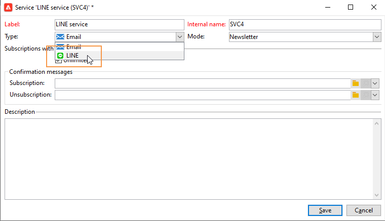

# 创建LINE投放{#line-channel}

[!DNL LINE] 是免费即时消息、语音和视频呼叫的应用程序，适用于每个移动操作系统和PC上。

[!DNL LINE] 也可以与事务型消息模块组合，以在 [!DNL LINE] 应用程序。 有关详细信息，请参见此 [ 页面](../../message-center/using/transactional-messaging-architecture.md#transactional-messaging-and-line)。

使用 [!DNL LINE] 渠道包括：

1. [设置LINE渠道](#setting-up-line-channel)
1. [创建投放](#creating-the-delivery)
1. [配置内容类型](#defining-the-content)
1. [监控投放（跟踪、隔离、报告等）](#accessing-reports)

## 设置LINE渠道 {#setting-up-line-channel}

在创建 [!DNL LINE] 帐户和外部帐户，您首先需要在实例上安装LINE包。 有关此内容的详细信息，请查阅 [此部分](../../installation/using/installing-campaign-standard-packages.md#line-package).

您必须先创建 [!DNL LINE] 帐户，以便您随后将其关联到Adobe Campaign。 然后，您可以发送 [!DNL LINE] 向添加了 [!DNL LINE] 帐户。 外部帐户和 [!DNL LINE] 帐户只能由平台的功能管理员管理。

创建和配置 [!DNL LINE] 帐户，请参阅 [LINE开发人员文档](https://developers.line.me/).

### 创建和配置LINE服务 {#configure-line-service}

创建 [!DNL LINE] 服务：

1. 从Adobe Campaign Classic主页中，选择 **[!UICONTROL Profiles and Targets]** 选项卡。

1. 在左侧菜单中，选择 **[!UICONTROL Services and Subscriptions]** 单击 **[!UICONTROL Create]**.

   

1. 添加 **[!UICONTROL Label]** 和 **[!UICONTROL Internal name]** 新服务。

1. 选择 **[!UICONTROL LINE]** 从 **[!UICONTROL Type]** 下拉菜单。

   

1. 单击 **[!UICONTROL Save]**。

有关订阅和服务的更多信息，请参阅 [管理订阅](managing-subscriptions.md).

### 配置LINE外部帐户 {#configure-line-external}

创建 [!DNL LINE] 服务，您需要配置 [!DNL LINE] Adobe Campaign上的外部帐户：

1. 在 **[!UICONTROL Administration]** > **[!UICONTROL Platform]** 树结构，单击 **[!UICONTROL External Accounts]** 选项卡。

1. 选择内置 **[!UICONTROL LINE V2 routing]** 外部帐户。

   

1. 单击 **[!UICONTROL LINE]** 选项卡，以开始配置外部帐户。 填写以下字段：

   

   * **[!UICONTROL Channel Alias]**:通过 [!DNL LINE] 帐户 **[!UICONTROL Channels]** > **[!UICONTROL Technical configuration]** 选项卡。
   * **[!UICONTROL Channel ID]**:通过 [!DNL LINE] 帐户 **[!UICONTROL Channels]** > **[!UICONTROL Basic Information panel]** 选项卡。
   * **[!UICONTROL Channel secret key]**:通过 [!DNL LINE] 帐户 **[!UICONTROL Channels]** > **[!UICONTROL Basic Information panel]** 选项卡。
   * **[!UICONTROL Access token]**:通过 [!DNL LINE] 帐户，或通过单击 **[!UICONTROL Get access token]** 按钮。
   * **[!UICONTROL Access token expiration date]**:允许您指定访问令牌的过期日期。
   * **[!UICONTROL LINE subscription service]**:允许您指定用户将订阅的服务。

1. 完成配置后，单击 **[!UICONTROL Save]**。

1. 从 **[!UICONTROL Explorer]**，选择 **[!UICONTROL Administration]** > **[!UICONTROL Production]** > **[!UICONTROL Technical workflows]** > **[!UICONTROL LINE workflows]** 检查 **[!UICONTROL LINE V2 access token update (updateLineAccessToken)]** 和 **[!UICONTROL Delete blocked LINE users (deleteBlockedLineUsers)]** 工作流已开始。

的 [!DNL LINE] 现已在Adobe Campaign中配置，您可以开始创建LINE投放并将其发送给订阅者。

## 创建LINE交付 {#creating-the-delivery}

>[!NOTE]
>
>发送 [!DNL LINE] 首次向新收件人投放时，您必须将有关使用条款和同意的正式LINE消息添加到投放中。 官方消息位于 [链接](https://terms.line.me/OA_privacy/).

创建 [!DNL LINE] 投放时，必须执行以下步骤：

1. 从 **[!UICONTROL Campaigns]** 选项卡，选择 **[!UICONTROL Deliveries]** 然后单击 **[!UICONTROL Create]** 按钮。

   

1. 选择 **[!UICONTROL LINE V2 delivery]** 投放模板。

   

1. 通过 **[!UICONTROL Label]**, **[!UICONTROL Delivery code]**&#x200B;和  **[!UICONTROL Description]**. 如需详细信息，请参阅[此部分](steps-create-and-identify-the-delivery.md#identifying-the-delivery)。

1. 单击 **[!UICONTROL Continue]** 创建投放。

1. 在投放编辑器中，选择 **[!UICONTROL To]** 以定位 [!DNL LINE] 投放。 定位于 **[!UICONTROL Visitor subscriptions (nms:visitorSub)]**.

   有关更多信息，请参阅 [确定目标群体](steps-defining-the-target-population.md).

   

1. 单击 **[!UICONTROL Add]** 选择 **[!UICONTROL Delivery target population]**.

   

1. 选择是否要定位 [!DNL LINE] 直接订阅者，或者根据用户的 [!DNL LINE] 订阅，单击 **[!UICONTROL Next]**. 在本例中，我们选择了 **[!UICONTROL By LINE V2 subscription]**.

1. 选择 **[!UICONTROL Line-V2]** 在 **[!UICONTROL Folder]** 下拉菜单，然后 [!DNL LINE] 服务。 单击 **[!UICONTROL Finish]** then **[!UICONTROL Ok]** 以开始个性化投放。

   

1. 在投放编辑器中，单击 **[!UICONTROL Add]** 添加一条或多条消息，然后选择 **[!UICONTROL Content type]**.

   有关不同 **[!UICONTROL Content type]** 可用，请参阅 [定义内容类型](#defining-the-content).

   

1. 正确创建和配置投放后，您可以将其发送到之前定义的目标。

   有关发送投放的更多信息，请参阅 [发送邮件](sending-messages.md).

1. 发送消息后，访问报表以衡量投放的有效性。

   有关 [!DNL LINE] 报表，请参阅 [访问报告](#accessing-reports).

## 定义内容类型 {#defining-the-content}

定义 [!DNL LINE] 投放时，您必须首先向投放添加消息类型。 每个 [!DNL LINE] 投放最多可包含5条消息。

您可以选择以下三种消息类型：

* [文本消息](#configuring-a-text-message-delivery)
* [图像和链接](#configuring-an-image-and-link-delivery)
* [视频消息](#configuring-a-video-message-delivery)

### 配置文本消息投放 {#configuring-a-text-message-delivery}

>[!NOTE]
>
>的 `<%@ include option='NmsServer_URL' %>/webApp/APP3?id=<%=escapeUrl(cryptString(visitor.id))%>` 语法允许您在LINE消息中包含指向web应用程序的链接。

A **[!UICONTROL Text message]** [!DNL LINE] 投放是以文本形式发送给收件人的消息。

此类型消息的配置与 **[!UICONTROL Text]** 电子邮件中。 有关更多信息，请参阅 [页面](defining-the-email-content.md#message-content).

### 配置图像和链接交付 {#configuring-an-image-and-link-delivery}

安 **[!UICONTROL Image and link]** [!DNL LINE] 投放是以包含一个或多个URL的图像形式发送给收件人的消息。

您可以使用：

* a **[!UICONTROL Personalized image]**,

   >[!NOTE]
   >
   >您可以使用 **%SIZE%** 变量来根据收件人移动设备的屏幕大小优化图像显示。

   

* an **[!UICONTROL Image URL]** 按设备屏幕大小，

   

   的 **[!UICONTROL Define images per device screen size]** 选项允许您使用不同的图像分辨率来优化移动设备上的交付可见性。 仅支持高度和宽度相同的图像。

   可根据屏幕大小定义图像：

   * 1040像素
   * 700像素
   * 460px
   * 300px
   * 240px

   >[!CAUTION]
   >
   >对于具有链接的每个LINE图像，大小必须为1040x1040像素。

   然后，您必须添加将在收件人移动设备上弹出的替换文本。

* 和 **[!UICONTROL Links]**.

   的 **[!UICONTROL Links]** 区域，您可以选择将图像划分到多个可单击区域的不同布局。 然后，您可以为每个用户分配一个专用 **[!UICONTROL Link URL]**.

   

### 配置视频消息投放 {#configuring-a-video-message-delivery}

A **[!UICONTROL Video message]** [!DNL LINE] 投放是以包含URL的视频形式发送给收件人的消息。

的 **[!UICONTROL Preview Image URL]** 字段，可添加字符限制为1000的预览图像的URL。 JPEG和PNG文件大小限制为1 MB。

的 **[!UICONTROL Video Image URL]** 字段，可添加字符限制为1000的视频文件的URL。 仅支持mp4格式，文件大小限制为200 MB。

请注意，在某些设备上播放宽视频或高视频时，可能会被裁剪。

## 访问报告 {#accessing-reports}

发送投放后，您可以查看 [!DNL LINE] 通过菜单报告 **[!UICONTROL Campaign Management]** > **[!UICONTROL Deliveries]** 从 **[!UICONTROL Explorer]**.

>[!NOTE]
>
>跟踪报表指示点进率。 [!DNL LINE] 不考虑开放率。

对于 [!DNL LINE] 服务报告，访问菜单 **[!UICONTROL Profiles and Targets]** > **[!UICONTROL Services and Subscriptions]** > **[!UICONTROL LINE-V2]** 从 **[!UICONTROL Explorer]** 选项卡。 然后，单击 **[!UICONTROL Reports]** 图标 [!DNL LINE] 服务。

## 示例：创建和发送个性化的LINE消息 {#example--create-and-send-a-personalized-line-message}

在此示例中，我们将创建并配置文本消息和包含将根据收件人进行个性化数据的图像。

1. 创建 [!DNL LINE] 通过单击 **[!UICONTROL Create]** 按钮 **[!UICONTROL Campaign]** 选项卡。

   

1. 选择 **[!UICONTROL LINE V2 delivery]** 投放模板并命名投放。

   

1. 在投放的配置窗口中，选择目标群体。

   有关更多信息，请参阅 [确定目标群体](steps-defining-the-target-population.md).

   

1. 单击 **[!UICONTROL Add]** 创建消息并选择 **[!UICONTROL Content type]**.

   在此，我们首先要创建 **[!UICONTROL Text message]**.

   

1. 将光标放在要插入个性化文本的位置并单击下拉图标，然后选择 **[!UICONTROL Visitor]** > **[!UICONTROL First name]**.

   

1. 按照相同的步骤添加图像，选择 **[!UICONTROL Image and links]** 在 **[!UICONTROL Message type]** 下拉菜单。

   添加 **[!UICONTROL Image URL]**.

   

1. 在 **[!UICONTROL Links]** ，请选择将图像划分到多个可单击区域的布局。

1. 为图像的每个区域分配一个URL。

   

1. 保存投放，然后单击 **[!UICONTROL Send]** 来分析并发送到目标。

   投放会发送到目标。

   

