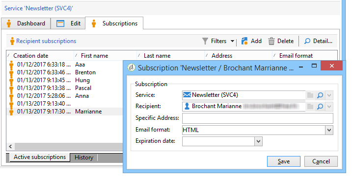
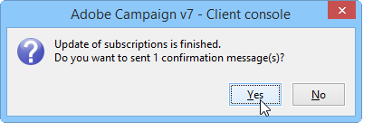

# 管理订阅{#managing-subscriptions}

## 关于信息服务 {#about-information-services}

信息服务包括：

* 注册和订阅（选择加入）,
* 取消注册、自愿退订选择退出()或自动退订(限时服务，例如试用优惠)、
* 订阅和退订确认机制(具有确认的简单机选择加入制、多次等),
* 跟踪订户历史记录。

作为标准功能，这些服务包括特定统计报告：订户跟踪、忠诚度级别、退订趋势等。

对于电子邮件，强制退订链接是自动生成的，整个／流程选择加入都完选择退出全自动化，历史记录跟踪可确保完全遵守现行法规。

有三种服务订阅/退订模式：

1. 手动
1. 通过导入(仅限订阅),
1. 通过Web表单

>[!NOTE]
>
>本节详细介绍了创建具有订阅选择加入的多次表 [单的示例](../../web/using/use-cases--web-forms.md#create-a-subscription--form-with-double-opt-in)。

## 创建信息服务 {#creating-an-information-service}

您可以创建和管理订阅给信息服务以及关联的确认消息或自动投放给订阅者。

要访问信息服务地图，请转到 **[!UICONTROL Profiles and Targets]** 宇宙并单击链 **[!UICONTROL Services and Subscriptions]** 接。

要编辑现有服务，请单击其名称。 要创建服务，请单击位 **[!UICONTROL Create]** 于列表上方的按钮。

* 在字段中输入服务的名 **[!UICONTROL Label]** 称，然后选择投放渠道:电子邮件、移动、Facebook、Twitter或移动应用程序。

   >[!NOTE]
   >
   >Facebook和Twitter订阅在此部分 [详细介绍](../../social/using/about-social-marketing.md)。 移动应用程序订阅详 [细介绍在移动应用渠道](../../delivery/using/about-mobile-app-channel.md)。

* 对于电子邮件类型服务，选择 **投放模式**。 可能的模式有： **[!UICONTROL Newsletter]** 或 **[!UICONTROL Viral]**&#x200B;者
* 您可以发送 **订阅** 或退订的确认消息。 为此，请从和字段中选择要用于创建相应投放模板的 **[!UICONTROL Subscription]** 投放 **[!UICONTROL Unsubscription]** 符。 这些模板必须配置为类 **[!UICONTROL Subscription]** 型目标映射，而不必定义目标。 请参阅关 [于电子邮件渠道](../../delivery/using/about-email-channel.md)。
* 默认情况下，订阅是无限的。 您可以取消选择 **[!UICONTROL Unlimited]** 此选项来定义服务的有效期。 持续时间可以以天()**[!UICONTROL d]** 或月(**[!UICONTROL m]** )为单位。

保存服务后，它将添加到服务和订阅列表:单击其名称可编辑它。 可使用多个选项卡。 通过 **[!UICONTROL Subscriptions]** 该选项卡可查看信息服务（选项卡）或列表&#x200B;**[!UICONTROL Active subscriptions]** /退订历史记录（选项卡）的订&#x200B;**[!UICONTROL History]** 阅者订阅。 您还可以在此选项卡中添加和删除订阅者。 请参 [阅添加和删除订阅者](#adding-and-deleting-subscribers)。

通 **[!UICONTROL Detail...]** 过按钮可查看选定订阅的收件人属性。

您可以修改订阅的收件人属性。

在仪表板中，单击选 **[!UICONTROL Reports]** 项卡以跟踪订阅:订阅级别的更改、订阅者总数等。 您可以从此选项卡中存档报告和查看历史记录。

## 添加和删除订阅者 {#adding-and-deleting-subscribers}

在信息服务 **[!UICONTROL Subscriptions]** 的选项卡中，单击 **[!UICONTROL Add]** 以添加订阅者。 您还可以右键单击订阅者的列表并选择 **[!UICONTROL Add]**。 选择存储要订阅的用户档案的文件夹，然后选择要订阅的用户档案并单击以 **[!UICONTROL OK]** 验证。

要删除订阅者，请选择订阅者并单击 **[!UICONTROL Delete]**。 您还可以右键单击订阅者列表并选择 **[!UICONTROL Delete]**。

在这两种情况下，如果投放模板已附加到服务，则可以向相关用户发送确认消息(请参 [阅创建信息服务](#creating-an-information-service))。 警告允许您验证或不验证此投放:

请参 [阅订阅和退订机制](#subscription-and-unsubscription-mechanisms)。

## 向服务的订户传送 {#delivering-to-the-subscribers-of-a-service}

要向信息服务的订阅者传送，您可以将订阅者目标到相关信息服务，如以下示例所示：

>[!CAUTION]
>
>目标映射一定是 **[!UICONTROL Subscriptions]**。

选择 **[!UICONTROL Subscribers of an information service]** 并单击 **[!UICONTROL Next]**。

选择目标信息服务并单击 **[!UICONTROL Finish]**。

通过 **[!UICONTROL Preview]** 该选项卡，您可以将订阅者的视图列表到所选信息服务。

## 订阅和退订机制 {#subscription-and-unsubscription-mechanisms}

您可以设置订阅和退订机制，以自动处理流程和管理订阅者。

>[!NOTE]
>
>可以向新订阅者发送确认消息。\
>此消息的内容在信息服务配置中通过或字段 **[!UICONTROL Subscription]** 进行 **[!UICONTROL Unsubscription]** 定义。
>
>通过这些字段中指定的投放模板创建确认消息。 这些目标映射一定 **[!UICONTROL Subscriptions]**&#x200B;是。

### 订阅收件人服务 {#subscribing-a-recipient-to-a-service}

要为收件人注册信息服务，您可以：

* 手动添加服务：要执行此操作，请从 **[!UICONTROL Subscriptions]** 其用户档案的选项卡中，单 **[!UICONTROL Add]** 击并选择相关信息服务。

   有关此内容的详细信息，请参阅此部分中有关用户档案编 [辑的部分](../../platform/using/editing-a-profile.md)。

* 自动订阅一组收件人此服务。 收件人的列表可以来自使用鼠标的筛选操作、组、文件夹、导入或直接选择。 要订阅这些收件人，请选择用户档案并右键单击。 选 **[!UICONTROL Actions > Subscribe selection to a service...]**&#x200B;择，选择相关服务，然后启动操作。
* 导入收件人并自动将其订阅到信息服务。 要执行此操作，请选择导入向导最后一步中涉及的服务。

   如需详细信息，请参阅[此部分](../../platform/using/importing-data.md#import-wizard)。

* 使用Web表单，以便收件人可以订阅服务。

   如需详细信息，请参阅[此部分](../../web/using/about-web-applications.md)。

* 创建定位工作流并使用 **[!UICONTROL Subscription service]** 框。

   

   工作流以及如何使用这些内容将在本 [节中详细介绍](../../workflow/using/about-workflows.md)。

### 从服务中取消收件人订阅 {#unsubscribing-a-recipient-from-a-service}

#### 手动取消订阅 {#manual-unsubscribing}

根据法律，电子邮件投放必须包含退订链接。 收件人可以单击此链接更新其用户档案，并排除在将来的目标之外。

默认退订链接通过投放向导中提供的内容编辑器的工具栏中的最后一个按钮插入(请参阅关 [于个性化](../../delivery/using/about-personalization.md))。 当收件人单击此链接时，该将添阻止列表加到用户档案（选择退出），这意味着此收件人将不再被任何投放操作定位。

但是，收件人可以选择取消订阅服务，而不取消订阅所有服务。 要实现此目的，您可以使用Web表单(请参 [阅本部](../../web/using/adding-fields-to-a-web-form.md#subscription-checkboxes)分)或插入个性化退订链接(请参 [阅个性化块](../../delivery/using/personalization-blocks.md))。

您还可以手动取消收件人与收件人用户档案的订阅。 为此，请单击 **[!UICONTROL Subscriptions]** 相关收件人的选项卡，选择相关信息服务，然后单击 **[!UICONTROL Delete]**。

您最终可以通过相关收件人取消订阅一个或多个订阅。 为此，请单击服 **[!UICONTROL Subscriptions]** 务的选项卡，选择相关收件人并单击 **[!UICONTROL Delete]**。

#### 自动退订 {#automatic-unsubscription}

信息服务的持续时间可以有限。 收件人在有效期到期后将自动取消订阅。 此期间在服务属性 **[!UICONTROL Edit]** 的选项卡中指定。 以天表示。

您还可以为人口设置退订工作流。 要执行此操作，请按照与订阅工作流相同的步骤操作，但选择选 **[!UICONTROL Unsubscription]** 项。 请参 [阅订阅收件人服务](#subscribing-a-recipient-to-a-service)。

### 订阅者跟踪 {#subscriber-tracking}

您可以使用订阅上的链接跟踪仪表板对 **[!UICONTROL Reports]** 信息服务的更改。

