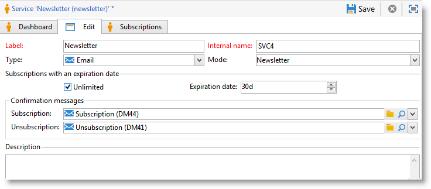

# 管理订阅{#managing-subscriptions}

## 关于信息服务{#about-information-services}

信息服务包括：

* 注册和订阅（选择加入），
* 取消注册、自愿退订(选择退出)或自动退订(限时服务，例如试用优惠)、
* 订阅和退订确认机制(带确认的简单机选择加入制、多次等),
* 订阅者历史记录的跟踪。

作为标准功能，这些服务包括特定统计报告：订阅者跟踪、忠诚度级别、退订趋势等。

对于电子邮件，强制退订链接是自动生成的，整个/流程都选择加入是完全自动选择退出化的，历史记录跟踪可确保全面遵守现行法规。

有三种服务订阅/退订模式：

1. 手动
1. 通过导入(仅限订阅),
1. 通过Web表单

>[!NOTE]
>
>[本节](../../web/using/use-cases--web-forms.md#create-a-subscription--form-with-double-opt-in)详细介绍了创建带有订阅选择的多次表单的示例。

## 创建信息服务{#creating-an-information-service}

您可以创建和管理对信息服务的订阅，这些具有关联的确认消息或对订阅者自动投放。

要访问信息服务映射，请打开&#x200B;**[!UICONTROL Profiles and Targets]**&#x200B;选项卡，然后单击&#x200B;**[!UICONTROL Services and Subscriptions]**&#x200B;链接。

要编辑现有服务，请单击其名称。 要创建服务，请单击位于列表上方的&#x200B;**[!UICONTROL Create]**&#x200B;按钮。

* 在&#x200B;**[!UICONTROL Label]**&#x200B;字段中输入服务的名称，然后选择投放渠道:电子邮件、移动、Facebook、Twitter或移动应用程序。

   >[!NOTE]
   >
   >Facebook和Twitter订阅详见[本节](../../social/using/about-social-marketing.md)。 [关于移动应用程序订阅](../../delivery/using/about-mobile-app-channel.md)中详细介绍了移动应用程序渠道。

* 对于“电子邮件”类型服务，请选择&#x200B;**投放模式**。 可能的模式有：**[!UICONTROL Newsletter]**&#x200B;或&#x200B;**[!UICONTROL Viral]**。
* 您可以发送&#x200B;**确认消息**&#x200B;以获取订阅或退订。 为此，请从&#x200B;**[!UICONTROL Subscription]**&#x200B;和&#x200B;**[!UICONTROL Unsubscription]**&#x200B;字段中选择要用于创建相应投放的投放模板。 这些模板必须配置&#x200B;**[!UICONTROL Subscription]**&#x200B;类型目标映射，而不定义目标。 请参阅[关于电子邮件渠道](../../delivery/using/about-email-channel.md)部分。
* 默认情况下，订阅是无限的。 您可以取消选择&#x200B;**[!UICONTROL Unlimited]**&#x200B;选项来定义服务的有效期。 持续时间可以以天(**[!UICONTROL d]**)或月(**[!UICONTROL m]**)为单位指定。

保存服务后，它将添加到服务和订阅列表:单击其名称以编辑它。 有多个选项卡可用。 通过&#x200B;**[!UICONTROL Subscriptions]**&#x200B;选项卡可查看信息服务（**[!UICONTROL Active subscriptions]**&#x200B;选项卡）或订阅/退订历史记录（**[!UICONTROL History]**&#x200B;选项卡）的订阅者列表。 您还可以在此选项卡中添加和删除订阅者。 请参阅[添加和删除订阅者](#adding-and-deleting-subscribers)。

通过&#x200B;**[!UICONTROL Detail...]**&#x200B;按钮可以查看所选收件人的订阅属性。

您可以修改订阅的收件人属性。

在仪表板上，单击&#x200B;**[!UICONTROL Reports]**&#x200B;选项卡以跟踪订阅:订阅级别、订阅者总数等的更改。 您可以存档报告并查看此选项卡中的历史记录。

## 添加和删除订阅者{#adding-and-deleting-subscribers}

在信息服务的&#x200B;**[!UICONTROL Subscriptions]**&#x200B;选项卡中，单击&#x200B;**[!UICONTROL Add]**&#x200B;以添加订阅者。 您还可以右键单击订阅者的列表并选择&#x200B;**[!UICONTROL Add]**。 选择存储要订阅的用户档案的文件夹，然后选择要订阅的用户档案并单击&#x200B;**[!UICONTROL OK]**&#x200B;进行验证。

要删除订阅者，请选择它们并单击&#x200B;**[!UICONTROL Delete]**。 您还可以右键单击订阅者列表并选择&#x200B;**[!UICONTROL Delete]**。

在这两种情况下，如果投放模板已附加到服务，则可以向相关用户发送确认消息(请参阅[创建信息服务](#creating-an-information-service))。 警告允许您验证或不验证此投放:

请参阅[订阅和退订机制](#subscription-and-unsubscription-mechanisms)。

## 向服务{#delivering-to-the-subscribers-of-a-service}的用户传送

要向某个信息服务的订阅者传送，您可以将订阅者目标到相关信息服务，如以下示例所示：

>[!CAUTION]
>
>目标映射必须为&#x200B;**[!UICONTROL Subscriptions]**。

选择 **[!UICONTROL Subscribers of an information service]** 并单击 **[!UICONTROL Next]**。

选择目标信息服务，然后单击&#x200B;**[!UICONTROL Finish]**。

使用&#x200B;**[!UICONTROL Preview]**&#x200B;选项卡可以将订阅者的列表视图到所选信息服务。

## 订阅和退订机制{#subscription-and-unsubscription-mechanisms}

您可以设置订阅和退订机制，以自动处理流程和用户管理。

>[!NOTE]
>
>可以向新订阅者发送确认消息。\
>此消息的内容在信息服务配置中通过&#x200B;**[!UICONTROL Subscription]**&#x200B;或&#x200B;**[!UICONTROL Unsubscription]**&#x200B;字段进行定义。
>
>通过这些字段中指定的投放模板创建确认消息。 这些目标映射必须为&#x200B;**[!UICONTROL Subscriptions]**。

### 订阅收件人到服务{#subscribing-a-recipient-to-a-service}

要为信息服务注册收件人，您可以：

* 手动添加服务：要执行此操作，请从其用户档案的&#x200B;**[!UICONTROL Subscriptions]**&#x200B;选项卡中，单击&#x200B;**[!UICONTROL Add]**&#x200B;并选择相关信息服务。

   有关详细信息，请参阅[此部分](../../platform/using/editing-a-profile.md)中有关用户档案编辑的部分。

* 自动订阅一组收件人到此服务。 收件人的列表可以来自使用鼠标的过滤操作、组、文件夹、导入或直接选择。 要订阅这些收件人，请选择用户档案并右键单击。 选择&#x200B;**[!UICONTROL Actions > Subscribe selection to a service...]**，选择相关服务，然后启动操作。
* 导入收件人并自动将其订阅到信息服务。 为此，请在导入向导的最后一步中选择相关服务。

   如需详细信息，请参阅[此部分](../../platform/using/executing-import-jobs.md)。

* 使用Web表单，以便收件人可以订阅服务。

   如需详细信息，请参阅[此部分](../../web/using/about-web-applications.md)。

* 创建定位工作流并使用&#x200B;**[!UICONTROL Subscription service]**&#x200B;框。

   

   工作流及其使用方法详见[本节](../../workflow/using/about-workflows.md)。

### 从服务{#unsubscribing-a-recipient-from-a-service}中取消收件人订阅

#### 手动取消订阅{#manual-unsubscribing}

根据法律，电子邮件投放必须包含退订链接。 收件人可以单击此链接以更新其用户档案，并被排除在将来投放的目标之外。

默认的退订链接通过投放向导中提供的内容编辑器工具栏中的最后一个按钮插入（请参阅[关于个性化](../../delivery/using/about-personalization.md)）。 当收件人单击此链接时，该用户档案将添加阻止列表到（选择退出），这意味着此收件人将不再被任何投放操作定位。

但是，收件人可以选择取消订阅某个服务，而不取消订阅所有服务。 要实现此目的，您可以使用Web表单（请参阅[此部分](../../web/using/adding-fields-to-a-web-form.md#subscription-checkboxes)）或插入个性化的退订链接(请参阅[个性化块](../../delivery/using/personalization-blocks.md))。

您还可以手动从收件人用户档案中取消订阅收件人。 要执行此操作，请单击相关收件人的&#x200B;**[!UICONTROL Subscriptions]**&#x200B;选项卡，选择相关信息服务，然后单击&#x200B;**[!UICONTROL Delete]**。

您最终可以通过相关收件人取消订阅一个或多个信息服务。 要执行此操作，请单击服务的&#x200B;**[!UICONTROL Subscriptions]**&#x200B;选项卡，选择相关收件人，然后单击&#x200B;**[!UICONTROL Delete]**。

#### 自动退订{#automatic-unsubscription}

信息服务的持续时间有限。 收件人将在有效期到期后自动取消订阅。 在服务属性的&#x200B;**[!UICONTROL Edit]**&#x200B;选项卡中指定此时段。 以天数表示。

您还可以为人口设置退订工作流。 要执行此操作，请按照与订阅工作流相同的步骤操作，但选择&#x200B;**[!UICONTROL Unsubscription]**&#x200B;选项。 请参阅[订阅服务收件人](#subscribing-a-recipient-to-a-service)。

### 订阅者跟踪{#subscriber-tracking}

您可以使用仪表板上的&#x200B;**[!UICONTROL Reports]**&#x200B;链接跟踪订阅对信息服务的更改。

